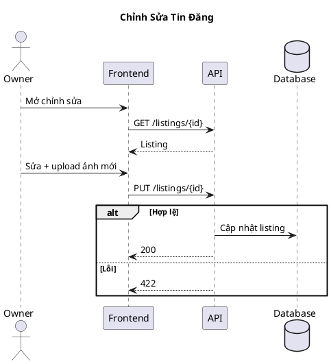

# Sequence Diagram - Chỉnh Sửa Tin Đăng

```plantuml
@startuml
title Chỉnh Sửa Tin Đăng

actor "Owner" as Owner
participant "Frontend" as FE
participant "API" as API
database "Database" as DB

Owner -> FE: Mở chỉnh sửa
FE -> API: GET /listings/{id}
API --> FE: Listing
Owner -> FE: Sửa + upload ảnh mới
FE -> API: PUT /listings/{id}
alt Hợp lệ
  API -> DB: Cập nhật listing
  API --> FE: 200
else Lỗi
  API --> FE: 422
end
@enduml
```

**Luồng:** GET → Sửa → PUT → Cập nhật DB.
