# Sequence Diagram - Chỉnh Sửa Tin Đăng

```plantuml
@startuml

title Chỉnh Sửa Tin Đăng

actor "Owner" as Owner
participant "EditListingForm\n/ Frontend" as FE
participant "ListingController\n/ API" as Controller
participant "CreateListingRequest\n«validation»" as Validation
participant "ListingService" as ListingService
participant "UpdateListingCommand" as UpdateCmd
participant "Listing / Property\n«entity»" as Entity
participant "ListingRepository\n«repository»" as Repo
database "Database" as DB

Owner -> FE: Truy cập "Tin đăng của tôi"
Owner -> FE: Chọn tin đăng cần chỉnh sửa
Owner -> FE: Nhấn "Chỉnh sửa"

FE -> Controller: GET /api/v1/listings/{id}/mine

Controller -> ListingService: getOwnedListingDetails(user, id)

ListingService -> Repo: findById(id)
Repo -> DB: SELECT * FROM listings\nWHERE id = ?
DB --> Repo: listing

alt Listing không tồn tại
    Repo --> ListingService: NotFoundException
    ListingService --> Controller: Exception
    Controller --> FE: 404 Not Found
    FE --> Owner: "Không tìm thấy tin đăng"
else Listing tồn tại
    ListingService -> ListingService: Check ownership\n(listing.owner_id = user.id)
    
    alt User không phải chủ tin
        ListingService --> Controller: ForbiddenException
        Controller --> FE: 403 Forbidden
        FE --> Owner: "Không có quyền chỉnh sửa"
    else User là chủ tin
        ListingService -> Repo: load(['property.attributes',\n'images', 'videos',\n'verificationDocuments'])
        Repo -> DB: SELECT với relations
        DB --> Repo: Listing với relations
        
        ListingService --> Controller: Listing
        Controller --> FE: 200 OK + ListingResource
        FE --> Owner: Hiển thị form với dữ liệu hiện tại
    end
end

Owner -> FE: Chỉnh sửa thông tin\n(title, price, images, ...)
Owner -> FE: Nhấn "Cập nhật" / "Lưu nháp"

FE -> Controller: PUT /api/v1/listings/{id}\nupdatedData

Controller -> Validation: validate()

alt Validation failed
    Validation --> Controller: ValidationError
    Controller --> FE: 422 Validation Error
    FE --> Owner: Hiển thị lỗi
else Validation passed
    Controller -> Validation: toDto()
    Validation --> Controller: CreateListingDto
    
    Controller -> ListingService: update(user, id, dto)
    
    ListingService -> Repo: findById(id)
    Repo -> DB: SELECT * FROM listings WHERE id = ?
    DB --> Repo: listing
    
    ListingService -> ListingService: Check ownership
    
    alt User không phải chủ tin
        ListingService --> Controller: ForbiddenException
        Controller --> FE: 403 Forbidden
        FE --> Owner: "Không có quyền"
    else User là chủ tin
        ListingService -> UpdateCmd: handle(user, id, dto)
        
        UpdateCmd -> UpdateCmd: BEGIN TRANSACTION
        
        UpdateCmd -> Repo: updateProperty(property_id, data)
        Repo -> DB: UPDATE properties SET\ntype, area, price, bedrooms,\nbathrooms, amenities, ...
        DB --> Repo: affected rows
        
        alt dto.attributeIds có dữ liệu
            UpdateCmd -> Repo: syncAttributes(property_id, ...)
            Repo -> DB: DELETE property_attributes\nWHERE property_id = ?
            Repo -> DB: INSERT property_attributes
            DB --> Repo: success
        end
        
        UpdateCmd -> UpdateCmd: Determine new status\n(DRAFT or PENDING)
        
        UpdateCmd -> Repo: updateListing(listing_id, data)
        Repo -> DB: UPDATE listings SET\ntitle, description, status,\nhas_video, submitted_at, ...
        DB --> Repo: affected rows
        
        UpdateCmd -> Repo: deleteListingImages(listing_id)
        Repo -> DB: DELETE FROM listing_images\nWHERE listing_id = ?
        DB --> Repo: deleted count
        
        UpdateCmd -> Repo: createListingImage(...)
        loop Cho mỗi ảnh mới
            Repo -> DB: INSERT listing_images\n(listing_id, image_url,\nis_thumbnail, sort_order)
            DB --> Repo: image_id
        end
        
        UpdateCmd -> Repo: deleteListingVideos(listing_id)
        Repo -> DB: DELETE FROM listing_videos\nWHERE listing_id = ?
        DB --> Repo: deleted count
        
        opt Có video mới
            UpdateCmd -> Repo: createListingVideo(...)
            Repo -> DB: INSERT listing_videos
            DB --> Repo: video_id
        end
        
        UpdateCmd -> Repo: deleteVerificationDocuments(listing_id)
        Repo -> DB: DELETE FROM\nlisting_verification_documents\nWHERE listing_id = ?
        DB --> Repo: deleted count
        
        opt request_verification = true
            UpdateCmd -> Repo: createVerificationDocument(...)
            loop Documents
                Repo -> DB: INSERT\nlisting_verification_documents
                DB --> Repo: document_id
            end
        end
        
        UpdateCmd -> UpdateCmd: COMMIT TRANSACTION
        
        UpdateCmd -> Repo: load(['property.attributes',\n'images', 'videos',\n'verificationDocuments'])
        Repo -> DB: SELECT với relations
        DB --> Repo: Listing updated
        
        UpdateCmd -> UpdateCmd: Dispatch ListingSaved event\n(context: 'updated' or 'draft_updated')
        
        UpdateCmd --> ListingService: Listing
        ListingService -> ListingService: clearPublicListingsCache()
        
        ListingService --> Controller: Listing
        
        Controller --> FE: 200 OK + ListingResource\n"Cập nhật tin đăng thành công.\nTin đăng đang chờ duyệt lại."
        FE --> Owner: Hiển thị thông báo
        
        note right
            Nếu tin đăng đang ACTIVE
            và user gửi cập nhật (không phải lưu nháp)
            → status chuyển về PENDING
            để admin duyệt lại
        end note
    end
end

@enduml
```



## Giải Thích

**Quy trình chỉnh sửa tin đăng gồm 2 bước:**

### Bước 1: Lấy thông tin tin đăng hiện tại (GET /api/v1/listings/{id}/mine)
1. **Owner chọn tin cần sửa** → Frontend gọi API lấy chi tiết
2. **ListingService**:
   - Tìm listing theo ID
   - Kiểm tra ownership (listing.owner_id = user.id)
   - Load relations: property, attributes, images, videos, verificationDocuments
3. **Response**: 200 OK + ListingResource
4. **Frontend**: Hiển thị form đã điền sẵn dữ liệu hiện tại

### Bước 2: Cập nhật tin đăng (PUT /api/v1/listings/{id})
1. **Owner sửa thông tin** → Nhấn "Cập nhật" hoặc "Lưu nháp"
2. **Validation**: Giống như tạo tin mới (nghiêm ngặt nếu không phải nháp)
3. **UpdateListingCommand** thực hiện transaction:

**a) Update Property:**
```sql
UPDATE properties SET type = ?, area = ?, price = ?, 
  bedrooms = ?, bathrooms = ?, amenities = ?, ...
WHERE id = ?
```

**b) Sync Attributes:**
```sql
DELETE FROM property_attributes WHERE property_id = ?
INSERT INTO property_attributes (property_id, attribute_id) VALUES ...
```

**c) Update Listing:**
```sql
UPDATE listings SET title = ?, description = ?, 
  status = ?, has_video = ?, submitted_at = ?
WHERE id = ?
```
- **status**: 
  - Nếu `save_as_draft = true` → DRAFT
  - Nếu `save_as_draft = false` → PENDING (cho dù trước đó là ACTIVE)

**d) Replace Images:**
```sql
DELETE FROM listing_images WHERE listing_id = ?
INSERT INTO listing_images (listing_id, image_url, is_thumbnail, sort_order) VALUES ...
```
- **Strategy**: Xóa hết ảnh cũ, insert lại ảnh mới
- Ảnh đầu tiên: `is_thumbnail = true`

**e) Replace Video:**
```sql
DELETE FROM listing_videos WHERE listing_id = ?
INSERT INTO listing_videos (listing_id, video_url, ...) VALUES ...
```

**f) Replace Verification Documents:**
```sql
DELETE FROM listing_verification_documents WHERE listing_id = ?
INSERT INTO listing_verification_documents (...) VALUES ...
```

### 4. Post-processing
- **Dispatch event**: `ListingSaved` (context: 'updated' hoặc 'draft_updated')
- **Clear cache**: Xóa cache tin đăng công khai
- **Load relations**: Trả về listing đã cập nhật với tất cả relations

### 5. Response
- **200 OK** + ListingResource
- Message:
  - "Lưu nháp thành công" (nếu DRAFT)
  - "Cập nhật tin đăng thành công. Tin đăng đang chờ duyệt lại." (nếu PENDING)

**Lưu ý quan trọng:**
- Khi cập nhật tin đang **ACTIVE**, tin sẽ quay về **PENDING** để admin kiểm duyệt lại nội dung mới
- Strategy **Replace All**: Xóa hết dữ liệu cũ (images, videos, docs) và insert lại dữ liệu mới
- Tất cả thao tác trong **transaction** để đảm bảo tính toàn vẹn

---

**Cách xem diagram**: Copy code PlantUML vào https://www.plantuml.com/plantuml/uml/
