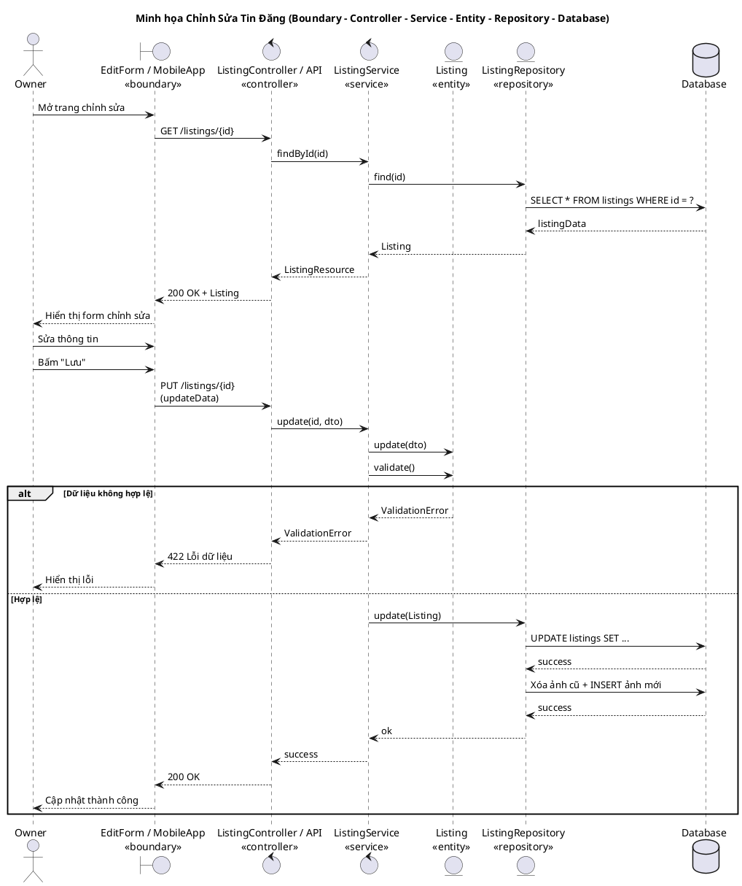

# Sequence Diagram - Chỉnh Sửa Tin Đăng

```plantuml
@startuml
title Minh họa Chỉnh Sửa Tin Đăng (Boundary - Controller - Service - Entity - Repository - Database)

actor "Owner" as Owner
boundary "EditForm / MobileApp\n«boundary»" as FE
control "ListingController / API\n«controller»" as Controller
control "ListingService\n«service»" as Service
entity "Listing\n«entity»" as ListingEntity
entity "ListingRepository\n«repository»" as Repo
database "Database" as DB

Owner -> FE: Mở trang chỉnh sửa
FE -> Controller: GET /listings/{id}
Controller -> Service: findById(id)
Service -> Repo: find(id)
Repo -> DB: SELECT * FROM listings WHERE id = ?
DB --> Repo: listingData
Repo --> Service: Listing
Service --> Controller: ListingResource
Controller --> FE: 200 OK + Listing
FE --> Owner: Hiển thị form chỉnh sửa
Owner -> FE: Sửa thông tin
Owner -> FE: Bấm "Lưu"
FE -> Controller: PUT /listings/{id}\n(updateData)
Controller -> Service: update(id, dto)
Service -> ListingEntity: update(dto)
Service -> ListingEntity: validate()

alt Dữ liệu không hợp lệ
  ListingEntity --> Service: ValidationError
  Service --> Controller: ValidationError
  Controller --> FE: 422 Lỗi dữ liệu
  FE --> Owner: Hiển thị lỗi
else Hợp lệ
  Service -> Repo: update(Listing)
  Repo -> DB: UPDATE listings SET ...
  DB --> Repo: success
  Repo -> DB: Xóa ảnh cũ + INSERT ảnh mới
  DB --> Repo: success
  Repo --> Service: ok
  Service --> Controller: success
  Controller --> FE: 200 OK
  FE --> Owner: Cập nhật thành công
end
@enduml
```
