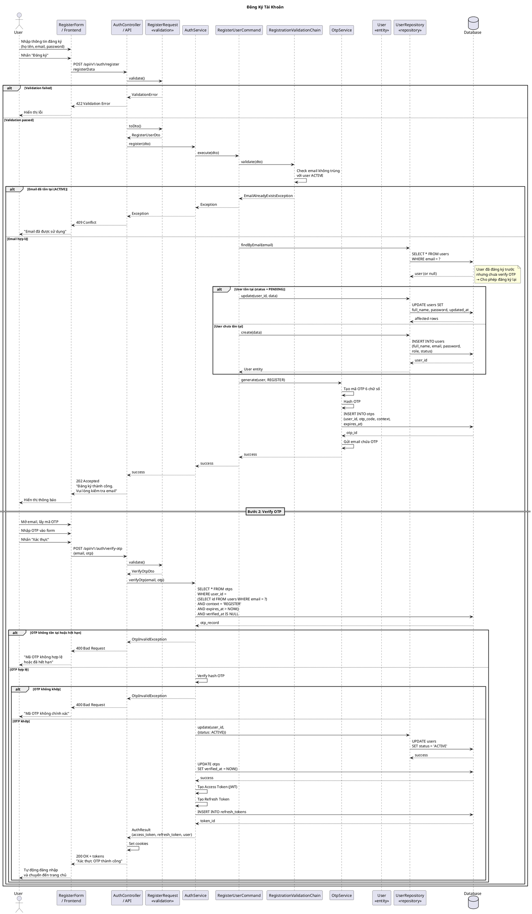

# Sequence Diagram - Đăng Ký Tài Khoản

## Giải Thích

**Quy trình đăng ký gồm 2 bước:**

### Bước 1: Đăng ký (POST /api/v1/auth/register)
1. **Frontend → Controller**: Gửi dữ liệu đăng ký
2. **Controller → Validation**: Validate format (email, password length)
3. **Controller → AuthService → RegisterUserCommand**: Xử lý logic đăng ký
4. **ValidationChain**: Kiểm tra email không trùng với user ACTIVE
5. **UserRepository**:
   - Nếu email tồn tại với status PENDING → Cập nhật thông tin (cho phép đăng ký lại)
   - Nếu email chưa tồn tại → Tạo user mới với status PENDING
6. **OtpService**: Tạo OTP, hash, lưu vào DB, gửi email
7. **Response**: 202 Accepted "Kiểm tra email"

### Bước 2: Verify OTP (POST /api/v1/auth/verify-otp)
1. **Frontend → Controller**: Gửi email + OTP
2. **AuthService**: Tìm OTP trong DB (chưa hết hạn, chưa dùng)
3. **Verify**: So sánh hash OTP
4. **Nếu đúng**:
   - Cập nhật user status = ACTIVE
   - Đánh dấu OTP đã verify
   - Tạo JWT tokens (access + refresh)
   - Lưu refresh token vào DB
   - Set cookies
5. **Response**: 200 OK + tokens, user tự động đăng nhập

---

**Cách xem diagram**: Copy code PlantUML vào https://www.plantuml.com/plantuml/uml/
