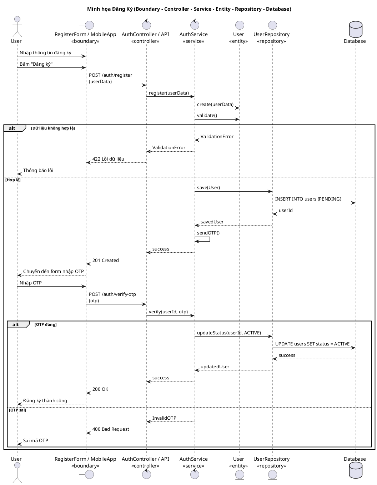

# Sequence Diagram - Đăng Ký Tài Khoản

```plantuml
@startuml
title Minh họa Đăng Ký (Boundary - Controller - Service - Entity - Repository - Database)

actor "User" as User
boundary "RegisterForm / MobileApp\n«boundary»" as FE
control "AuthController / API\n«controller»" as Controller
control "AuthService\n«service»" as Service
entity "User\n«entity»" as Entity
entity "UserRepository\n«repository»" as Repo
database "Database" as DB

User -> FE: Nhập thông tin đăng ký
User -> FE: Bấm "Đăng ký"
FE -> Controller: POST /auth/register\n(userData)
Controller -> Service: register(userData)
Service -> Entity: create(userData)
Service -> Entity: validate()

alt Dữ liệu không hợp lệ
  Entity --> Service: ValidationError
  Service --> Controller: ValidationError
  Controller --> FE: 422 Lỗi dữ liệu
  FE --> User: Thông báo lỗi
else Hợp lệ
  Service -> Repo: save(User)
  Repo -> DB: INSERT INTO users (PENDING)
  DB --> Repo: userId
  Repo --> Service: savedUser
  Service -> Service: sendOTP()
  Service --> Controller: success
  Controller --> FE: 201 Created
  FE --> User: Chuyển đến form nhập OTP
  
  User -> FE: Nhập OTP
  FE -> Controller: POST /auth/verify-otp\n(otp)
  Controller -> Service: verify(userId, otp)
  alt OTP đúng
    Service -> Repo: updateStatus(userId, ACTIVE)
    Repo -> DB: UPDATE users SET status = ACTIVE
    DB --> Repo: success
    Repo --> Service: updatedUser
    Service --> Controller: success
    Controller --> FE: 200 OK
    FE --> User: Đăng ký thành công
  else OTP sai
    Service --> Controller: InvalidOTP
    Controller --> FE: 400 Bad Request
    FE --> User: Sai mã OTP
  end
end
@enduml
```
