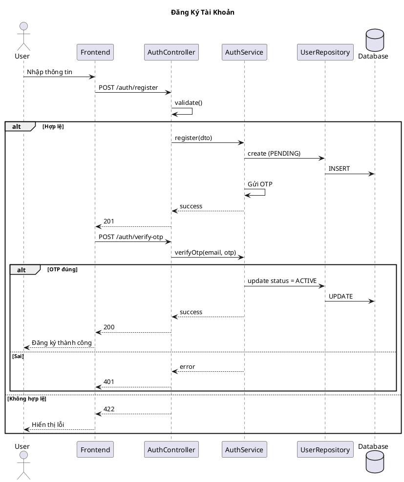

# Sequence Diagram - Đăng Ký Tài Khoản

```plantuml
@startuml
title Đăng Ký Tài Khoản

actor "User" as User
participant "Frontend" as FE
participant "AuthController" as Controller
participant "AuthService" as Service
participant "UserRepository" as Repo
database "Database" as DB

User -> FE: Nhập thông tin
FE -> Controller: POST /auth/register
Controller -> Controller: validate()
alt Hợp lệ
  Controller -> Service: register(dto)
  Service -> Repo: create (PENDING)
  Repo -> DB: INSERT
  Service -> Service: Gửi OTP
  Service --> Controller: success
  Controller --> FE: 201
  FE -> Controller: POST /auth/verify-otp
  Controller -> Service: verifyOtp(email, otp)
  alt OTP đúng
    Service -> Repo: update status = ACTIVE
    Repo -> DB: UPDATE
    Service --> Controller: success
    Controller --> FE: 200
    FE --> User: Đăng ký thành công
  else Sai
    Service --> Controller: error
    Controller --> FE: 401
  end
else Không hợp lệ
  Controller --> FE: 422
  FE --> User: Hiển thị lỗi
end
@enduml
```

**3-layer:** Controller -> Service -> Repository -> DB.
