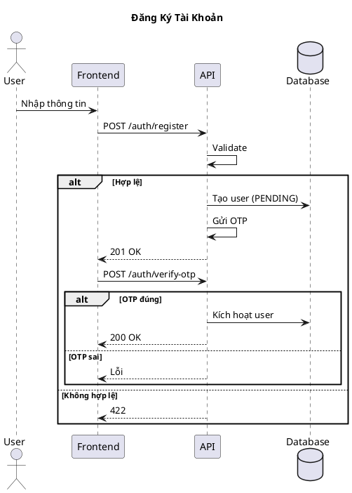

# Sequence Diagram - Đăng Ký Tài Khoản

```plantuml
@startuml
title Đăng Ký Tài Khoản

actor "User" as User
participant "Frontend" as FE
participant "API" as API
database "Database" as DB

User -> FE: Nhập thông tin
FE -> API: POST /auth/register
API -> API: Validate
alt Hợp lệ
  API -> DB: Tạo user (PENDING)
  API -> API: Gửi OTP
  API --> FE: 201 OK
  FE -> API: POST /auth/verify-otp
  alt OTP đúng
    API -> DB: Kích hoạt user
    API --> FE: 200 OK
  else OTP sai
    API --> FE: Lỗi
  end
else Không hợp lệ
  API --> FE: 422
end
@enduml
```

**Luồng:** Nhập → Validate → OTP → Kích hoạt.
