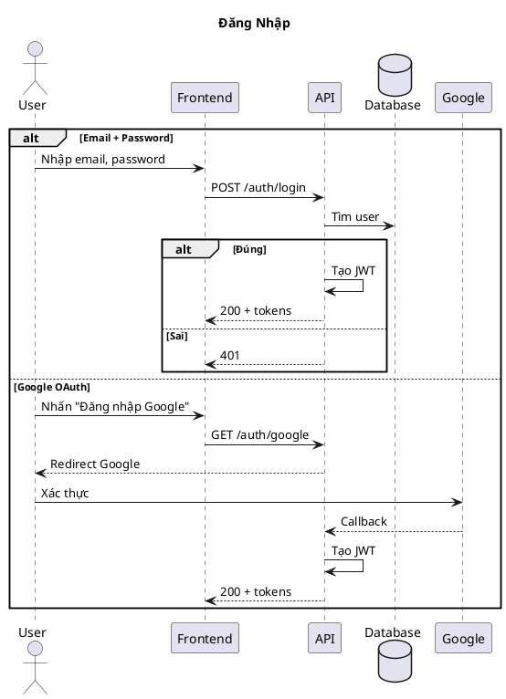

# Sequence Diagram - Đăng Nhập

```plantuml
@startuml
title Đăng Nhập

actor "User" as User
participant "Frontend" as FE
participant "API" as API
database "Database" as DB

alt Email + Password
  User -> FE: Nhập email, password
  FE -> API: POST /auth/login
  API -> DB: Tìm user
  alt Đúng
    API -> API: Tạo JWT
    API --> FE: 200 + tokens
  else Sai
    API --> FE: 401
  end
else Google OAuth
  User -> FE: Nhấn "Đăng nhập Google"
  FE -> API: GET /auth/google
  API --> User: Redirect Google
  User -> Google: Xác thực
  Google --> API: Callback
  API -> API: Tạo JWT
  API --> FE: 200 + tokens
end
@enduml
```

**Luồng:** 2 phương thức (Email/Google) → JWT tokens.
