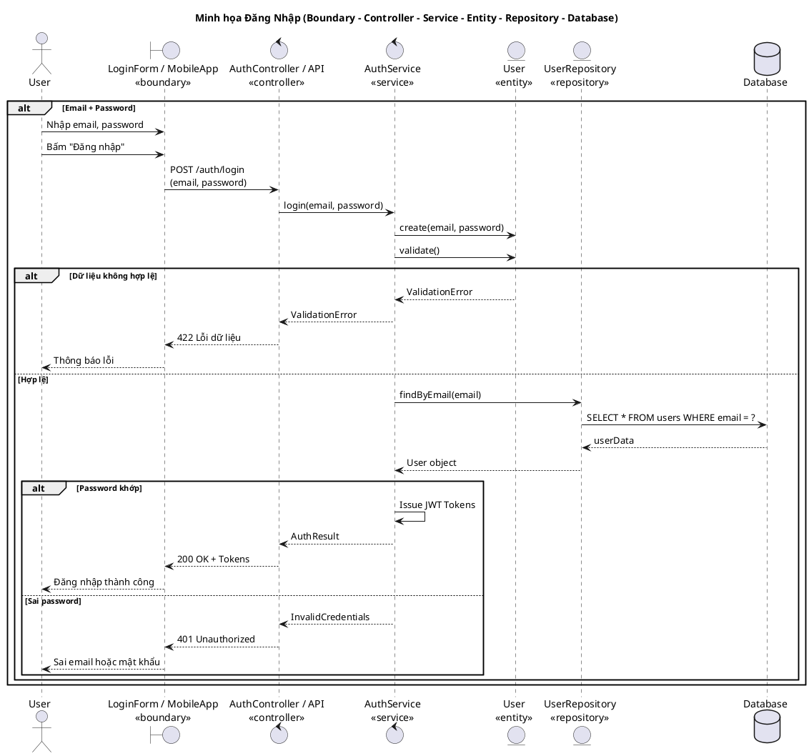

# Sequence Diagram - Đăng Nhập

```plantuml
@startuml
title Minh họa Đăng Nhập (Boundary - Controller - Service - Entity - Repository - Database)

actor "User" as User
boundary "LoginForm / MobileApp\n«boundary»" as FE
control "AuthController / API\n«controller»" as Controller
control "AuthService\n«service»" as Service
entity "User\n«entity»" as Entity
entity "UserRepository\n«repository»" as Repo
database "Database" as DB

alt Email + Password
  User -> FE: Nhập email, password
  User -> FE: Bấm "Đăng nhập"
  FE -> Controller: POST /auth/login\n(email, password)
  Controller -> Service: login(email, password)
  Service -> Entity: create(email, password)
  Service -> Entity: validate()
  
  alt Dữ liệu không hợp lệ
    Entity --> Service: ValidationError
    Service --> Controller: ValidationError
    Controller --> FE: 422 Lỗi dữ liệu
    FE --> User: Thông báo lỗi
  else Hợp lệ
    Service -> Repo: findByEmail(email)
    Repo -> DB: SELECT * FROM users WHERE email = ?
    DB --> Repo: userData
    Repo --> Service: User object
    alt Password khớp
      Service -> Service: Issue JWT Tokens
      Service --> Controller: AuthResult
      Controller --> FE: 200 OK + Tokens
      FE --> User: Đăng nhập thành công
    else Sai password
      Service --> Controller: InvalidCredentials
      Controller --> FE: 401 Unauthorized
      FE --> User: Sai email hoặc mật khẩu
    end
  end
end
@enduml
```
