# Sequence Diagram - Đăng Nhập

```plantuml
@startuml

title Đăng Nhập

actor "User" as User
participant "LoginForm\n/ Frontend" as FE
participant "AuthController\n/ API" as Controller
participant "LoginRequest\n«validation»" as Validation
participant "AuthService" as AuthService
participant "AuthStrategyResolver" as StrategyResolver
participant "EmailPasswordAuthStrategy" as EmailStrategy
participant "GoogleOAuthAuthStrategy" as GoogleStrategy
participant "LoginValidationChain" as ValidationChain
participant "AuthTokenIssuer" as TokenIssuer
participant "User\n«entity»" as UserEntity
participant "UserRepository\n«repository»" as UserRepo
participant "RefreshToken\n«entity»" as RefreshTokenEntity
database "Database" as DB

alt Đăng nhập Email + Password
    User -> FE: Nhập email và password
    User -> FE: Nhấn "Đăng nhập"
    
    FE -> Controller: POST /api/v1/auth/login\n{email, password}
    
    Controller -> Validation: validate()
    
    alt Validation failed
        Validation --> Controller: ValidationError
        Controller --> FE: 422 Validation Error
        FE --> User: Hiển thị lỗi
    else Validation passed
        Controller -> Validation: toDto()
        Validation --> Controller: LoginCredentialsDto
        
        Controller -> AuthService: login(dto)
        
        AuthService -> StrategyResolver: resolve('email_password')
        StrategyResolver --> AuthService: EmailPasswordAuthStrategy
        
        AuthService -> EmailStrategy: authenticate(dto)
        
        EmailStrategy -> ValidationChain: validate(dto)
        
        EmailStrategy -> UserRepo: findByEmail(email)
        UserRepo -> DB: SELECT * FROM users\nWHERE email = ?
        DB --> UserRepo: user (or null)
        
        alt User không tồn tại
            EmailStrategy --> AuthService: InvalidCredentialsException
            AuthService --> Controller: Exception
            Controller --> FE: 401 Unauthorized\n"Email hoặc mật khẩu sai"
            FE --> User: Hiển thị lỗi
        else User tồn tại
            EmailStrategy -> EmailStrategy: Verify password hash
            
            alt Password không khớp
                EmailStrategy --> AuthService: InvalidCredentialsException
                AuthService --> Controller: Exception
                Controller --> FE: 401 Unauthorized\n"Email hoặc mật khẩu sai"
                FE --> User: Hiển thị lỗi
            else Password khớp
                EmailStrategy -> EmailStrategy: Check user status
                
                alt Status != ACTIVE
                    EmailStrategy --> AuthService: AccountNotActiveException
                    AuthService --> Controller: Exception
                    Controller --> FE: 403 Forbidden\n"Tài khoản chưa kích hoạt\nhoặc đã bị khóa"
                    FE --> User: Hiển thị lỗi
                else Status = ACTIVE
                    EmailStrategy -> AuthService: Check role vs client
                    
                    alt Role mismatch (Admin on Web, User on Admin)
                        AuthService --> Controller: ForbiddenException
                        Controller --> FE: 403 Forbidden\n"Không có quyền truy cập"
                        FE --> User: Hiển thị lỗi
                    else Role hợp lệ
                        AuthService -> TokenIssuer: issue(user)
                        
                        TokenIssuer -> TokenIssuer: Tạo Access Token (JWT)\nexpires_in = 15 phút
                        TokenIssuer -> TokenIssuer: Tạo Refresh Token\nexpires_in = 30 ngày
                        
                        TokenIssuer -> DB: INSERT INTO refresh_tokens\n(user_id, token, expires_at)
                        DB --> TokenIssuer: token_id
                        
                        TokenIssuer --> AuthService: AuthResult\n(access_token, refresh_token)
                        
                        AuthService --> Controller: AuthResult + User
                        
                        Controller -> Controller: Set cookies\n(access_token, refresh_token)
                        
                        Controller --> FE: 200 OK\n{access_token, refresh_token, user}
                        FE --> User: Đăng nhập thành công\nChuyển đến trang chủ
                    end
                end
            end
        end
    end
    
else Đăng nhập Google OAuth
    User -> FE: Nhấn "Đăng nhập bằng Google"
    
    FE -> Controller: GET /api/v1/auth/google
    
    Controller --> FE: Redirect đến Google OAuth
    
    FE -> User: Chuyển đến trang Google
    
    User -> FE: Chọn tài khoản Google
    User -> FE: Cho phép quyền truy cập
    
    FE -> Controller: GET /api/v1/auth/google/callback\n?code=...
    
    Controller -> AuthService: handleGoogleCallback(code)
    
    AuthService -> StrategyResolver: resolve('google_oauth')
    StrategyResolver --> AuthService: GoogleOAuthAuthStrategy
    
    AuthService -> GoogleStrategy: authenticate(code)
    
    GoogleStrategy -> GoogleStrategy: Exchange code\nfor access token
    
    GoogleStrategy -> GoogleStrategy: Lấy user info từ Google\n(id, email, name, avatar)
    
    GoogleStrategy -> UserRepo: findByGoogleId(google_id)
    UserRepo -> DB: SELECT * FROM users\nWHERE google_id = ?
    DB --> UserRepo: user (or null)
    
    alt User chưa tồn tại
        GoogleStrategy -> UserRepo: findByEmail(email)
        UserRepo -> DB: SELECT * FROM users\nWHERE email = ?
        DB --> UserRepo: user (or null)
        
        alt Email đã tồn tại
            GoogleStrategy -> UserRepo: update(user_id,\n{google_id})
            UserRepo -> DB: UPDATE users\nSET google_id = ?
            DB --> UserRepo: affected rows
            note right
                Link Google account
                với user hiện có
            end note
        else Email chưa tồn tại
            GoogleStrategy -> UserRepo: create({...google_data})
            UserRepo -> DB: INSERT INTO users\n(full_name, email, google_id,\nrole, status = ACTIVE)
            DB --> UserRepo: user_id
            UserRepo --> GoogleStrategy: User entity
            note right
                User đăng ký qua Google
                không cần verify OTP
                → ACTIVE ngay
            end note
        end
    end
    
    GoogleStrategy -> AuthService: Check role vs client
    
    alt Role mismatch
        AuthService --> Controller: ForbiddenException
        Controller --> FE: Redirect với error
        FE --> User: "Không có quyền truy cập"
    else Role hợp lệ
        AuthService -> TokenIssuer: issue(user)
        
        TokenIssuer -> TokenIssuer: Tạo Access + Refresh Token
        
        TokenIssuer -> DB: INSERT INTO refresh_tokens
        DB --> TokenIssuer: token_id
        
        TokenIssuer --> AuthService: AuthResult
        
        AuthService --> Controller: AuthResult + User
        
        Controller -> Controller: Set cookies
        
        Controller --> FE: Redirect với tokens
        FE --> User: Đăng nhập thành công
    end
end

@enduml
```

## Giải Thích

**2 phương thức đăng nhập:**

### 1. Email + Password (POST /api/v1/auth/login)
1. **Frontend → Controller**: Gửi {email, password}
2. **Validation**: Check email format, password not empty
3. **AuthService → EmailPasswordAuthStrategy**:
   - Tìm user theo email
   - Verify password hash
   - Check user status = ACTIVE
   - Check role phù hợp với client (Admin vs Web)
4. **TokenIssuer**: Tạo JWT tokens (access + refresh)
5. **Database**: Lưu refresh token
6. **Response**: 200 OK + tokens + user info

### 2. Google OAuth (GET /api/v1/auth/google)
1. **Frontend → Controller**: Request OAuth URL
2. **Controller**: Redirect user đến Google
3. **User**: Chọn account và authorize
4. **Google**: Redirect về callback với code
5. **Controller → GoogleOAuthAuthStrategy**:
   - Exchange code → access token
   - Lấy user info từ Google
   - Tìm user theo google_id hoặc email
   - Nếu chưa tồn tại → Tạo mới (status = ACTIVE ngay)
   - Nếu email trùng → Link google_id với account hiện có
6. **TokenIssuer**: Tạo tokens
7. **Response**: Redirect với tokens

**Security:**
- Password được hash với bcrypt
- JWT tokens với expiry (access: 15min, refresh: 30 days)
- Role-based access (Admin không đăng nhập web, User không đăng nhập admin)
- Status check (chỉ ACTIVE user được đăng nhập)

---

**Cách xem diagram**: Copy code PlantUML vào https://www.plantuml.com/plantuml/uml/
