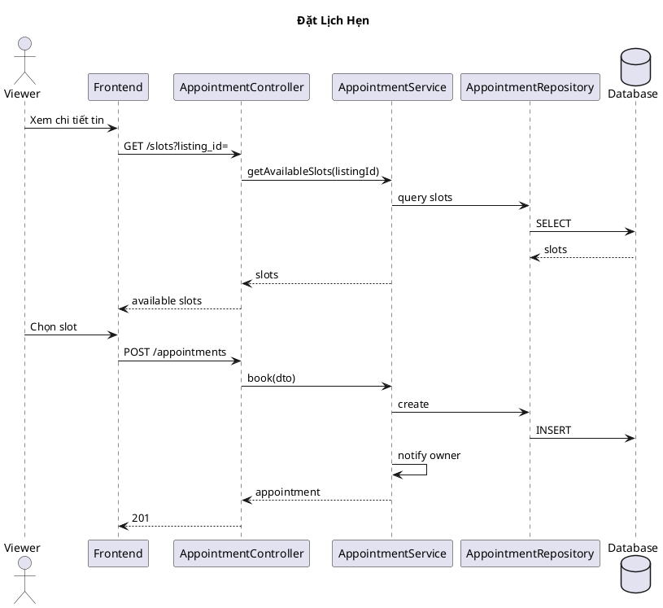

# Sequence Diagram - Đặt Lịch Hẹn

```plantuml
@startuml
title Đặt Lịch Hẹn

actor "Viewer" as Viewer
participant "Frontend" as FE
participant "AppointmentController" as Controller
participant "AppointmentService" as Service
participant "AppointmentRepository" as Repo
database "Database" as DB

Viewer -> FE: Xem chi tiết tin
FE -> Controller: GET /slots?listing_id=
Controller -> Service: getAvailableSlots(listingId)
Service -> Repo: query slots
Repo -> DB: SELECT
DB --> Repo: slots
Service --> Controller: slots
Controller --> FE: available slots
Viewer -> FE: Chọn slot
FE -> Controller: POST /appointments
Controller -> Service: book(dto)
Service -> Repo: create
Repo -> DB: INSERT
Service -> Service: notify owner
Service --> Controller: appointment
Controller --> FE: 201
@enduml
```

**3-layer:** Controller -> Service -> Repository -> DB.
