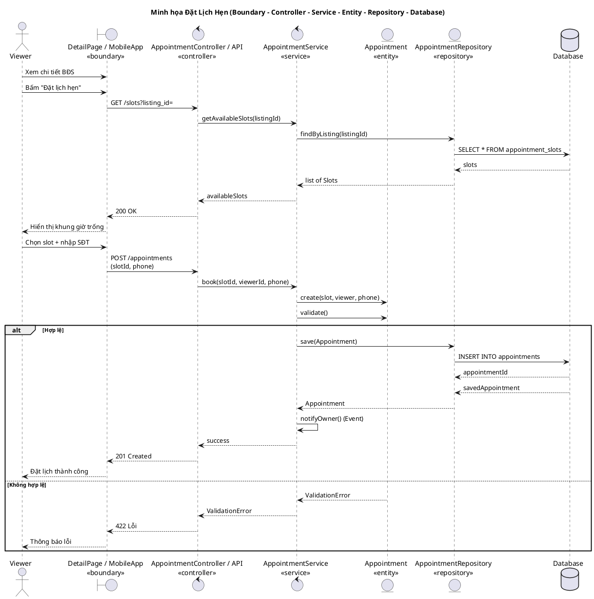

# Sequence Diagram - Đặt Lịch Hẹn

```plantuml
@startuml
title Minh họa Đặt Lịch Hẹn (Boundary - Controller - Service - Entity - Repository - Database)

actor "Viewer" as Viewer
boundary "DetailPage / MobileApp\n«boundary»" as FE
control "AppointmentController / API\n«controller»" as Controller
control "AppointmentService\n«service»" as Service
entity "Appointment\n«entity»" as Entity
entity "AppointmentRepository\n«repository»" as Repo
database "Database" as DB

Viewer -> FE: Xem chi tiết BĐS
Viewer -> FE: Bấm "Đặt lịch hẹn"
FE -> Controller: GET /slots?listing_id=
Controller -> Service: getAvailableSlots(listingId)
Service -> Repo: findByListing(listingId)
Repo -> DB: SELECT * FROM appointment_slots
DB --> Repo: slots
Repo --> Service: list of Slots
Service --> Controller: availableSlots
Controller --> FE: 200 OK
FE --> Viewer: Hiển thị khung giờ trống
Viewer -> FE: Chọn slot + nhập SĐT
FE -> Controller: POST /appointments\n(slotId, phone)
Controller -> Service: book(slotId, viewerId, phone)
Service -> Entity: create(slot, viewer, phone)
Service -> Entity: validate()

alt Hợp lệ
  Service -> Repo: save(Appointment)
  Repo -> DB: INSERT INTO appointments
  DB --> Repo: appointmentId
  DB --> Repo: savedAppointment
  Repo --> Service: Appointment
  Service -> Service: notifyOwner() (Event)
  Service --> Controller: success
  Controller --> FE: 201 Created
  FE --> Viewer: Đặt lịch thành công
else Không hợp lệ
  Entity --> Service: ValidationError
  Service --> Controller: ValidationError
  Controller --> FE: 422 Lỗi
  FE --> Viewer: Thông báo lỗi
end
@enduml
```
