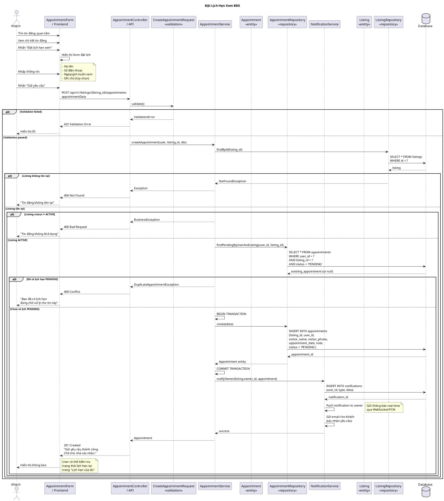

# Sequence Diagram - Đặt Lịch Hẹn



## Giải Thích

**Quy trình đặt lịch hẹn xem BĐS:**

### 1. Frontend → Controller (POST /api/v1/listings/{listing_id}/appointments)
**Khách nhập thông tin:**
- **Họ tên**: visitor_name
- **Số điện thoại**: visitor_phone (format: 03/05/07/08/09 + 8 số)
- **Ngày/giờ**: appointment_date (phải sau thời điểm hiện tại)
- **Ghi chú**: note (tùy chọn, max 500 ký tự)

### 2. Validation (CreateAppointmentRequest)
- **visitor_name**: required, max 100 ký tự
- **visitor_phone**: required, regex `/^(03|05|07|08|09)\d{8}$/`
- **appointment_date**: required, datetime, after:now (không được chọn quá khứ)
- **note**: nullable, max 500 ký tự

### 3. Business Logic Checks

**a) Check Listing tồn tại:**
```sql
SELECT * FROM listings WHERE id = ?
```

**b) Check Listing status = ACTIVE:**
- Chỉ tin đăng đang ACTIVE mới nhận lịch hẹn
- DRAFT/PENDING/REJECTED/LOCKED/UNLISTED → Từ chối

**c) Check trùng lịch:**
```sql
SELECT * FROM appointments 
WHERE user_id = ? 
  AND listing_id = ? 
  AND status = 'PENDING'
```
- Mỗi user chỉ được có **1 lịch hẹn PENDING** cho cùng 1 tin đăng
- Nếu muốn đặt lại → Phải hủy lịch cũ trước

### 4. Create Appointment
```sql
INSERT INTO appointments (
  listing_id, 
  user_id, 
  visitor_name, 
  visitor_phone, 
  appointment_date, 
  note, 
  status,
  created_at
) VALUES (?, ?, ?, ?, ?, ?, 'PENDING', NOW())
```

**Initial status**: `PENDING` (chờ chủ nhà xử lý)

### 5. Notifications

**a) Thông báo cho chủ nhà:**
```sql
INSERT INTO notifications (
  user_id,          -- owner_id của listing
  type,             -- 'NEW_APPOINTMENT'
  data,             -- JSON: {listing_id, appointment_id, visitor_name}
  is_read,          -- false
  created_at
) VALUES (?, 'NEW_APPOINTMENT', ?, false, NOW())
```
- **Push notification**: Gửi real-time qua WebSocket hoặc Firebase Cloud Messaging (FCM)
- **Email notification**: Gửi email cho chủ nhà với thông tin lịch hẹn

**b) Email xác nhận cho khách:**
- Subject: "Yêu cầu lịch hẹn đã được gửi"
- Body: Thông tin tin đăng, ngày giờ hẹn, thông báo chờ xác nhận

### 6. Response
- **201 Created** + AppointmentResource
- Message: "Gửi yêu cầu thành công. Chờ chủ nhà xác nhận."

### 7. Status Flow
```
PENDING  →  CONFIRMED  (chủ nhà xác nhận)
         →  REJECTED   (chủ nhà từ chối)
         →  CANCELLED  (khách hủy)
         →  COMPLETED  (đã xem xong)
```

**Lưu ý:**
- **Duplicate prevention**: Mỗi user chỉ 1 lịch PENDING/tin đăng
- **Real-time notification**: Chủ nhà nhận thông báo ngay lập tức
- **Email confirmation**: Khách nhận email xác nhận đã gửi yêu cầu
- **Status tracking**: User có thể kiểm tra trạng thái lịch hẹn tại "Lịch hẹn của tôi"

---

**Cách xem diagram**: Copy code PlantUML vào https://www.plantuml.com/plantuml/uml/
