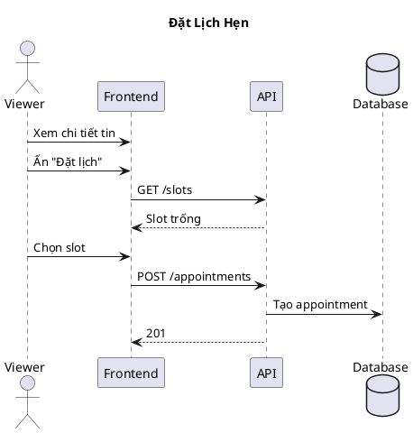

# Sequence Diagram - Đặt Lịch Hẹn

```plantuml
@startuml
title Đặt Lịch Hẹn

actor "Viewer" as Viewer
participant "Frontend" as FE
participant "API" as API
database "Database" as DB

Viewer -> FE: Xem chi tiết tin
Viewer -> FE: Ấn "Đặt lịch"
FE -> API: GET /slots
API --> FE: Slot trống
Viewer -> FE: Chọn slot
FE -> API: POST /appointments
API -> DB: Tạo appointment
API --> FE: 201
@enduml
```

**Luồng:** Xem slot → Chọn → Đặt.
