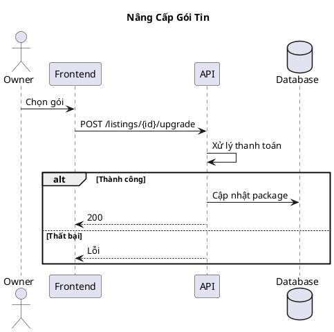

# Sequence Diagram - Nâng Cấp Gói Tin

```plantuml
@startuml
title Nâng Cấp Gói Tin

actor "Owner" as Owner
participant "Frontend" as FE
participant "API" as API
database "Database" as DB

Owner -> FE: Chọn gói
FE -> API: POST /listings/{id}/upgrade
API -> API: Xử lý thanh toán
alt Thành công
  API -> DB: Cập nhật package
  API --> FE: 200
else Thất bại
  API --> FE: Lỗi
end
@enduml
```

**Luồng:** Chọn gói → Thanh toán → Cập nhật.
