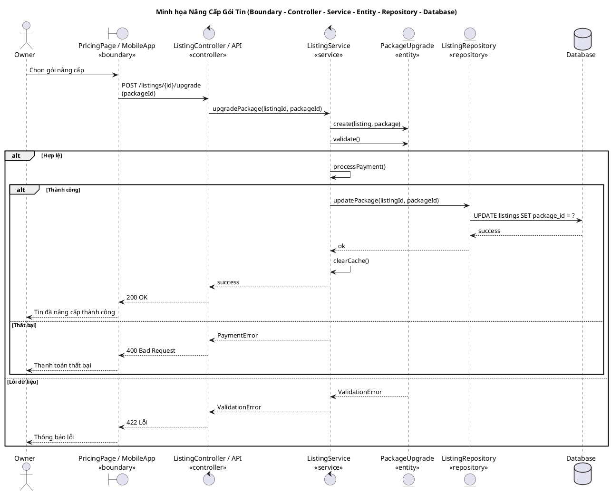

# Sequence Diagram - Nâng Cấp Gói Tin

```plantuml
@startuml
title Minh họa Nâng Cấp Gói Tin (Boundary - Controller - Service - Entity - Repository - Database)

actor "Owner" as Owner
boundary "PricingPage / MobileApp\n«boundary»" as FE
control "ListingController / API\n«controller»" as Controller
control "ListingService\n«service»" as Service
entity "PackageUpgrade\n«entity»" as Entity
entity "ListingRepository\n«repository»" as Repo
database "Database" as DB

Owner -> FE: Chọn gói nâng cấp
FE -> Controller: POST /listings/{id}/upgrade\n(packageId)
Controller -> Service: upgradePackage(listingId, packageId)
Service -> Entity: create(listing, package)
Service -> Entity: validate()
alt Hợp lệ
  Service -> Service: processPayment()
  alt Thành công
    Service -> Repo: updatePackage(listingId, packageId)
    Repo -> DB: UPDATE listings SET package_id = ?
    DB --> Repo: success
    Repo --> Service: ok
    Service -> Service: clearCache()
    Service --> Controller: success
    Controller --> FE: 200 OK
    FE --> Owner: Tin đã nâng cấp thành công
  else Thất bại
    Service --> Controller: PaymentError
    Controller --> FE: 400 Bad Request
    FE --> Owner: Thanh toán thất bại
  end
else Lỗi dữ liệu
  Entity --> Service: ValidationError
  Service --> Controller: ValidationError
  Controller --> FE: 422 Lỗi
  FE --> Owner: Thông báo lỗi
end
@enduml
```
