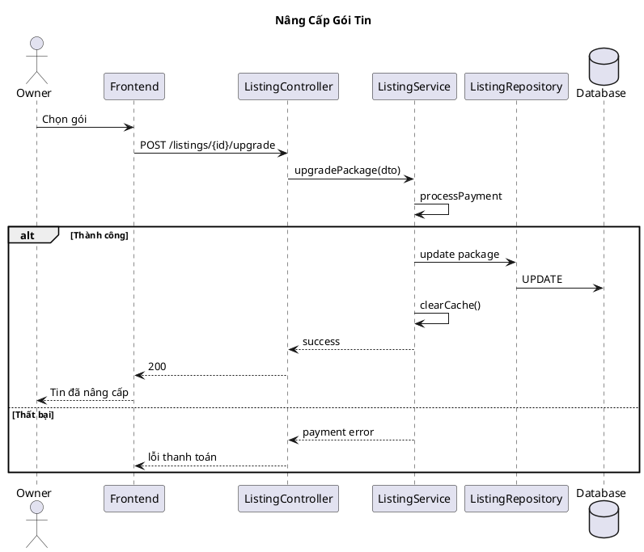

# Sequence Diagram - Nâng Cấp Gói Tin

```plantuml
@startuml
title Nâng Cấp Gói Tin

actor "Owner" as Owner
participant "Frontend" as FE
participant "ListingController" as Controller
participant "ListingService" as Service
participant "ListingRepository" as Repo
database "Database" as DB

Owner -> FE: Chọn gói
FE -> Controller: POST /listings/{id}/upgrade
Controller -> Service: upgradePackage(dto)
Service -> Service: processPayment
alt Thành công
  Service -> Repo: update package
  Repo -> DB: UPDATE
  Service -> Service: clearCache()
  Service --> Controller: success
  Controller --> FE: 200
  FE --> Owner: Tin đã nâng cấp
else Thất bại
  Service --> Controller: payment error
  Controller --> FE: lỗi thanh toán
end
@enduml
```

**3-layer:** Controller -> Service -> Repository -> DB.
