# Sequence Diagram - Nâng Cấp Gói Tin

```plantuml
@startuml

title Nâng Cấp Gói Tin

actor "Owner" as Owner
participant "UpgradePackage\n/ Frontend" as FE
participant "ListingUpgradeController\n/ API" as Controller
participant "UpgradeListingRequest\n«validation»" as Validation
participant "ListingService" as ListingService
participant "UpgradeEligibilityPolicy" as EligibilityPolicy
participant "CreateUpgradePaymentCommand" as PaymentCmd
participant "UpgradeListingCommand" as UpgradeCmd
participant "UpgradeContext" as UpgradeCtx
participant "Listing / Package\n«entity»" as Entity
participant "ListingRepository\n«repository»" as ListingRepo
participant "TransactionRepository\n«repository»" as TransactionRepo
database "Database" as DB

Owner -> FE: Truy cập tin đăng của mình
Owner -> FE: Nhấn "Nâng cấp gói"

FE -> Controller: GET /api/v1/listings/{id}/upgrade/options

Controller -> ListingRepo: findById(listing_id)
ListingRepo -> DB: SELECT * FROM listings WHERE id = ?
DB --> ListingRepo: listing

Controller -> DB: SELECT * FROM packages\nWHERE is_active = true\nORDER BY priority
DB --> Controller: packages[]

Controller -> DB: SELECT * FROM package_pricings\nWHERE package_id IN (...)\nAND is_active = true
DB --> Controller: pricings[]

Controller --> FE: 200 OK\n{packages[], current_package, pricings[]}
FE --> Owner: Hiển thị các gói:
note right
  - Gói Tiêu chuẩn (7/15/30 ngày)
  - Gói Nổi bật (7/15/30 ngày)
  - Gói VIP (7/15/30 ngày)
end note

Owner -> FE: Chọn gói và thời hạn
note right
  VD: Gói VIP - 30 ngày
  Giá: 500,000 VND
end note

Owner -> FE: Nhấn "Thanh toán"

FE -> Controller: POST /api/v1/listings/{id}/upgrade\n{package_id, duration_days}

Controller -> Validation: validate()

alt Validation failed
    Validation --> Controller: ValidationError
    Controller --> FE: 422 Validation Error
    FE --> Owner: Hiển thị lỗi
else Validation passed
    
    Controller -> ListingService: upgradeListing(user, listing_id,\npackage_id, duration_days)
    
    ListingService -> ListingService: prepareUpgrade(user, listing_id,\npackage_id, duration_days)
    
    ListingService -> ListingRepo: findById(listing_id)
    ListingRepo -> DB: SELECT * FROM listings WHERE id = ?
    DB --> ListingRepo: listing
    
    alt Listing không tồn tại
        ListingRepo --> ListingService: NotFoundException
        ListingService --> Controller: Exception
        Controller --> FE: 404 Not Found
        FE --> Owner: "Tin đăng không tồn tại"
    else Listing tồn tại
        
        ListingService -> ListingService: Check ownership\n(listing.owner_id = user.id)
        
        alt User không sở hữu
            ListingService --> Controller: ForbiddenException
            Controller --> FE: 403 Forbidden
            FE --> Owner: "Không có quyền"
        else User sở hữu
            
            alt Listing status != ACTIVE
                ListingService --> Controller: BusinessException
                Controller --> FE: 400 Bad Request
                FE --> Owner: "Chỉ tin ACTIVE\nmới được nâng cấp"
            else Listing ACTIVE
                
                ListingService -> DB: SELECT * FROM packages\nWHERE id = ?
                DB --> ListingService: new_package
                
                alt Package không tồn tại
                    ListingService --> Controller: NotFoundException
                    Controller --> FE: 404 Not Found
                    FE --> Owner: "Gói không tồn tại"
                else Package tồn tại
                    
                    ListingService -> DB: SELECT * FROM package_pricings\nWHERE package_id = ?\nAND duration_days = ?\nAND is_active = true
                    DB --> ListingService: pricing
                    
                    alt Pricing không tồn tại
                        ListingService --> Controller: NotFoundException
                        Controller --> FE: 404 Not Found
                        FE --> Owner: "Gói với thời hạn này\nkhông tồn tại"
                    else Pricing hợp lệ
                        
                        ListingService -> DB: SELECT * FROM packages\nWHERE id = listing.package_id
                        DB --> ListingService: current_package (or null)
                        
                        ListingService -> UpgradeCtx: new UpgradeContext(user,\nlisting, new_package, pricing,\nduration_days, current_package)
                        
                        ListingService -> EligibilityPolicy: assertEligible(context)
                        
                        EligibilityPolicy -> EligibilityPolicy: Check điều kiện nâng cấp
                        
                        alt Đang có gói cao hơn
                            note right
                              Chỉ được nâng cấp lên gói
                              cao hơn, không được hạ cấp
                            end note
                            EligibilityPolicy --> ListingService: UpgradeNotAllowedException
                            ListingService --> Controller: Exception
                            Controller --> FE: 400 Bad Request
                            FE --> Owner: "Không thể hạ cấp.\nGói hiện tại cao hơn."
                        else Điều kiện hợp lệ
                            
                            note over ListingService
                              === SIMULATED PAYMENT ===
                              (Production: redirect to VNPay)
                            end note
                            
                            ListingService -> TransactionRepo: create(data)
                            TransactionRepo -> DB: INSERT INTO transactions\n(user_id, listing_id, package_id,\namount, duration_days,\npayment_method = 'SIMULATED',\nstatus = 'SUCCESS',\ntransaction_date = NOW())
                            DB --> TransactionRepo: transaction_id
                            TransactionRepo --> ListingService: Transaction
                            
                            ListingService -> UpgradeCmd: execute(transaction,\nlisting, new_package, context)
                            
                            UpgradeCmd -> UpgradeCmd: BEGIN TRANSACTION
                            
                            UpgradeCmd -> UpgradeCmd: Calculate new expiry date
                            
                            alt Listing đã có gói chưa hết hạn
                                UpgradeCmd -> UpgradeCmd: new_expires_at =\nMAX(listing.package_expires_at, NOW())\n+ duration_days
                                note right
                                  Gia hạn:
                                  Cộng thêm vào thời gian còn lại
                                  
                                  VD: Còn 5 ngày + mua thêm 30 ngày
                                  = 35 ngày từ hôm nay
                                end note
                            else Chưa có gói hoặc đã hết hạn
                                UpgradeCmd -> UpgradeCmd: new_expires_at =\nNOW() + duration_days
                            end
                            
                            UpgradeCmd -> ListingRepo: update(listing_id, data)
                            ListingRepo -> DB: UPDATE listings SET\npackage_id = ?,\npackage_expires_at = ?,\nupdated_at = NOW()
                            DB --> ListingRepo: affected rows
                            
                            UpgradeCmd -> UpgradeCmd: Dispatch\nListingPackageUpgraded event
                            
                            UpgradeCmd -> UpgradeCmd: COMMIT TRANSACTION
                            
                            UpgradeCmd -> UpgradeCmd: Log package upgrade
                            
                            UpgradeCmd --> ListingService: Listing updated
                            
                            ListingService -> ListingService: clearPublicListingsCache()
                            
                            ListingService --> Controller: Listing
                            
                            Controller --> FE: 200 OK + ListingResource\n"Nâng cấp gói thành công!"
                            FE --> Owner: Hiển thị thông báo
                            
                            note right
                              Tin đăng được:
                              - Ưu tiên hiển thị cao hơn
                              - Xuất hiện ở vị trí đầu
                              - Có badge gói VIP/Nổi bật
                            end note
                        end
                    end
                end
            end
        end
    end
end

@enduml
```



## Giải Thích

**Quy trình nâng cấp gói tin:**

### 1. Xem các gói có sẵn
**Endpoint**: GET /api/v1/listings/{id}/upgrade/options

**Response:**
```json
{
  "current_package": {
    "id": 1,
    "name": "Gói Tiêu chuẩn",
    "expires_at": "2026-07-15T10:00:00Z"
  },
  "packages": [
    {
      "id": 2,
      "name": "Gói Nổi bật",
      "priority": 2,
      "features": ["Ưu tiên hiển thị", "Badge Nổi bật"],
      "pricings": [
        {"duration_days": 7, "price": 200000},
        {"duration_days": 15, "price": 350000},
        {"duration_days": 30, "price": 600000}
      ]
    },
    {
      "id": 3,
      "name": "Gói VIP",
      "priority": 3,
      "features": ["Top đầu trang", "Badge VIP", "Làm nổi"],
      "pricings": [
        {"duration_days": 7, "price": 350000},
        {"duration_days": 15, "price": 650000},
        {"duration_days": 30, "price": 1000000}
      ]
    }
  ]
}
```

### 2. Điều kiện nâng cấp

**UpgradeEligibilityPolicy checks:**

```
1. Listing MUST be ACTIVE
   - DRAFT/PENDING/REJECTED/LOCKED → Reject

2. Cannot downgrade
   - Current: VIP (priority 3)
   - New: Nổi bật (priority 2) → REJECT
   - Current: Nổi bật (priority 2)
   - New: VIP (priority 3) → OK

3. Can upgrade to SAME package (gia hạn)
   - Current: VIP
   - New: VIP → OK (extend expiry)
```

### 3. Tính toán thời hạn mới

**Logic:**

```javascript
if (listing.package_expires_at && listing.package_expires_at > NOW()) {
  // Còn thời gian → Cộng thêm
  new_expires_at = MAX(listing.package_expires_at, NOW()) + duration_days
} else {
  // Hết hạn hoặc chưa có gói → Tính từ hôm nay
  new_expires_at = NOW() + duration_days
}
```

**Ví dụ:**
```
Hôm nay: 2026-06-26
Gói hiện tại hết hạn: 2026-07-01 (còn 5 ngày)
Mua thêm: 30 ngày

new_expires_at = 2026-07-01 + 30 ngày = 2026-07-31
→ Tổng cộng được dùng: 5 + 30 = 35 ngày từ hôm nay
```

### 4. Database Update

```sql
-- Update listing
UPDATE listings 
SET package_id = ?,
    package_expires_at = ?,
    updated_at = NOW()
WHERE id = ?

-- Create transaction
INSERT INTO transactions (
  user_id, listing_id, package_id,
  amount, duration_days,
  payment_method, status,
  transaction_date
) VALUES (?, ?, ?, ?, ?, 'SIMULATED', 'SUCCESS', NOW())
```

### 5. Benefits của các gói

**Gói Tiêu chuẩn (FREE):**
- Hiển thị bình thường
- Không badge
- Priority: 1

**Gói Nổi bật:**
- Ưu tiên hiển thị cao hơn
- Badge "Nổi bật"
- Priority: 2
- Giá: 200k-600k

**Gói VIP:**
- Top đầu trang chủ
- Badge "VIP"
- Làm nổi (highlight)
- Priority: 3
- Giá: 350k-1tr

### Upgrade Flow

```
FREE → Nổi bật ✅
FREE → VIP ✅
Nổi bật → VIP ✅
Nổi bật → Nổi bật ✅ (gia hạn)
VIP → VIP ✅ (gia hạn)
VIP → Nổi bật ❌ (hạ cấp)
VIP → FREE ❌ (hạ cấp)
```

**Auto-expiry:**
- Khi hết hạn → package_id giữ nguyên, nhưng không còn benefits
- Cron job daily check `package_expires_at < NOW()` → notification

**Note:** Diagram này focus vào **logic nâng cấp**. Payment flow chi tiết (VNPay) đã được cover trong [sequence-diagram-thanh-toan.md](sequence-diagram-thanh-toan.md).

---

**Cách xem diagram**: Copy code PlantUML vào https://www.plantuml.com/plantuml/uml/
