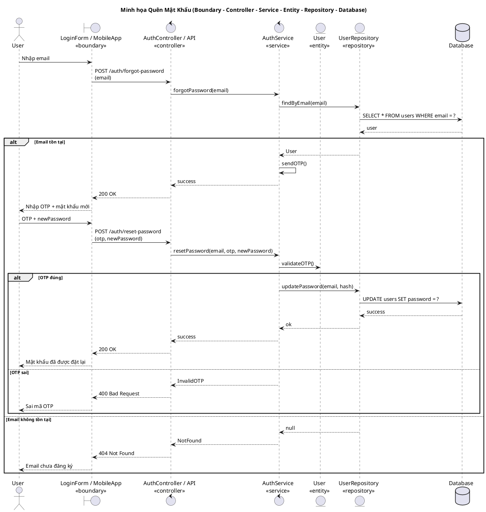

# Sequence Diagram - Quên Mật Khẩu

```plantuml
@startuml
title Minh họa Quên Mật Khẩu (Boundary - Controller - Service - Entity - Repository - Database)

actor "User" as User
boundary "LoginForm / MobileApp\n«boundary»" as FE
control "AuthController / API\n«controller»" as Controller
control "AuthService\n«service»" as Service
entity "User\n«entity»" as Entity
entity "UserRepository\n«repository»" as Repo
database "Database" as DB

User -> FE: Nhập email
FE -> Controller: POST /auth/forgot-password\n(email)
Controller -> Service: forgotPassword(email)
Service -> Repo: findByEmail(email)
Repo -> DB: SELECT * FROM users WHERE email = ?
DB --> Repo: user
alt Email tồn tại
  Repo --> Service: User
  Service -> Service: sendOTP()
  Service --> Controller: success
  Controller --> FE: 200 OK
  FE --> User: Nhập OTP + mật khẩu mới
  User -> FE: OTP + newPassword
  FE -> Controller: POST /auth/reset-password\n(otp, newPassword)
  Controller -> Service: resetPassword(email, otp, newPassword)
  Service -> Entity: validateOTP()
  alt OTP đúng
    Service -> Repo: updatePassword(email, hash)
    Repo -> DB: UPDATE users SET password = ?
    DB --> Repo: success
    Repo --> Service: ok
    Service --> Controller: success
    Controller --> FE: 200 OK
    FE --> User: Mật khẩu đã được đặt lại
  else OTP sai
    Service --> Controller: InvalidOTP
    Controller --> FE: 400 Bad Request
    FE --> User: Sai mã OTP
  end
else Email không tồn tại
  Repo --> Service: null
  Service --> Controller: NotFound
  Controller --> FE: 404 Not Found
  FE --> User: Email chưa đăng ký
end
@enduml
```
