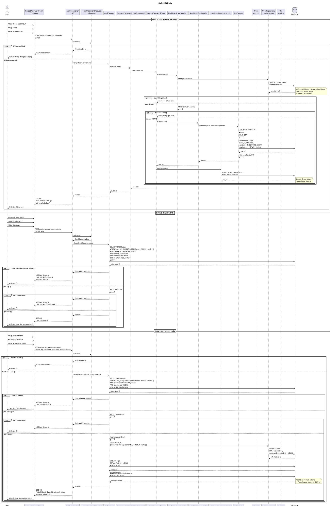

# Sequence Diagram - Quên Mật Khẩu

## Giải Thích

**Quy trình reset mật khẩu gồm 3 bước:**

### Bước 1: Yêu cầu reset (POST /api/v1/auth/forgot-password)
1. **Frontend → Controller**: Gửi {email}
2. **AuthService → ForgotPasswordChain**:
   - **FindResetUserHandler**: Tìm user, check status = ACTIVE
   - **SendResetOtpHandler**: Tạo OTP, gửi email
   - **LogResetAttemptHandler**: Log attempt để detect abuse
3. **Security**: Luôn trả về success dù email có tồn tại hay không (không tiết lộ thông tin)
4. **Response**: 200 OK "Mã OTP đã được gửi"

### Bước 2: Kiểm tra OTP (POST /api/v1/auth/check-reset-otp)
1. **Frontend → Controller**: Gửi {email, otp}
2. **AuthService**: 
   - Tìm OTP trong DB (context = PASSWORD_RESET, chưa hết hạn, chưa dùng)
   - Verify hash OTP
3. **Nếu đúng**: Response 200 OK "Mã OTP hợp lệ"
4. **Frontend**: Hiển thị form nhập password mới

### Bước 3: Reset password (POST /api/v1/auth/reset-password)
1. **Frontend → Controller**: Gửi {email, otp, password, password_confirmation}
2. **Validation**: Password >= 8 ký tự, password khớp với confirmation
3. **AuthService**:
   - Verify OTP lần nữa (đảm bảo không hết hạn giữa chừng)
   - Hash password mới
   - Update users.password
   - Đánh dấu OTP đã verify
   - **Xóa tất cả refresh_tokens** → Force logout khỏi mọi thiết bị
4. **Response**: 200 OK "Đặt lại thành công"
5. **Frontend**: Chuyển đến trang đăng nhập

**Security Features:**
- **Email enumeration prevention**: Không tiết lộ email có tồn tại hay không
- **OTP expiry**: 5 phút
- **One-time use**: OTP chỉ dùng được 1 lần
- **Double verification**: Verify OTP ở cả bước 2 và bước 3
- **Session revocation**: Force logout tất cả devices sau reset
- **Attempt logging**: Track để detect brute force
- **Context isolation**: OTP PASSWORD_RESET khác với REGISTER

---

**Cách xem diagram**: Copy code PlantUML vào https://www.plantuml.com/plantuml/uml/
