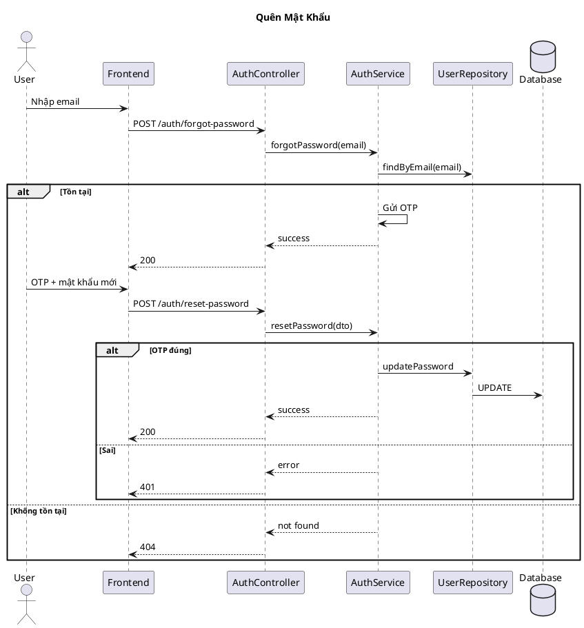

# Sequence Diagram - Quên Mật Khẩu

```plantuml
@startuml
title Quên Mật Khẩu

actor "User" as User
participant "Frontend" as FE
participant "AuthController" as Controller
participant "AuthService" as Service
participant "UserRepository" as Repo
database "Database" as DB

User -> FE: Nhập email
FE -> Controller: POST /auth/forgot-password
Controller -> Service: forgotPassword(email)
Service -> Repo: findByEmail(email)
alt Tồn tại
  Service -> Service: Gửi OTP
  Service --> Controller: success
  Controller --> FE: 200
  User -> FE: OTP + mật khẩu mới
  FE -> Controller: POST /auth/reset-password
  Controller -> Service: resetPassword(dto)
  alt OTP đúng
    Service -> Repo: updatePassword
    Repo -> DB: UPDATE
    Service --> Controller: success
    Controller --> FE: 200
  else Sai
    Service --> Controller: error
    Controller --> FE: 401
  end
else Không tồn tại
  Service --> Controller: not found
  Controller --> FE: 404
end
@enduml
```

**3-layer:** Controller -> Service -> Repository -> DB.
