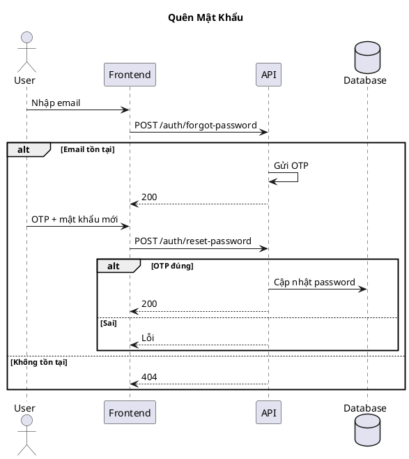

# Sequence Diagram - Quên Mật Khẩu

```plantuml
@startuml
title Quên Mật Khẩu

actor "User" as User
participant "Frontend" as FE
participant "API" as API
database "Database" as DB

User -> FE: Nhập email
FE -> API: POST /auth/forgot-password
alt Email tồn tại
  API -> API: Gửi OTP
  API --> FE: 200
  User -> FE: OTP + mật khẩu mới
  FE -> API: POST /auth/reset-password
  alt OTP đúng
    API -> DB: Cập nhật password
    API --> FE: 200
  else Sai
    API --> FE: Lỗi
  end
else Không tồn tại
  API --> FE: 404
end
@enduml
```

**Luồng:** Email → OTP → Reset password.
