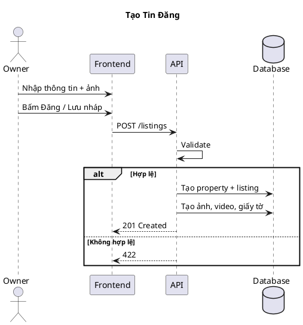

# Sequence Diagram - Tạo Tin Đăng

```plantuml
@startuml
title Tạo Tin Đăng

actor "Owner" as Owner
participant "Frontend" as FE
participant "API" as API
database "Database" as DB

Owner -> FE: Nhập thông tin + ảnh
Owner -> FE: Bấm Đăng / Lưu nháp
FE -> API: POST /listings
API -> API: Validate
alt Hợp lệ
  API -> DB: Tạo property + listing
  API -> DB: Tạo ảnh, video, giấy tờ
  API --> FE: 201 Created
else Không hợp lệ
  API --> FE: 422
end
@enduml
```

**Luồng:** Nhập → Validate → Tạo DB → 201.
