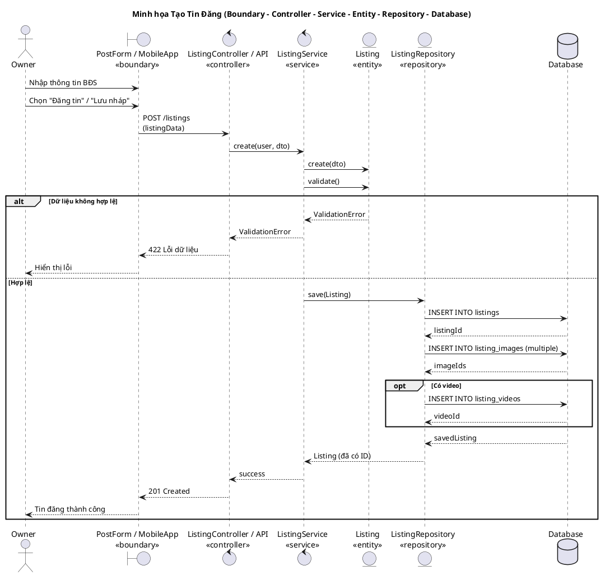

# Sequence Diagram - Tạo Tin Đăng

```plantuml
@startuml
title Minh họa Tạo Tin Đăng (Boundary - Controller - Service - Entity - Repository - Database)

actor "Owner" as Owner
boundary "PostForm / MobileApp\n«boundary»" as FE
control "ListingController / API\n«controller»" as Controller
control "ListingService\n«service»" as Service
entity "Listing\n«entity»" as ListingEntity
entity "ListingRepository\n«repository»" as Repo
database "Database" as DB

Owner -> FE: Nhập thông tin BĐS
Owner -> FE: Chọn "Đăng tin" / "Lưu nháp"
FE -> Controller: POST /listings\n(listingData)
Controller -> Service: create(user, dto)
Service -> ListingEntity: create(dto)
Service -> ListingEntity: validate()

alt Dữ liệu không hợp lệ
  ListingEntity --> Service: ValidationError
  Service --> Controller: ValidationError
  Controller --> FE: 422 Lỗi dữ liệu
  FE --> Owner: Hiển thị lỗi
else Hợp lệ
  Service -> Repo: save(Listing)
  Repo -> DB: INSERT INTO listings
  DB --> Repo: listingId
  Repo -> DB: INSERT INTO listing_images (multiple)
  DB --> Repo: imageIds
  opt Có video
    Repo -> DB: INSERT INTO listing_videos
    DB --> Repo: videoId
  end
  DB --> Repo: savedListing
  Repo --> Service: Listing (đã có ID)
  Service --> Controller: success
  Controller --> FE: 201 Created
  FE --> Owner: Tin đăng thành công
end
@enduml
```
