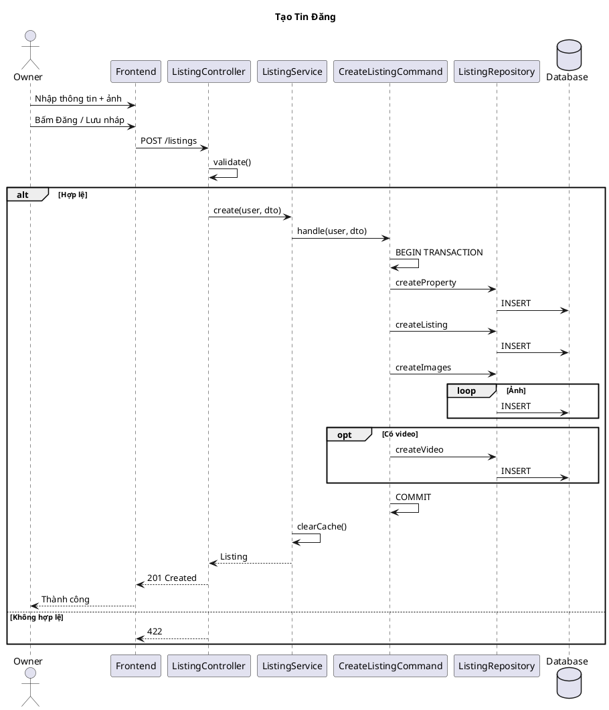

# Sequence Diagram - Tạo Tin Đăng

```plantuml
@startuml
title Tạo Tin Đăng

actor "Owner" as Owner
participant "Frontend" as FE
participant "ListingController" as Controller
participant "ListingService" as Service
participant "CreateListingCommand" as Cmd
participant "ListingRepository" as Repo
database "Database" as DB

Owner -> FE: Nhập thông tin + ảnh
Owner -> FE: Bấm Đăng / Lưu nháp
FE -> Controller: POST /listings
Controller -> Controller: validate()
alt Hợp lệ
  Controller -> Service: create(user, dto)
  Service -> Cmd: handle(user, dto)
  Cmd -> Cmd: BEGIN TRANSACTION
  Cmd -> Repo: createProperty
  Repo -> DB: INSERT
  Cmd -> Repo: createListing
  Repo -> DB: INSERT
  Cmd -> Repo: createImages
  loop Ảnh
    Repo -> DB: INSERT
  end
  opt Có video
    Cmd -> Repo: createVideo
    Repo -> DB: INSERT
  end
  Cmd -> Cmd: COMMIT
  Service -> Service: clearCache()
  Service --> Controller: Listing
  Controller --> FE: 201 Created
  FE --> Owner: Thành công
else Không hợp lệ
  Controller --> FE: 422
end
@enduml
```

**3-layer:** Controller -> Service -> Command -> Repository -> DB.
