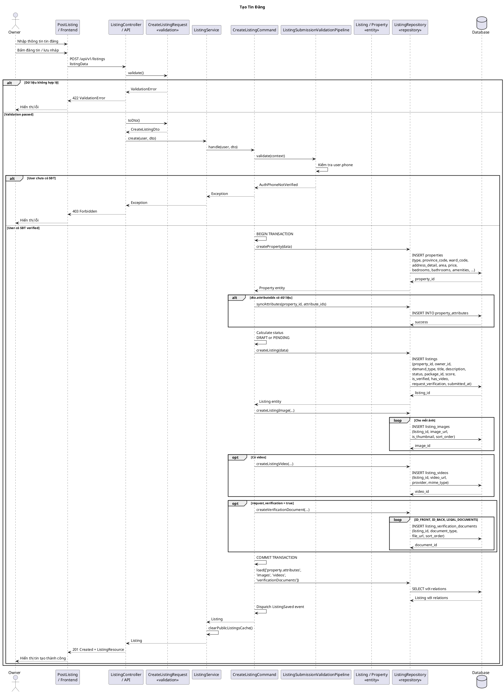

# Sequence Diagram - Tạo Tin Đăng



## Giải Thích

**Quy trình tạo tin đăng:**

### 1. Frontend → Controller (POST /api/v1/listings)
- Owner nhập thông tin: tiêu đề, mô tả, loại BĐS, địa chỉ, diện tích, giá, hình ảnh, video, giấy tờ xác thực
- Owner chọn: "Lưu nháp" (save_as_draft = true) hoặc "Đăng tin" (save_as_draft = false)

### 2. Validation (CreateListingRequest)
- **Nếu lưu nháp**: Validation lỏng lẻo (nhiều trường nullable)
- **Nếu đăng tin**: Validation nghiêm ngặt:
  - Tiêu đề bắt buộc (max 120 ký tự)
  - Mô tả >= 20 ký tự
  - Ít nhất 1 ảnh (max 10)
  - Giá > 0 (nếu không thương lượng)
  - Thông tin liên hệ đầy đủ

### 3. Service Layer
**ListingService → CreateListingCommand → ValidationPipeline:**
- **UserPhoneVerifiedHandler**: Kiểm tra user đã verify SĐT chưa (bắt buộc để đăng tin)
- **VerificationDocumentsHandler**: Validate giấy tờ xác thực (nếu có)

### 4. Database Transaction (Atomic)
Tất cả thao tác trong 1 transaction:

**a) Tạo Property:**
```sql
INSERT INTO properties (type, province_code, ward_code, street_code, 
  address_detail, area, price, is_negotiable, bedrooms, bathrooms, 
  floors, amenities, legal_paper_types, contact_name, contact_phone, ...)
```

**b) Sync Attributes:**
```sql
INSERT INTO property_attributes (property_id, attribute_id)
```

**c) Tạo Listing:**
```sql
INSERT INTO listings (property_id, owner_id, demand_type, title, 
  description, status, package_id, score, is_verified, has_video, 
  request_verification, submitted_at)
```
- **status**: DRAFT (nếu lưu nháp) hoặc PENDING (nếu gửi duyệt)
- **score**: Tính toán dựa trên độ đầy đủ thông tin (0-100)
- **is_verified**: PENDING_VERIFICATION (nếu có đủ giấy tờ) hoặc NOT_VERIFIED

**d) Tạo Images:**
```sql
INSERT INTO listing_images (listing_id, image_url, is_thumbnail, sort_order)
```
- Ảnh đầu tiên: `is_thumbnail = true`

**e) Tạo Video (optional):**
```sql
INSERT INTO listing_videos (listing_id, video_url, provider, mime_type)
```

**f) Tạo Verification Documents (optional):**
```sql
INSERT INTO listing_verification_documents 
  (listing_id, document_type, file_url, sort_order)
```
- `document_type`: ID_FRONT, ID_BACK, LEGAL_DOCUMENT

### 5. Post-processing
- **Load relations**: property.attributes, images, videos, verificationDocuments
- **Dispatch event**: `ListingSaved` (listeners: CreateListingNotification, LogListingSaved, ClearPublicListingCache)
- **Clear cache**: Xóa cache tin đăng công khai

### 6. Response
- **201 Created** + ListingResource
- Message: 
  - "Lưu tin nháp thành công" (nếu DRAFT)
  - "Tạo tin đăng thành công. Tin đăng đang chờ duyệt." (nếu PENDING)

---

**Cách xem diagram**: Copy code PlantUML vào https://www.plantuml.com/plantuml/uml/
