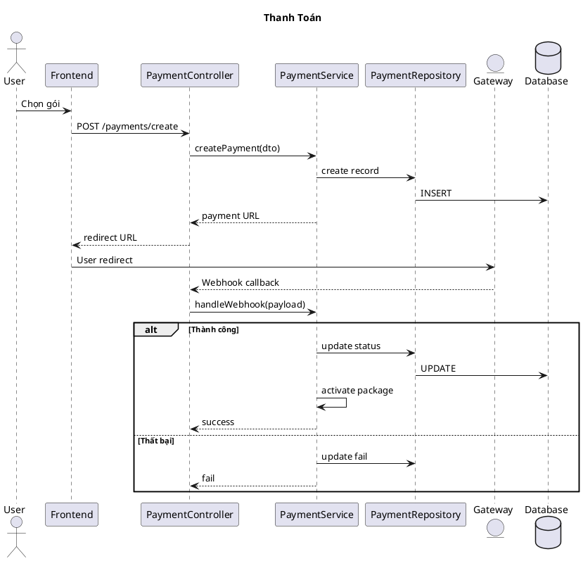

# Sequence Diagram - Thanh Toán

```plantuml
@startuml
title Thanh Toán

actor "User" as User
participant "Frontend" as FE
participant "PaymentController" as Controller
participant "PaymentService" as Service
participant "PaymentRepository" as Repo
entity "Gateway" as GW
database "Database" as DB

User -> FE: Chọn gói
FE -> Controller: POST /payments/create
Controller -> Service: createPayment(dto)
Service -> Repo: create record
Repo -> DB: INSERT
Service --> Controller: payment URL
Controller --> FE: redirect URL
FE -> GW: User redirect
GW --> Controller: Webhook callback
Controller -> Service: handleWebhook(payload)
alt Thành công
  Service -> Repo: update status
  Repo -> DB: UPDATE
  Service -> Service: activate package
  Service --> Controller: success
else Thất bại
  Service -> Repo: update fail
  Service --> Controller: fail
end
@enduml
```

**3-layer:** Controller -> Service -> Repository -> DB + Gateway webhook.
