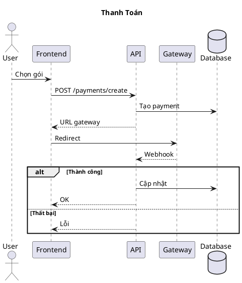

# Sequence Diagram - Thanh Toán

```plantuml
@startuml
title Thanh Toán

actor "User" as User
participant "Frontend" as FE
participant "API" as API
participant "Gateway" as GW
database "Database" as DB

User -> FE: Chọn gói
FE -> API: POST /payments/create
API -> DB: Tạo payment
API --> FE: URL gateway
FE -> GW: Redirect
GW --> API: Webhook
alt Thành công
  API -> DB: Cập nhật
  API --> FE: OK
else Thất bại
  API --> FE: Lỗi
end
@enduml
```

**Luồng:** Tạo payment → Gateway → Webhook.
