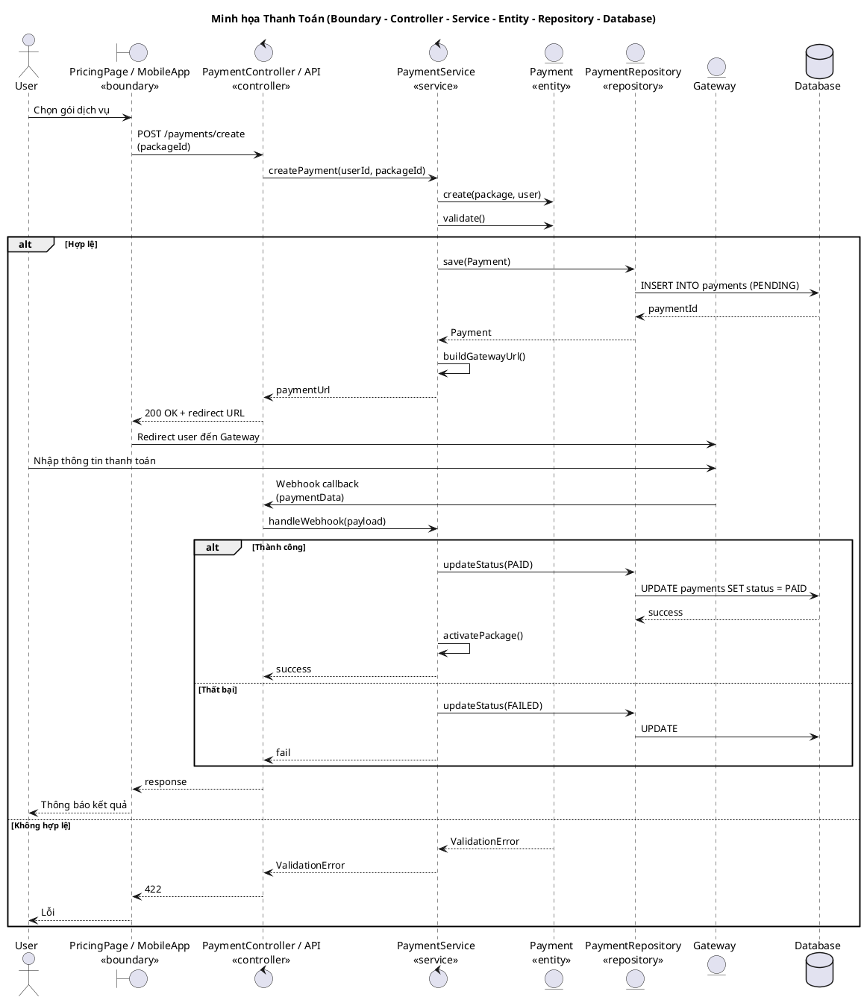

# Sequence Diagram - Thanh Toán

```plantuml
@startuml
title Minh họa Thanh Toán (Boundary - Controller - Service - Entity - Repository - Database)

actor "User" as User
boundary "PricingPage / MobileApp\n«boundary»" as FE
control "PaymentController / API\n«controller»" as Controller
control "PaymentService\n«service»" as Service
entity "Payment\n«entity»" as PaymentEntity
entity "PaymentRepository\n«repository»" as Repo
entity "Gateway" as Gateway
database "Database" as DB

User -> FE: Chọn gói dịch vụ
FE -> Controller: POST /payments/create\n(packageId)
Controller -> Service: createPayment(userId, packageId)
Service -> PaymentEntity: create(package, user)
Service -> PaymentEntity: validate()
alt Hợp lệ
  Service -> Repo: save(Payment)
  Repo -> DB: INSERT INTO payments (PENDING)
  DB --> Repo: paymentId
  Repo --> Service: Payment
  Service -> Service: buildGatewayUrl()
  Service --> Controller: paymentUrl
  Controller --> FE: 200 OK + redirect URL
  FE -> Gateway: Redirect user đến Gateway
  User -> Gateway: Nhập thông tin thanh toán
  Gateway -> Controller: Webhook callback\n(paymentData)
  Controller -> Service: handleWebhook(payload)
  alt Thành công
    Service -> Repo: updateStatus(PAID)
    Repo -> DB: UPDATE payments SET status = PAID
    DB --> Repo: success
    Service -> Service: activatePackage()
    Service --> Controller: success
  else Thất bại
    Service -> Repo: updateStatus(FAILED)
    Repo -> DB: UPDATE
    Service --> Controller: fail
  end
  Controller --> FE: response
  FE --> User: Thông báo kết quả
else Không hợp lệ
  PaymentEntity --> Service: ValidationError
  Service --> Controller: ValidationError
  Controller --> FE: 422
  FE --> User: Lỗi
end
@enduml
```
