# Sequence Diagram - Thanh Toán (VNPay)

```plantuml
@startuml

title Thanh Toán VNPay

actor "User" as User
participant "PaymentForm\n/ Frontend" as FE
participant "VnpayReturnController\n/ API" as Controller
participant "TransactionService" as TransactionService
participant "ListingService" as ListingService
participant "UpgradeListingCommand" as UpgradeCmd
participant "Transaction\n«entity»" as Transaction
participant "Listing\n«entity»" as Listing
participant "TransactionRepository\n«repository»" as TransactionRepo
participant "ListingRepository\n«repository»" as ListingRepo
participant "VNPay Gateway" as VNPay
database "Database" as DB

User -> FE: Chọn gói tin cần thanh toán
User -> FE: Nhấn "Thanh toán"

FE -> Controller: POST /api/v1/listings/{id}/upgrade/payment\n{package_id, duration_days}

Controller -> ListingService: createUpgradePayment(user, listing_id,\npackage_id, duration_days, client_ip)

ListingService -> ListingService: prepareUpgrade(user, listing_id,\npackage_id, duration_days)

ListingService -> ListingRepo: findById(listing_id)
ListingRepo -> DB: SELECT * FROM listings WHERE id = ?
DB --> ListingRepo: listing

ListingService -> DB: SELECT * FROM packages WHERE id = ?
DB --> ListingService: package

ListingService -> DB: SELECT * FROM package_pricings\nWHERE package_id = ?\nAND duration_days = ?\nAND is_active = true
DB --> ListingService: pricing

ListingService -> ListingService: Validate điều kiện nâng cấp

alt Listing không ACTIVE
    ListingService --> Controller: BusinessException
    Controller --> FE: 400 Bad Request
    FE --> User: "Chỉ tin ACTIVE\nmới được nâng cấp"
else Listing ACTIVE
    
    ListingService -> TransactionRepo: create(data)
    TransactionRepo -> DB: INSERT INTO transactions\n(user_id, listing_id, package_id,\namount, duration_days,\npayment_method = 'VNPAY',\nstatus = 'PENDING')
    DB --> TransactionRepo: transaction_id
    TransactionRepo --> ListingService: Transaction entity
    
    ListingService -> ListingService: Tạo VNPay payment URL
    note right
      - vnp_TxnRef = transaction_id
      - vnp_Amount = amount * 100
      - vnp_OrderInfo = description
      - vnp_ReturnUrl = callback URL
      - Ký HMAC SHA512 với secret key
    end note
    
    ListingService --> Controller: payment_url
    Controller --> FE: 200 OK\n{payment_url}
    
    FE --> User: Redirect đến VNPay
    
    User -> VNPay: Trang thanh toán VNPay
    User -> VNPay: Chọn ngân hàng
    User -> VNPay: Nhập thông tin thẻ/tài khoản
    User -> VNPay: Xác nhận OTP (từ ngân hàng)
    
    VNPay -> VNPay: Xử lý thanh toán
    
    alt Thanh toán thành công
        VNPay -> Controller: GET /api/v1/payment/vnpay/return\n?vnp_ResponseCode=00\n&vnp_TxnRef={transaction_id}\n&vnp_SecureHash=...
        
        Controller -> Controller: Verify chữ ký digital (HMAC)
        
        alt Chữ ký không hợp lệ
            Controller -> Controller: Log security warning
            Controller --> FE: Redirect error page
            FE --> User: "Lỗi bảo mật"
        else Chữ ký hợp lệ
            
            Controller -> TransactionService: handleVnpayReturn(params)
            
            TransactionService -> TransactionRepo: findById(txn_ref)
            TransactionRepo -> DB: SELECT * FROM transactions\nWHERE id = ?
            DB --> TransactionRepo: transaction
            
            alt Transaction không tồn tại
                TransactionService --> Controller: NotFoundException
                Controller --> FE: Redirect error
                FE --> User: "Giao dịch không tồn tại"
            else Transaction tồn tại
                
                alt Transaction đã xử lý (status != PENDING)
                    TransactionService --> Controller: AlreadyProcessedException
                    Controller --> FE: Redirect success\n(idempotent - không xử lý lại)
                    FE --> User: "Đã thanh toán thành công"
                else Transaction PENDING
                    
                    TransactionService -> TransactionService: BEGIN TRANSACTION
                    
                    TransactionService -> TransactionRepo: update(transaction_id,\n{status: 'SUCCESS',\npayment_date: NOW()})
                    TransactionRepo -> DB: UPDATE transactions\nSET status = 'SUCCESS',\npayment_date = NOW()
                    DB --> TransactionRepo: affected rows
                    
                    TransactionService -> ListingService: completePaidUpgrade(transaction)
                    
                    ListingService -> UpgradeCmd: execute(transaction, listing,\npackage, context)
                    
                    UpgradeCmd -> ListingRepo: update(listing_id, data)
                    
                    alt Listing đã có gói chưa hết hạn
                        UpgradeCmd -> UpgradeCmd: Calculate new expiry:\nexpires_at = MAX(current_expires_at, NOW())\n+ duration_days
                        note right
                          Gia hạn:
                          Cộng thêm thời gian
                          vào thời hạn còn lại
                        end note
                    else Listing chưa có gói hoặc đã hết hạn
                        UpgradeCmd -> UpgradeCmd: Calculate new expiry:\nexpires_at = NOW() + duration_days
                    end
                    
                    ListingRepo -> DB: UPDATE listings SET\npackage_id = ?,\npackage_expires_at = ?,\nupdated_at = NOW()
                    DB --> ListingRepo: affected rows
                    
                    UpgradeCmd -> UpgradeCmd: Dispatch\nListingPackageUpgraded event
                    
                    UpgradeCmd --> ListingService: Listing updated
                    ListingService -> ListingService: clearPublicListingsCache()
                    
                    ListingService --> TransactionService: Listing
                    
                    TransactionService -> TransactionService: Gửi email hóa đơn
                    
                    TransactionService -> TransactionService: COMMIT TRANSACTION
                    
                    TransactionService --> Controller: success
                    
                    Controller --> FE: Redirect success page
                    FE --> User: "Thanh toán thành công!\nGói tin đã được kích hoạt."
                end
            end
        end
        
    else Thanh toán thất bại
        VNPay -> Controller: GET /api/v1/payment/vnpay/return\n?vnp_ResponseCode!=00\n&vnp_TxnRef={transaction_id}\n&vnp_SecureHash=...
        
        Controller -> Controller: Verify chữ ký
        
        Controller -> TransactionService: handleVnpayReturn(params)
        
        TransactionService -> TransactionRepo: update(transaction_id,\n{status: 'FAILED',\nerror_code: vnp_ResponseCode})
        TransactionRepo -> DB: UPDATE transactions\nSET status = 'FAILED',\nerror_code = ?
        DB --> TransactionRepo: affected rows
        
        TransactionService -> TransactionService: Log payment failure
        
        TransactionService --> Controller: failure
        
        Controller --> FE: Redirect failed page
        FE --> User: "Thanh toán thất bại\nMã lỗi: {error_code}"
    end
end

@enduml
```



## Giải Thích

**Quy trình thanh toán VNPay:**

### 1. Tạo payment URL
**Endpoint**: POST /api/v1/listings/{id}/upgrade/payment

**Validation & Preparation:**
```sql
-- Check listing ACTIVE
SELECT * FROM listings WHERE id = ? AND status = 'ACTIVE'

-- Get package info
SELECT * FROM packages WHERE id = ?

-- Get pricing
SELECT * FROM package_pricings 
WHERE package_id = ? AND duration_days = ? AND is_active = true
```

**Create Transaction:**
```sql
INSERT INTO transactions (
  user_id, listing_id, package_id,
  amount, duration_days,
  payment_method, status
) VALUES (?, ?, ?, ?, ?, 'VNPAY', 'PENDING')
```

**Generate VNPay URL:**
- vnp_TxnRef = transaction_id
- vnp_Amount = amount * 100 (VNPay dùng đơn vị VND * 100)
- vnp_OrderInfo = "Nâng cấp gói {package_name} cho tin đăng #{listing_id}"
- vnp_ReturnUrl = https://domain.com/api/v1/payment/vnpay/return
- **Chữ ký**: HMAC SHA512 với secret key

### 2. User thanh toán trên VNPay
1. Chọn ngân hàng
2. Nhập thông tin thẻ/tài khoản
3. Xác nhận OTP từ ngân hàng
4. VNPay xử lý thanh toán

### 3. VNPay callback (GET /api/v1/payment/vnpay/return)

**Parameters:**
- vnp_ResponseCode: "00" = success, khác = failed
- vnp_TxnRef: transaction_id
- vnp_SecureHash: Chữ ký HMAC để verify

**Security Check:**
```
1. Verify HMAC SHA512 signature
2. If invalid → Log security warning, reject
3. If valid → Continue processing
```

**Update Transaction:**
```sql
-- Success
UPDATE transactions 
SET status = 'SUCCESS', payment_date = NOW()
WHERE id = ?

-- Failed
UPDATE transactions 
SET status = 'FAILED', error_code = ?
WHERE id = ?
```

### 4. Kích hoạt gói tin (nếu success)

**UpgradeListingCommand:**

**a) Calculate expiry:**
```
IF listing.package_expires_at > NOW():
  new_expires_at = listing.package_expires_at + duration_days
ELSE:
  new_expires_at = NOW() + duration_days
```

**b) Update Listing:**
```sql
UPDATE listings 
SET package_id = ?,
    package_expires_at = ?,
    updated_at = NOW()
WHERE id = ?
```

**c) Clear cache:**
- Xóa cache tin đăng công khai
- Tin sẽ được ưu tiên hiển thị theo gói mới

**d) Send email:**
- Gửi hóa đơn điện tử
- Thông tin gói tin đã mua
- Thời hạn sử dụng

### 5. Response
- **Success**: Redirect → "/payment/success?transaction_id={id}"
- **Failed**: Redirect → "/payment/failed?error_code={code}"

**VNPay Response Codes:**
- 00: Thành công
- 07: Trừ tiền thành công, giao dịch bị nghi ngờ
- 09: Thẻ chưa đăng ký Internet Banking
- 10: Xác thực thất bại
- 11: Hết thời gian thanh toán
- 24: Hủy giao dịch
- ... (nhiều mã khác)

**Security Features:**
- ✅ HMAC SHA512 signature verification
- ✅ Idempotent callback handling (không xử lý lại transaction đã SUCCESS)
- ✅ Transaction trong database để đảm bảo atomicity
- ✅ Log mọi attempt để audit

---

**Cách xem diagram**: Copy code PlantUML vào https://www.plantuml.com/plantuml/uml/
