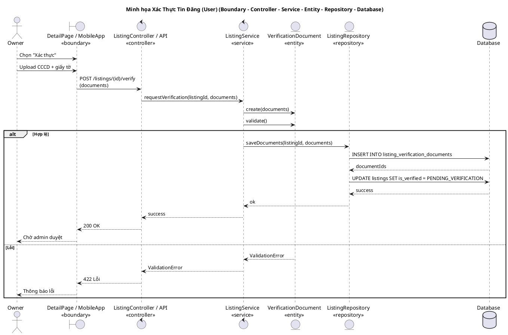

# Sequence Diagram - Xác Thực Tin Đăng (User)

```plantuml
@startuml
title Minh họa Xác Thực Tin Đăng (User) (Boundary - Controller - Service - Entity - Repository - Database)

actor "Owner" as Owner
boundary "DetailPage / MobileApp\n«boundary»" as FE
control "ListingController / API\n«controller»" as Controller
control "ListingService\n«service»" as Service
entity "VerificationDocument\n«entity»" as Entity
entity "ListingRepository\n«repository»" as Repo
database "Database" as DB

Owner -> FE: Chọn "Xác thực"
Owner -> FE: Upload CCCD + giấy tờ
FE -> Controller: POST /listings/{id}/verify\n(documents)
Controller -> Service: requestVerification(listingId, documents)
Service -> Entity: create(documents)
Service -> Entity: validate()

alt Hợp lệ
  Service -> Repo: saveDocuments(listingId, documents)
  Repo -> DB: INSERT INTO listing_verification_documents
  DB --> Repo: documentIds
  Repo -> DB: UPDATE listings SET is_verified = PENDING_VERIFICATION
  DB --> Repo: success
  Repo --> Service: ok
  Service --> Controller: success
  Controller --> FE: 200 OK
  FE --> Owner: Chờ admin duyệt
else Lỗi
  Entity --> Service: ValidationError
  Service --> Controller: ValidationError
  Controller --> FE: 422 Lỗi
  FE --> Owner: Thông báo lỗi
end
@enduml
```
