# Sequence Diagram - Xác Thực Tin Đăng (User)

```plantuml
@startuml

title Xác Thực Tin Đăng (User gửi yêu cầu)

actor "Owner" as Owner
participant "VerificationForm\n/ Frontend" as FE
participant "ListingController\n/ API" as Controller
participant "UpdateVerificationRequest\n«validation»" as Validation
participant "ListingVerificationService" as VerificationService
participant "Listing\n«entity»" as Listing
participant "ListingRepository\n«repository»" as ListingRepo
participant "NotificationService" as NotificationService
database "Database" as DB

Owner -> FE: Truy cập tin đăng của mình
Owner -> FE: Nhấn "Yêu cầu xác thực"

FE -> Controller: GET /api/v1/listings/{id}/mine

Controller -> ListingRepo: findById(id)
ListingRepo -> DB: SELECT * FROM listings WHERE id = ?
DB --> ListingRepo: listing

alt Listing.demand_type = RENT
    ListingRepo --> Controller: Listing
    Controller --> FE: 200 OK + Listing
    FE --> Owner: "Tin cho thuê không cần\nxác thực giấy tờ"
else Listing.demand_type = SELL/BUY
    
    alt is_verified = PENDING_VERIFICATION
        ListingRepo --> Controller: Listing
        Controller --> FE: 200 OK + Listing
        FE --> Owner: "Đã có yêu cầu xác thực\nđang chờ duyệt"
    else is_verified != PENDING_VERIFICATION
        
        ListingRepo --> Controller: Listing
        Controller --> FE: 200 OK + Listing
        FE --> Owner: Hiển thị form upload giấy tờ
        
        Owner -> FE: Upload giấy tờ:
        note right
          - CCCD mặt trước
          - CCCD mặt sau
          - Giấy tờ pháp lý (1-5 file)
        end note
        
        Owner -> FE: Tick "Đồng ý công khai thông tin"
        Owner -> FE: Nhấn "Gửi yêu cầu"
        
        FE -> Controller: PUT /api/v1/listings/{id}/verification\n{identity_card_front,\nidentity_card_back,\nlegal_documents[],\npublic_info_agreed}
        
        Controller -> Validation: validate()
        
        alt Validation failed
            Validation --> Controller: ValidationError
            Controller --> FE: 422 Validation Error
            FE --> Owner: Hiển thị lỗi
        else Validation passed
            
            Controller -> VerificationService: updateVerification(user, listing_id, data)
            
            VerificationService -> ListingRepo: findById(listing_id)
            ListingRepo -> DB: SELECT * FROM listings WHERE id = ?
            DB --> ListingRepo: listing
            
            VerificationService -> VerificationService: Check ownership\n(listing.owner_id = user.id)
            
            alt User không sở hữu listing
                VerificationService --> Controller: ForbiddenException
                Controller --> FE: 403 Forbidden
                FE --> Owner: "Không có quyền"
            else User sở hữu listing
                
                alt Listing demand_type = RENT
                    VerificationService --> Controller: BusinessException
                    Controller --> FE: 400 Bad Request
                    FE --> Owner: "Tin cho thuê không cần xác thực"
                else Listing demand_type = SELL/BUY
                    
                    VerificationService -> VerificationService: Check có đủ giấy tờ
                    
                    alt Thiếu giấy tờ bắt buộc
                        VerificationService --> Controller: ValidationException
                        Controller --> FE: 400 Bad Request
                        FE --> Owner: "Vui lòng upload đầy đủ\nCCCD 2 mặt + giấy tờ pháp lý"
                    else Đủ giấy tờ
                        
                        VerificationService -> VerificationService: BEGIN TRANSACTION
                        
                        VerificationService -> ListingRepo: deleteVerificationDocuments(listing_id)
                        ListingRepo -> DB: DELETE FROM\nlisting_verification_documents\nWHERE listing_id = ?
                        DB --> ListingRepo: deleted count
                        
                        VerificationService -> ListingRepo: createVerificationDocument(...)
                        loop ID_FRONT, ID_BACK, LEGAL_DOCUMENTS
                            ListingRepo -> DB: INSERT INTO\nlisting_verification_documents\n(listing_id, document_type,\nfile_url, sort_order)
                            DB --> ListingRepo: document_id
                        end
                        
                        VerificationService -> ListingRepo: update(listing_id, data)
                        ListingRepo -> DB: UPDATE listings SET\nis_verified = 'PENDING_VERIFICATION',\nrequest_verification = true,\npublic_info_agreed = ?,\nupdated_at = NOW()
                        DB --> ListingRepo: affected rows
                        
                        VerificationService -> VerificationService: COMMIT TRANSACTION
                        
                        VerificationService -> NotificationService: notifyAdmin(listing)
                        
                        NotificationService -> DB: INSERT INTO notifications\n(user_id = admin_users,\ntype = 'VERIFICATION_REQUEST')
                        DB --> NotificationService: notification_ids
                        
                        NotificationService -> NotificationService: Push notification to admins
                        
                        NotificationService --> VerificationService: success
                        
                        VerificationService -> ListingRepo: load(['verificationDocuments'])
                        ListingRepo -> DB: SELECT với relations
                        DB --> ListingRepo: Listing with docs
                        
                        VerificationService --> Controller: Listing
                        
                        Controller --> FE: 200 OK\n"Đã gửi yêu cầu xác thực.\nAdmin sẽ xem xét trong 24-48h."
                        FE --> Owner: Hiển thị thông báo
                        
                        note right
                          Listing.is_verified = PENDING_VERIFICATION
                          Owner có thể kiểm tra trạng thái
                          tại trang quản lý tin đăng
                        end note
                    end
                end
            end
        end
    end
end

@enduml
```



## Giải Thích

**Quy trình user gửi yêu cầu xác thực tin đăng:**

### 1. Điều kiện xác thực
**Chỉ áp dụng cho:**
- Tin đăng loại **SELL** hoặc **BUY** (Bán/Mua)
- Tin **CHO THUÊ** (RENT) không cần xác thực giấy tờ

**Trạng thái is_verified:**
- `NOT_VERIFIED`: Chưa có yêu cầu xác thực
- `PENDING_VERIFICATION`: Đã gửi yêu cầu, chờ admin duyệt
- `VERIFIED`: Đã được admin phê duyệt
- `REJECTED`: Admin từ chối

### 2. Validation (UpdateVerificationRequest)
**Required:**
- `identity_card_front`: URL ảnh CCCD mặt trước (max 2048 chars)
- `identity_card_back`: URL ảnh CCCD mặt sau
- `legal_documents`: Array URLs (1-5 files, mỗi URL max 2048 chars)

**Optional:**
- `public_info_agreed`: boolean (đồng ý công khai thông tin)

### 3. Business Logic

**a) Check ownership:**
```sql
SELECT * FROM listings WHERE id = ? AND owner_id = ?
```

**b) Check demand type:**
```
IF listing.demand_type = 'RENT':
  REJECT "Tin cho thuê không cần xác thực"
```

**c) Validate documents:**
```
REQUIRED:
- identity_card_front (not null)
- identity_card_back (not null)
- legal_documents.length >= 1
```

### 4. Database Operations (Transaction)

**a) Delete old documents:**
```sql
DELETE FROM listing_verification_documents 
WHERE listing_id = ?
```

**b) Insert new documents:**
```sql
INSERT INTO listing_verification_documents (
  listing_id, document_type, file_url, sort_order
) VALUES 
  (?, 'ID_FRONT', ?, 0),
  (?, 'ID_BACK', ?, 1),
  (?, 'LEGAL_DOCUMENT', ?, 2),
  ...
```

**c) Update listing:**
```sql
UPDATE listings 
SET is_verified = 'PENDING_VERIFICATION',
    request_verification = true,
    public_info_agreed = ?,
    updated_at = NOW()
WHERE id = ?
```

### 5. Notifications

**Notify all admins:**
```sql
-- Get admin user IDs
SELECT id FROM users WHERE role = 'ADMIN'

-- Create notification for each admin
INSERT INTO notifications (user_id, type, data, is_read)
VALUES (?, 'VERIFICATION_REQUEST', ?, false)
```

**Push notification:**
- Real-time notification qua WebSocket/FCM
- Admin nhận thông báo có yêu cầu xác thực mới

### 6. Response
- **200 OK** + ListingResource
- Message: "Đã gửi yêu cầu xác thực. Admin sẽ xem xét trong 24-48h."
- Listing có badge "Đang chờ xác thực"

### 7. Workflow sau khi gửi

```
User submit documents
       ↓
is_verified = PENDING_VERIFICATION
       ↓
Admin reviews documents
       ↓
    ┌──┴──┐
    ↓     ↓
VERIFIED  REJECTED
```

**VERIFIED:**
- Listing có badge "Đã xác thực"
- Tăng độ tin cậy
- Ưu tiên hiển thị cao hơn

**REJECTED:**
- Admin gửi lý do từ chối
- User có thể upload lại giấy tờ đúng
- Gửi yêu cầu mới

**Lợi ích của xác thực:**
- Badge "Đã xác thực" trên tin đăng
- Tăng content score
- Người mua/thuê tin tưởng hơn
- Ưu tiên hiển thị trong kết quả tìm kiếm

---

**Cách xem diagram**: Copy code PlantUML vào https://www.plantuml.com/plantuml/uml/
