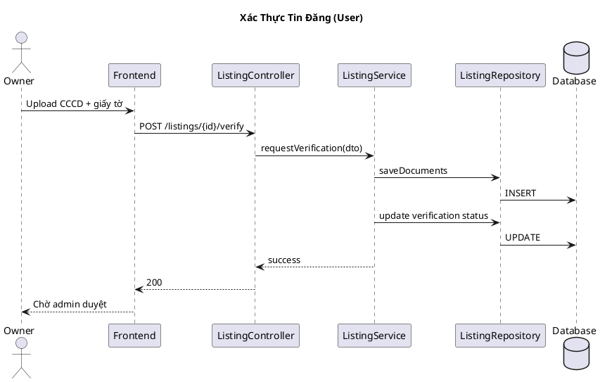

# Sequence Diagram - Xác Thực (User)

```plantuml
@startuml
title Xác Thực Tin Đăng (User)

actor "Owner" as Owner
participant "Frontend" as FE
participant "ListingController" as Controller
participant "ListingService" as Service
participant "ListingRepository" as Repo
database "Database" as DB

Owner -> FE: Upload CCCD + giấy tờ
FE -> Controller: POST /listings/{id}/verify
Controller -> Service: requestVerification(dto)
Service -> Repo: saveDocuments
Repo -> DB: INSERT
Service -> Repo: update verification status
Repo -> DB: UPDATE
Service --> Controller: success
Controller --> FE: 200
FE --> Owner: Chờ admin duyệt
@enduml
```

**3-layer:** Controller -> Service -> Repository -> DB.
