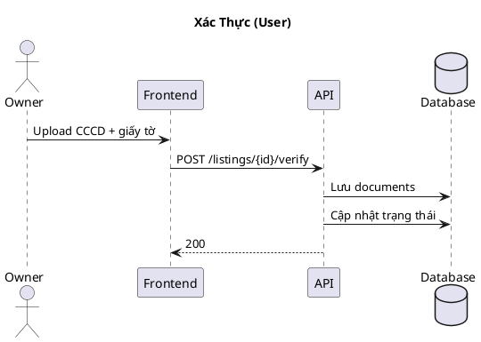

# Sequence Diagram - Xác Thực Tin Đăng (User)

```plantuml
@startuml
title Xác Thực (User)

actor "Owner" as Owner
participant "Frontend" as FE
participant "API" as API
database "Database" as DB

Owner -> FE: Upload CCCD + giấy tờ
FE -> API: POST /listings/{id}/verify
API -> DB: Lưu documents
API -> DB: Cập nhật trạng thái
API --> FE: 200
@enduml
```

**Luồng:** Upload giấy tờ → Gửi → Chờ duyệt.
