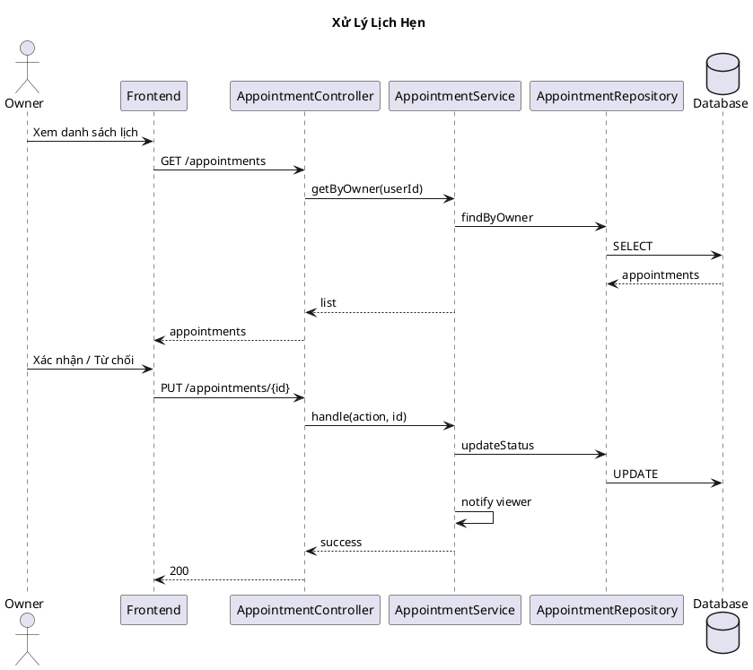

# Sequence Diagram - Xử Lý Lịch Hẹn

```plantuml
@startuml
title Xử Lý Lịch Hẹn

actor "Owner" as Owner
participant "Frontend" as FE
participant "AppointmentController" as Controller
participant "AppointmentService" as Service
participant "AppointmentRepository" as Repo
database "Database" as DB

Owner -> FE: Xem danh sách lịch
FE -> Controller: GET /appointments
Controller -> Service: getByOwner(userId)
Service -> Repo: findByOwner
Repo -> DB: SELECT
DB --> Repo: appointments
Service --> Controller: list
Controller --> FE: appointments
Owner -> FE: Xác nhận / Từ chối
FE -> Controller: PUT /appointments/{id}
Controller -> Service: handle(action, id)
Service -> Repo: updateStatus
Repo -> DB: UPDATE
Service -> Service: notify viewer
Service --> Controller: success
Controller --> FE: 200
@enduml
```

**3-layer:** Controller -> Service -> Repository -> DB.
