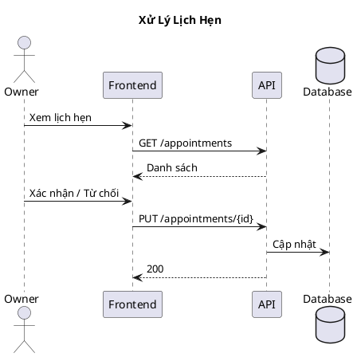

# Sequence Diagram - Xử Lý Lịch Hẹn

```plantuml
@startuml
title Xử Lý Lịch Hẹn

actor "Owner" as Owner
participant "Frontend" as FE
participant "API" as API
database "Database" as DB

Owner -> FE: Xem lịch hẹn
FE -> API: GET /appointments
API --> FE: Danh sách
Owner -> FE: Xác nhận / Từ chối
FE -> API: PUT /appointments/{id}
API -> DB: Cập nhật
API --> FE: 200
@enduml
```

**Luồng:** Xem → Xác nhận/Từ chối.
