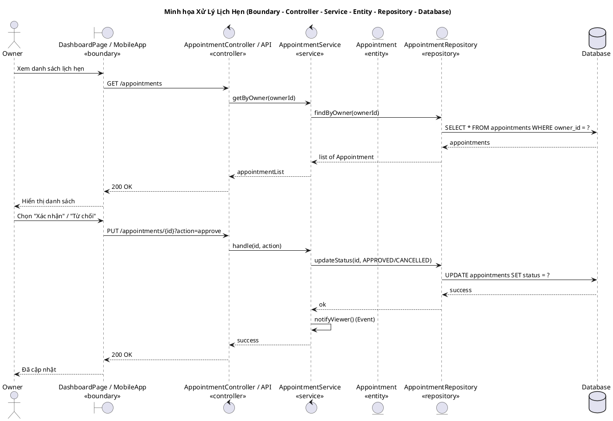

# Sequence Diagram - Xử Lý Lịch Hẹn

```plantuml
@startuml
title Minh họa Xử Lý Lịch Hẹn (Boundary - Controller - Service - Entity - Repository - Database)

actor "Owner" as Owner
boundary "DashboardPage / MobileApp\n«boundary»" as FE
control "AppointmentController / API\n«controller»" as Controller
control "AppointmentService\n«service»" as Service
entity "Appointment\n«entity»" as Entity
entity "AppointmentRepository\n«repository»" as Repo
database "Database" as DB

Owner -> FE: Xem danh sách lịch hẹn
FE -> Controller: GET /appointments
Controller -> Service: getByOwner(ownerId)
Service -> Repo: findByOwner(ownerId)
Repo -> DB: SELECT * FROM appointments WHERE owner_id = ?
DB --> Repo: appointments
Repo --> Service: list of Appointment
Service --> Controller: appointmentList
Controller --> FE: 200 OK
FE --> Owner: Hiển thị danh sách
Owner -> FE: Chọn "Xác nhận" / "Từ chối"
FE -> Controller: PUT /appointments/{id}?action=approve
Controller -> Service: handle(id, action)
Service -> Repo: updateStatus(id, APPROVED/CANCELLED)
Repo -> DB: UPDATE appointments SET status = ?
DB --> Repo: success
Repo --> Service: ok
Service -> Service: notifyViewer() (Event)
Service --> Controller: success
Controller --> FE: 200 OK
FE --> Owner: Đã cập nhật
@enduml
```
