# Sequence Diagram - Xác Nhận/Từ Chối Lịch Hẹn

```plantuml
@startuml

title Xác Nhận/Từ Chối Lịch Hẹn (Owner)

actor "Chủ nhà" as Owner
participant "AppointmentManagement\n/ Frontend" as FE
participant "AppointmentController\n/ API" as Controller
participant "UpdateAppointmentRequest\n«validation»" as Validation
participant "AppointmentService" as AppointmentService
participant "Appointment\n«entity»" as AppointmentEntity
participant "AppointmentRepository\n«repository»" as AppointmentRepo
participant "NotificationService" as NotificationService
database "Database" as DB

Owner -> FE: Nhận thông báo:\n"Có yêu cầu lịch hẹn mới"

Owner -> FE: Truy cập trang\n"Quản lý lịch hẹn"

FE -> Controller: GET /api/v1/appointments/my-listings

Controller -> AppointmentService: getAppointmentsByOwner(user)

AppointmentService -> AppointmentRepo: findByOwner(user_id)
AppointmentRepo -> DB: SELECT a.* FROM appointments a\nJOIN listings l ON a.listing_id = l.id\nWHERE l.owner_id = ?\nAND a.status = 'PENDING'\nORDER BY a.created_at DESC
DB --> AppointmentRepo: appointments[]

AppointmentRepo --> AppointmentService: appointments[]
AppointmentService --> Controller: appointments[]
Controller --> FE: 200 OK + appointments
FE --> Owner: Hiển thị danh sách lịch hẹn

Owner -> FE: Chọn lịch hẹn để xem chi tiết

FE -> FE: Hiển thị thông tin:
note right
  - Tên khách: visitor_name
  - SĐT: visitor_phone
  - Ngày giờ: appointment_date
  - Ghi chú: note
  - Tin đăng: listing.title
end note

alt Chủ nhà xác nhận
    Owner -> FE: Nhấn "Xác nhận lịch hẹn"
    
    FE -> Controller: PUT /api/v1/appointments/{id}/confirm
    
    Controller -> AppointmentService: confirmAppointment(owner, appointment_id)
    
    AppointmentService -> AppointmentRepo: findById(appointment_id)
    AppointmentRepo -> DB: SELECT * FROM appointments WHERE id = ?
    DB --> AppointmentRepo: appointment
    
    alt Appointment không tồn tại
        AppointmentRepo --> AppointmentService: NotFoundException
        AppointmentService --> Controller: Exception
        Controller --> FE: 404 Not Found
        FE --> Owner: "Lịch hẹn không tồn tại"
    else Appointment tồn tại
        
        AppointmentService -> AppointmentRepo: getListing(appointment.listing_id)
        AppointmentRepo -> DB: SELECT * FROM listings WHERE id = ?
        DB --> AppointmentRepo: listing
        
        AppointmentService -> AppointmentService: Check ownership\n(listing.owner_id = owner.id)
        
        alt Owner không sở hữu listing
            AppointmentService --> Controller: ForbiddenException
            Controller --> FE: 403 Forbidden
            FE --> Owner: "Không có quyền xử lý"
        else Owner sở hữu listing
            
            alt Status != PENDING
                AppointmentService --> Controller: BusinessException
                Controller --> FE: 400 Bad Request
                FE --> Owner: "Lịch đã được xử lý"
            else Status = PENDING
                
                AppointmentService -> AppointmentService: BEGIN TRANSACTION
                
                AppointmentService -> AppointmentRepo: update(appointment_id,\n{status: 'CONFIRMED', confirmed_at: NOW()})
                AppointmentRepo -> DB: UPDATE appointments\nSET status = 'CONFIRMED',\nconfirmed_at = NOW()\nWHERE id = ?
                DB --> AppointmentRepo: affected rows
                
                AppointmentService -> AppointmentService: COMMIT TRANSACTION
                
                AppointmentService -> NotificationService: notifyVisitor(appointment)
                
                NotificationService -> DB: INSERT INTO notifications\n(user_id, type, data)
                DB --> NotificationService: notification_id
                
                NotificationService -> NotificationService: Gửi email cho khách:\n"Lịch hẹn đã được xác nhận"
                note right
                  Email chứa:
                  - Thông tin tin đăng
                  - Ngày giờ hẹn
                  - Thông tin liên hệ chủ nhà
                end note
                
                NotificationService -> NotificationService: Push notification to visitor
                
                NotificationService --> AppointmentService: success
                
                AppointmentService --> Controller: Appointment updated
                
                Controller --> FE: 200 OK\n"Đã xác nhận lịch hẹn"
                FE --> Owner: Hiển thị thông báo
            end
        end
    end
    
else Chủ nhà từ chối
    Owner -> FE: Nhấn "Từ chối"
    
    FE -> FE: Hiển thị form nhập lý do
    
    Owner -> FE: Nhập lý do từ chối (tùy chọn)
    Owner -> FE: Xác nhận từ chối
    
    FE -> Controller: PUT /api/v1/appointments/{id}/reject\n{rejection_reason}
    
    Controller -> Validation: validate()
    Validation --> Controller: RejectAppointmentDto
    
    Controller -> AppointmentService: rejectAppointment(owner, appointment_id, reason)
    
    AppointmentService -> AppointmentRepo: findById(appointment_id)
    AppointmentRepo -> DB: SELECT * FROM appointments WHERE id = ?
    DB --> AppointmentRepo: appointment
    
    alt Appointment không tồn tại
        AppointmentRepo --> AppointmentService: NotFoundException
        AppointmentService --> Controller: Exception
        Controller --> FE: 404 Not Found
        FE --> Owner: "Lịch hẹn không tồn tại"
    else Appointment tồn tại
        
        AppointmentService -> AppointmentRepo: getListing(appointment.listing_id)
        AppointmentRepo -> DB: SELECT * FROM listings WHERE id = ?
        DB --> AppointmentRepo: listing
        
        AppointmentService -> AppointmentService: Check ownership
        
        alt Owner không sở hữu listing
            AppointmentService --> Controller: ForbiddenException
            Controller --> FE: 403 Forbidden
            FE --> Owner: "Không có quyền"
        else Owner sở hữu listing
            
            alt Status != PENDING
                AppointmentService --> Controller: BusinessException
                Controller --> FE: 400 Bad Request
                FE --> Owner: "Lịch đã được xử lý"
            else Status = PENDING
                
                AppointmentService -> AppointmentService: BEGIN TRANSACTION
                
                AppointmentService -> AppointmentRepo: update(appointment_id,\n{status: 'REJECTED',\nrejection_reason: reason,\nrejected_at: NOW()})
                AppointmentRepo -> DB: UPDATE appointments\nSET status = 'REJECTED',\nrejection_reason = ?,\nrejected_at = NOW()\nWHERE id = ?
                DB --> AppointmentRepo: affected rows
                
                AppointmentService -> AppointmentService: COMMIT TRANSACTION
                
                AppointmentService -> NotificationService: notifyVisitor(appointment)
                
                NotificationService -> DB: INSERT INTO notifications
                DB --> NotificationService: notification_id
                
                NotificationService -> NotificationService: Gửi email cho khách:\n"Lịch hẹn bị từ chối"
                note right
                  Email chứa:
                  - Lý do từ chối (nếu có)
                  - Link xem tin đăng
                  - Gợi ý đặt lịch khác
                end note
                
                NotificationService -> NotificationService: Push notification to visitor
                
                NotificationService --> AppointmentService: success
                
                AppointmentService --> Controller: Appointment updated
                
                Controller --> FE: 200 OK\n"Đã từ chối lịch hẹn"
                FE --> Owner: Hiển thị thông báo
            end
        end
    end
end

@enduml
```



## Giải Thích

**Quy trình xử lý lịch hẹn (từ phía chủ nhà):**

### 1. Xem danh sách lịch hẹn (GET /api/v1/appointments/my-listings)
```sql
SELECT a.*, l.title as listing_title, l.id as listing_id
FROM appointments a
JOIN listings l ON a.listing_id = l.id
WHERE l.owner_id = ?
  AND a.status = 'PENDING'
ORDER BY a.created_at DESC
```
- Chỉ hiển thị lịch hẹn **PENDING** (chờ xử lý)
- Join với bảng listings để lấy thông tin tin đăng

### 2. Xác nhận lịch hẹn (PUT /api/v1/appointments/{id}/confirm)

**Business Logic Checks:**
1. **Appointment tồn tại**: findById(appointment_id)
2. **Ownership**: listing.owner_id = current_user.id
3. **Status = PENDING**: Chỉ lịch PENDING mới có thể xử lý

**Update Database:**
```sql
UPDATE appointments 
SET status = 'CONFIRMED',
    confirmed_at = NOW()
WHERE id = ?
```

**Notifications:**
- **Database**: INSERT notification cho visitor
- **Push**: Real-time notification qua WebSocket/FCM
- **Email**: Gửi email xác nhận cho khách với:
  - Thông tin tin đăng
  - Ngày giờ hẹn đã xác nhận
  - Thông tin liên hệ chủ nhà (SĐT, địa chỉ)

### 3. Từ chối lịch hẹn (PUT /api/v1/appointments/{id}/reject)

**Input:**
- `rejection_reason`: string, nullable, max 500 ký tự

**Business Logic:** Giống xác nhận (check appointment, ownership, status)

**Update Database:**
```sql
UPDATE appointments 
SET status = 'REJECTED',
    rejection_reason = ?,
    rejected_at = NOW()
WHERE id = ?
```

**Notifications:**
- **Database**: INSERT notification cho visitor
- **Push**: Real-time notification
- **Email**: Gửi email từ chối cho khách với:
  - Lý do từ chối (nếu chủ nhà nhập)
  - Link xem lại tin đăng
  - Gợi ý: "Bạn có thể đặt lịch khác hoặc liên hệ trực tiếp"

### Status Flow
```
PENDING → CONFIRMED (chủ nhà xác nhận)
        → REJECTED  (chủ nhà từ chối)
        → CANCELLED (khách hủy)
```

**Quy tắc:**
- Mỗi lịch hẹn chỉ có thể xử lý **1 lần**
- Sau khi CONFIRMED hoặc REJECTED, không thể thay đổi
- Chỉ owner của listing mới có quyền xử lý

---

**Cách xem diagram**: Copy code PlantUML vào https://www.plantuml.com/plantuml/uml/
