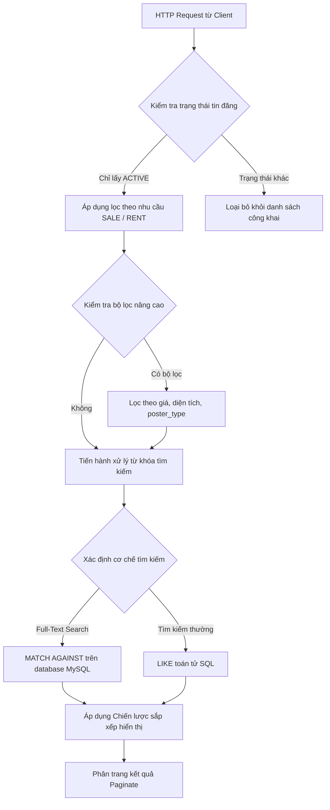

# PHÂN TÍCH CHI TIẾT NGHIỆP VỤ HIỂN THỊ TIN ĐĂNG TRÊN HỆ THỐNG PROPIFY

Nghiệp vụ hiển thị tin đăng là trái tim của hệ thống **Propify** (Website đăng tin bất động sản). Để đảm bảo tin đăng hiển thị chính xác, tốc độ truy vấn nhanh, nội dung tìm kiếm thông minh và thứ tự ưu tiên hợp lý (cân bằng giữa quyền lợi khách hàng VIP và tính cập nhật của tin đăng), hệ thống đã thiết kế một giải pháp kiến trúc kết hợp nhiều công nghệ và mẫu thiết kế (**Design Pattern**).

Tài liệu này phân tích sâu về nghiệp vụ hiển thị tin đăng từ luồng dữ liệu, thuật toán tính điểm ưu tiên, bộ lọc tìm kiếm cho tới cách cài đặt trong mã nguồn.

---

## 1. LUỒNG XỬ LÝ VÀ BỘ LỌC XÁC THỰC HIỂN THỊ

Tiến trình hiển thị danh sách tin đăng công khai được thực hiện qua phương thức `paginatePublic` trong [EloquentListingRepository.php](file:///d:/PROJECT/Meyland/PropifyBackend/app/Repositories/Eloquent/EloquentListingRepository.php#L110). Quy trình lọc gồm các bước nghiêm ngặt sau:



### 1.1. Bộ lọc trạng thái tin đăng (State Constraint)
Hệ thống chỉ cho phép các tin đăng có trạng thái cụ thể là `ACTIVE` xuất hiện trên trang tìm kiếm công khai.
*   **Mã nguồn**: `->where('listings.status', 'ACTIVE')`
*   **Mục đích**: Chặn các tin đăng ở dạng Nháp (`DRAFT`), Chờ duyệt (`PENDING`), Bị từ chối (`REJECTED`) hoặc Bị khóa (`LOCKED`) hiển thị ra ngoài. Trạng thái này được đồng bộ và kiểm soát chặt chẽ thông qua **State Pattern**.

### 1.2. Chuẩn hóa từ khóa tìm kiếm (Search Tokenization & Normalization)
Để đảm bảo người dùng tìm kiếm chính xác dù gõ tiếng Việt có dấu, không dấu, chữ hoa hay chữ thường, hệ thống thực hiện hai cơ chế:
1.  **Chuẩn hóa văn bản**: Sử dụng lớp hỗ trợ `PropertySearchText::normalize($keyword)` để loại bỏ dấu tiếng Việt, đưa về dạng chữ thường tiêu chuẩn, loại bỏ các ký tự đặc biệt nhằm tránh xung đột ngôn ngữ (collation) trên cơ sở dữ liệu.
2.  **Chuyển đổi biểu thức SQL**: Áp dụng hàm `normalizeSearchExpression` để ép kiểu dữ liệu cột tìm kiếm về dạng chữ thường không dấu tương ứng với driver database đang chạy:
    *   **SQLite** (dùng khi chạy Unit Test): `normalize_text(column)`
    *   **MySQL / MariaDB** (chạy trên Production): `LOWER(CONVERT(column USING utf8mb4)) COLLATE utf8mb4_unicode_ci`

### 1.3. Cơ chế tìm kiếm Full-Text Search vs LIKE
Hệ thống tự động phân tích từ khóa của người dùng để quyết định phương thức truy vấn tối ưu nhất:
*   **Điều kiện kích hoạt Full-Text**: Khi chạy trên MySQL/MariaDB và tất cả các từ trong từ khóa có độ dài từ 3 ký tự trở lên (sau khi cắt khoảng trắng).
*   **Truy vấn Full-Text**:
    `MATCH(properties.search_text) AGAINST ('+keyword1* +keyword2*' IN BOOLEAN MODE)`
    Cơ chế này sử dụng chỉ mục Full-text index trên trường tổng hợp `search_text` của bảng `properties`, giúp tốc độ tìm kiếm nhanh hơn gấp hàng chục lần so với toán tử `LIKE` thông thường trên tập dữ liệu hàng triệu bản ghi.
*   **Truy vấn thường**: Nếu không đủ điều kiện Full-Text hoặc sử dụng SQLite, hệ thống quay về dùng toán tử `LIKE` thông thường nhằm đảm bảo tính tương thích và chính xác cho các từ khóa ngắn.

---

## 2. THUẬT TOÁN SẮP XẾP HIỂN THỊ (RANKING ALGORITHM)

Để quyết định tin đăng nào được xếp ở vị trí đầu tiên trên trang tìm kiếm, hệ thống áp dụng chiến lược sắp xếp mặc định rất thông minh tại [DefaultPackageScoreSortingStrategy.php](file:///d:/PROJECT/Meyland/PropifyBackend/app/Services/Listing/Sorting/Strategies/DefaultPackageScoreSortingStrategy.php).

### 2.1. Công thức toán học tính điểm ưu tiên (Time-Decay Score)
Thứ tự hiển thị được sắp xếp dựa trên sự kết hợp giữa **Độ ưu tiên gói VIP** và **Điểm số suy giảm theo thời gian (Time-Decay Score)**. Công thức tính điểm trên MySQL/Production như sau:

$$Score_{final} = Score_{listing} \times Multiplier_{package} \times \frac{1.0}{1.0 + \frac{Hours}{24}} \times e^{-DecayRate \times Hours}$$

Trong đó:
*   $Score_{listing}$: Điểm chất lượng nội dung của tin đăng (tự động tính dựa trên số lượng hình ảnh, độ dài mô tả, mức độ chi tiết thông tin).
*   $Multiplier_{package}$: Hệ số nhân của gói tin (ví dụ: Tin VIP Kim Cương có hệ số nhân 5.0, VIP Vàng là 3.0, tin thường là 1.0).
*   $Hours$: Số giờ trôi qua kể từ thời điểm tin đăng được xuất bản (`published_at`).
*   $\frac{1.0}{1.0 + \frac{Hours}{24}}$: Hệ số suy giảm tuyến tính theo chu kỳ ngày.
*   $e^{-DecayRate \times Hours}$: Hệ số suy giảm mũ giúp tin đăng giảm điểm nhanh chóng theo thời gian.
*   $DecayRate$: Tỷ lệ suy giảm của gói tin (cấu hình trong bảng `packages`). Các gói VIP cao cấp sẽ có tỉ lệ suy giảm rất thấp (ví dụ: `0.01`), giúp tin giữ vị trí top lâu hơn. Gói tin thường có tỉ lệ suy giảm cao (ví dụ: `0.08`), khiến tin nhanh chóng bị trôi xuống dưới.

### 2.2. Phân cấp sắp xếp trong SQL
Mã nguồn chuyển hóa công thức trên thành câu lệnh SQL Select động như sau:

```sql
COALESCE(packages.priority, 1) AS pkg_priority,
(
  COALESCE(listings.score, 0) 
  * COALESCE(packages.multiplier, 1.0) 
  * (1.0 / (1.0 + TIMESTAMPDIFF(HOUR, COALESCE(listings.published_at, listings.created_at), NOW()) / 24.0)) 
  * EXP(-COALESCE(packages.decay_rate, 0.05) * TIMESTAMPDIFF(HOUR, COALESCE(listings.published_at, listings.created_at), NOW()))
) AS final_score
```

Thứ tự ưu tiên sắp xếp của câu lệnh SQL (`ORDER BY`):
1.  **`ORDER BY pkg_priority DESC`**: Đầu tiên, hệ thống gom nhóm các tin đăng theo cấp độ gói tin. Tin đăng thuộc gói VIP có Priority cao hơn (Kim Cương > Vàng > Bạc > Thường) luôn luôn được ghim ở phía trên.
2.  **`ORDER BY final_score DESC`**: Trong cùng một phân cấp gói tin (cùng Priority), các tin đăng sẽ cạnh tranh vị trí dựa trên điểm số `final_score`. Tin nào mới xuất bản hoặc có điểm nội dung chất lượng cao hơn sẽ được xếp lên đầu.

### 2.3. Lợi ích của thuật toán
*   **Bảo vệ quyền lợi nhà đầu tư VIP**: Tin đăng VIP luôn nằm ở vị trí dễ nhìn thấy nhất.
*   **Tránh hiện tượng "Tin rác ghim vĩnh viễn"**: Một tin VIP đăng từ 1 tháng trước sẽ bị suy giảm điểm số đáng kể và phải nhường vị trí đầu cho một tin VIP cùng cấp mới đăng ngày hôm nay. Điều này giữ cho bảng tin luôn tươi mới và hấp dẫn người tìm kiếm.

---

## 3. CÀI ĐẶT THIẾT KẾ MÃ NGUỒN (DESIGN PATTERNS)

Hệ thống hiển thị tin đăng được tách biệt logic một cách hoàn hảo nhờ áp dụng hai design pattern chính:

### 3.1. Strategy Pattern — Chuyển đổi linh hoạt giải thuật sắp xếp
Thay vì viết cứng câu lệnh sắp xếp SQL hoặc dùng nhiều rẽ nhánh `if/else` trong Repository, hệ thống định nghĩa interface `ListingSortingStrategy` làm chuẩn giao tiếp:

```php
interface ListingSortingStrategy
{
    public function apply(Builder $query): Builder;
}
```

Mỗi cách sắp xếp là một lớp triển khai cụ thể:
*   `DefaultPackageScoreSortingStrategy`: Sắp xếp mặc định theo điểm ưu tiên và độ trôi thời gian.
*   `PriceLowToHighSortingStrategy` / `PriceHighToLowSortingStrategy`: Sắp xếp theo giá bán/thuê.
*   `AreaLowToHighSortingStrategy` / `AreaHighToLowSortingStrategy`: Sắp xếp theo diện tích bất động sản.
*   `NewestListingSortingStrategy` / `OldestListingSortingStrategy`: Sắp xếp theo ngày xuất bản tin.

Hàm `paginatePublic` chỉ việc nhận vào interface này và thực thi:
```php
$query = $sortingStrategy->apply($query);
return $query->paginate($perPage);
```

### 3.2. Factory Method Pattern — Sinh đối tượng sắp xếp từ yêu cầu của Client
Để chuyển đổi từ chuỗi tham số truyền từ URL của trình duyệt (ví dụ: `?sortBy=price_asc`) thành đối tượng Strategy tương ứng, lớp `ListingSortingStrategyFactory` được thiết kế để bao bọc logic mapping này:

```php
final class ListingSortingStrategyFactory
{
    public static function make(?string $sortBy): ListingSortingStrategy
    {
        return match ($sortBy) {
            'price_asc'  => new PriceLowToHighSortingStrategy,
            'price_desc' => new PriceHighToLowSortingStrategy,
            'area_asc'   => new AreaLowToHighSortingStrategy,
            'area_desc'  => new AreaHighToLowSortingStrategy,
            'newest'     => new NewestListingSortingStrategy,
            'oldest'     => new OldestListingSortingStrategy,
            default      => new DefaultPackageScoreSortingStrategy,
        };
    }
}
```

---

## 4. TỔNG KẾT
Giải pháp thiết kế nghiệp vụ hiển thị tin đăng của Propify giải quyết triệt để 3 bài toán lớn của các hệ thống TMĐT bất động sản:
1.  **Hiệu năng**: Tối ưu hóa tốc độ truy vấn nhờ Full-Text Search và giới hạn các trường select thô.
2.  **Kinh doanh**: Thuật toán xếp hạng khoa học giúp kích thích người dùng nộp phí nâng cấp gói VIP để đạt được vị trí hiển thị tốt nhất, đồng thời duy trì luồng thông tin mới mẻ cho trang web.
3.  **Kiến trúc**: Nhờ áp dụng **Strategy** và **Factory Method**, việc bổ sung thêm các tiêu chí sắp xếp mới hoặc tích hợp AI gợi ý tin đăng trong tương lai chỉ mất vài phút phát triển bằng cách tạo lớp mới, hoàn toàn độc lập và an toàn với hệ thống hiện tại.
