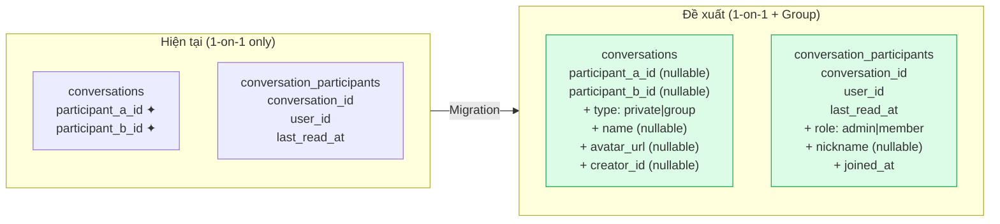
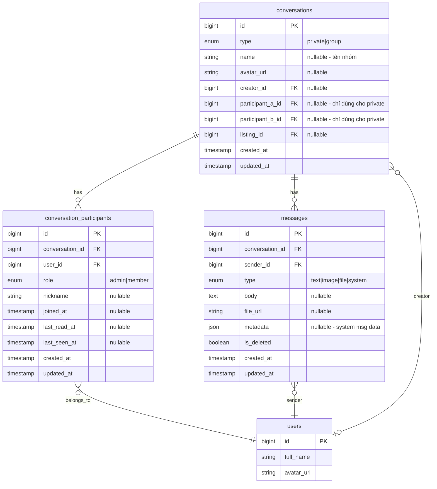

# Chức năng Nhóm Chat (Group Chat) — Implementation Plan

## Mục tiêu

Mở rộng hệ thống chat hiện tại (chỉ 1-on-1) để hỗ trợ **nhóm chat** với N thành viên, bao gồm: tạo nhóm, quản lý thành viên, phân quyền admin/member, system messages, và UI tương ứng — **100% backward-compatible** với chat 1-on-1 hiện tại.

## Kiến trúc hiện tại vs. Đề xuất



## User Review Required

> [!IMPORTANT]
> **Quyết định thiết kế**: Giữ lại `participant_a_id` / `participant_b_id` trên bảng `conversations` cho chat 1-on-1 (không phá schema cũ). Nhóm chat sẽ dùng `type = 'group'` và chỉ quản lý thành viên qua `conversation_participants`. Điều này đảm bảo **zero migration risk** cho data hiện tại.

> [!WARNING]
> **Giới hạn nhóm**: Plan này thiết kế cho nhóm **≤ 50 người**. Nếu cần nhóm lớn hơn (kiểu channel/community), cần kiến trúc khác (fan-out on write, sharding). Xác nhận giới hạn trước khi implement.

## Open Questions

1. **Giới hạn thành viên nhóm**: Mặc định 50? Hay cần cao hơn?
2. **Quyền tạo nhóm**: Tất cả user đều được tạo nhóm, hay chỉ user có gói nhất định?
3. **Upload avatar nhóm**: Dùng cùng hệ thống upload ảnh hiện tại hay cần endpoint riêng?
4. **Xoá nhóm**: Admin có thể xoá nhóm hay chỉ rời nhóm (nhóm tồn tại cho đến khi hết thành viên)?
5. **Tin nhắn ghim (pin)**: Có cần trong phase đầu không?

---

## Tổng quan các Phase

| Phase | Nội dung | Effort | Dependency |
|-------|----------|--------|------------|
| **1** | Database migrations | Low | None |
| **2** | Backend: Models, DTOs, Service, Controller, Routes | High | Phase 1 |
| **3** | Frontend: Service, Store, logic | Medium | Phase 2 |
| **4** | Frontend: UI components | High | Phase 3 |
| **5** | Polish & nâng cao | Medium | Phase 4 |

---

## Phase 1 — Database Migrations

> Mở rộng schema để hỗ trợ group conversations mà không phá vỡ data 1-on-1 hiện tại.

---

#### [NEW] Migration: `add_group_support_to_conversations_table`

```php
public function up(): void
{
    Schema::table('conversations', function (Blueprint $table) {
        // Loại conversation: 'private' (1-on-1) hoặc 'group'
        $table->enum('type', ['private', 'group'])
              ->default('private')
              ->after('id');

        // Tên nhóm (null cho private conversations)
        $table->string('name', 100)->nullable()->after('type');

        // Avatar nhóm
        $table->string('avatar_url')->nullable()->after('name');

        // Người tạo nhóm (null cho private — tạo tự động khi chat)
        $table->unsignedBigInteger('creator_id')->nullable()->after('avatar_url');
        $table->foreign('creator_id')->references('id')->on('users')->nullOnDelete();

        // Cho phép participant_a_id, participant_b_id nullable (group không dùng)
        $table->unsignedBigInteger('participant_a_id')->nullable()->change();
        $table->unsignedBigInteger('participant_b_id')->nullable()->change();

        // Index
        $table->index('type');
        $table->index('creator_id');
    });
}

public function down(): void
{
    Schema::table('conversations', function (Blueprint $table) {
        $table->dropForeign(['creator_id']);
        $table->dropIndex(['type']);
        $table->dropIndex(['creator_id']);
        $table->dropColumn(['type', 'name', 'avatar_url', 'creator_id']);
        // Revert nullable (nếu cần)
    });
}
```

> [!NOTE]
> `participant_a_id` và `participant_b_id` trở thành **nullable**. Data cũ vẫn giữ nguyên giá trị, nhưng group conversations sẽ có giá trị `null` ở cả 2 cột. Logic 1-on-1 cũ không bị ảnh hưởng vì luôn check `type = 'private'` hoặc `participant_a_id IS NOT NULL`.

---

#### [NEW] Migration: `add_role_to_conversation_participants_table`

```php
public function up(): void
{
    Schema::table('conversation_participants', function (Blueprint $table) {
        // Vai trò trong nhóm: admin (quản trị) hoặc member (thành viên)
        $table->enum('role', ['admin', 'member'])
              ->default('member')
              ->after('user_id');

        // Biệt danh trong nhóm (tuỳ chọn)
        $table->string('nickname', 50)->nullable()->after('role');

        // Thời điểm tham gia (cho system message "X đã tham gia lúc...")
        $table->timestamp('joined_at')->nullable()->after('nickname');
    });
}
```

---

#### [NEW] Migration: `add_system_type_to_messages`

```php
public function up(): void
{
    // Mở rộng enum type thêm 'system' cho system messages
    DB::statement("ALTER TABLE messages MODIFY COLUMN type ENUM('text', 'image', 'file', 'system') DEFAULT 'text'");

    Schema::table('messages', function (Blueprint $table) {
        // Metadata JSON cho system messages (ai thêm ai, ai rời, đổi tên, etc.)
        $table->json('metadata')->nullable()->after('file_url');
    });
}
```

**System message metadata examples**:
```json
// Thành viên được thêm
{ "action": "member_added", "actor_id": 1, "target_id": 5, "target_name": "Nguyễn Văn A" }

// Thành viên rời nhóm
{ "action": "member_left", "actor_id": 5 }

// Bị xoá khỏi nhóm
{ "action": "member_removed", "actor_id": 1, "target_id": 5, "target_name": "Nguyễn Văn A" }

// Đổi tên nhóm
{ "action": "group_renamed", "actor_id": 1, "old_name": "Nhóm A", "new_name": "Nhóm B" }

// Đổi avatar nhóm
{ "action": "avatar_changed", "actor_id": 1 }

// Chuyển quyền admin
{ "action": "admin_promoted", "actor_id": 1, "target_id": 3, "target_name": "Trần Thị B" }
```

---

### Schema sau Phase 1



---

## Phase 2 — Backend: Models, Service, Controller, Routes

> Mở rộng backend layer để CRUD nhóm chat + quản lý thành viên.

---

### Enums

#### [MODIFY] [MessageType.php](file:///d:/PROJECT/Meyland/PropifyBackend/app/Enums/MessageType.php)

```diff
  enum MessageType: string
  {
      case Text = 'text';
      case Image = 'image';
      case File = 'file';
+     case System = 'system';
  }
```

#### [NEW] `ConversationType.php`

```php
namespace App\Enums;

enum ConversationType: string
{
    case Private = 'private';
    case Group = 'group';
}
```

#### [NEW] `ConversationRole.php`

```php
namespace App\Enums;

enum ConversationRole: string
{
    case Admin = 'admin';
    case Member = 'member';
}
```

#### [NEW] `SystemMessageAction.php`

```php
namespace App\Enums;

enum SystemMessageAction: string
{
    case GroupCreated = 'group_created';
    case MemberAdded = 'member_added';
    case MemberRemoved = 'member_removed';
    case MemberLeft = 'member_left';
    case GroupRenamed = 'group_renamed';
    case AvatarChanged = 'avatar_changed';
    case AdminPromoted = 'admin_promoted';
}
```

#### [MODIFY] [ErrorCode.php](file:///d:/PROJECT/Meyland/PropifyBackend/app/Enums/ErrorCode.php)

Thêm các error code mới:

```php
// Group Chat
case GroupNotFound = 'GROUP_NOT_FOUND';
case NotGroupAdmin = 'NOT_GROUP_ADMIN';
case AlreadyGroupMember = 'ALREADY_GROUP_MEMBER';
case NotGroupMember = 'NOT_GROUP_MEMBER';
case CannotRemoveSelf = 'CANNOT_REMOVE_SELF';
case GroupMemberLimitReached = 'GROUP_MEMBER_LIMIT_REACHED';
case LastAdminCannotLeave = 'LAST_ADMIN_CANNOT_LEAVE';
case CannotModifyPrivateChat = 'CANNOT_MODIFY_PRIVATE_CHAT';
```

---

### Models

#### [MODIFY] [Conversation.php](file:///d:/PROJECT/Meyland/PropifyBackend/app/Models/Conversation.php)

```diff
+ use App\Enums\ConversationType;

  final class Conversation extends Model
  {
      protected $fillable = [
+         'type',
+         'name',
+         'avatar_url',
+         'creator_id',
          'participant_a_id',
          'participant_b_id',
          'listing_id',
      ];

+     protected $casts = [
+         'type' => ConversationType::class,
+     ];

      // ==================== Relationships ====================

+     public function creator(): BelongsTo
+     {
+         return $this->belongsTo(User::class, 'creator_id');
+     }

      // ... (giữ nguyên participantA, participantB, messages, participants, etc.)

      // ==================== Helpers ====================

+     public function isGroup(): bool
+     {
+         return $this->type === ConversationType::Group;
+     }
+
+     public function isPrivate(): bool
+     {
+         return $this->type === ConversationType::Private;
+     }

      // Giữ nguyên getOtherParticipant() cho backward compat
  }
```

#### [MODIFY] [ConversationParticipant.php](file:///d:/PROJECT/Meyland/PropifyBackend/app/Models/ConversationParticipant.php)

```diff
+ use App\Enums\ConversationRole;

  final class ConversationParticipant extends Model
  {
      protected $fillable = [
          'conversation_id',
          'user_id',
+         'role',
+         'nickname',
+         'joined_at',
          'last_read_at',
          'last_seen_at',
      ];

      protected $casts = [
+         'role' => ConversationRole::class,
+         'joined_at' => 'datetime',
          'last_read_at' => 'datetime',
          'last_seen_at' => 'datetime',
      ];

+     public function isAdmin(): bool
+     {
+         return $this->role === ConversationRole::Admin;
+     }
  }
```

#### [MODIFY] [Message.php](file:///d:/PROJECT/Meyland/PropifyBackend/app/Models/Message.php)

```diff
  protected $fillable = [
      'conversation_id',
      'sender_id',
      'type',
      'body',
      'file_url',
+     'metadata',
  ];

  protected $casts = [
      'type' => MessageType::class,
      'is_deleted' => 'boolean',
+     'metadata' => 'array',
  ];
```

---

### DTOs

#### [NEW] `CreateGroupDto.php`

```php
namespace App\DTOs\Chat;

final readonly class CreateGroupDto
{
    public function __construct(
        public readonly int $creatorId,
        public readonly string $name,
        public readonly array $memberIds,    // user IDs to add (excluding creator)
        public readonly ?string $avatarUrl = null,
    ) {}

    public static function fromRequest(CreateGroupRequest $request, int $creatorId): self
    {
        return new self(
            creatorId: $creatorId,
            name: $request->validated('name'),
            memberIds: $request->validated('member_ids'),
            avatarUrl: $request->validated('avatar_url'),
        );
    }
}
```

#### [NEW] `UpdateGroupDto.php`

```php
namespace App\DTOs\Chat;

final readonly class UpdateGroupDto
{
    public function __construct(
        public readonly int $conversationId,
        public readonly int $userId,
        public readonly ?string $name = null,
        public readonly ?string $avatarUrl = null,
    ) {}
}
```

#### [NEW] `GroupMemberDto.php`

```php
namespace App\DTOs\Chat;

final readonly class GroupMemberDto
{
    public function __construct(
        public readonly int $conversationId,
        public readonly int $actorId,      // Người thực hiện thao tác
        public readonly array $userIds,    // Người bị tác động
    ) {}
}
```

---

### Form Requests

#### [NEW] `CreateGroupRequest.php`

```php
public function rules(): array
{
    return [
        'name'        => ['required', 'string', 'min:2', 'max:100'],
        'member_ids'  => ['required', 'array', 'min:1', 'max:49'], // + creator = 50 max
        'member_ids.*'=> ['integer', 'exists:users,id', 'distinct'],
        'avatar_url'  => ['nullable', 'string', 'url'],
    ];
}
```

#### [NEW] `UpdateGroupRequest.php`

```php
public function rules(): array
{
    return [
        'name'       => ['sometimes', 'string', 'min:2', 'max:100'],
        'avatar_url' => ['sometimes', 'nullable', 'string', 'url'],
    ];
}
```

#### [NEW] `AddGroupMembersRequest.php`

```php
public function rules(): array
{
    return [
        'user_ids'   => ['required', 'array', 'min:1', 'max:20'],
        'user_ids.*' => ['integer', 'exists:users,id', 'distinct'],
    ];
}
```

---

### Resources

#### [MODIFY] [ConversationResource.php](file:///d:/PROJECT/Meyland/PropifyBackend/app/Http/Resources/ConversationResource.php)

Mở rộng để trả về cả group info. **Backward-compatible** — response cũ của private chat giữ nguyên shape:

```php
public function toArray(Request $request): array
{
    $currentUserId = auth()->id();
    $isGroup = $this->type === ConversationType::Group;

    // === PRIVATE: giữ nguyên logic cũ ===
    $otherUser = null;
    if (!$isGroup) {
        $otherUser = $this->participant_a_id === $currentUserId
            ? $this->participantB
            : $this->participantA;
    }

    // === Last message ===
    $lastMessage = $this->latestMessage;

    // === Unread count ===
    $myParticipant = $this->conversationParticipants
        ->where('user_id', $currentUserId)->first();
    $unreadCount = 0;
    if ($myParticipant && $lastMessage) {
        $lastRead = $myParticipant->last_read_at;
        if ($lastRead === null || $lastMessage->created_at > $lastRead) {
            $unreadCount = 1;
        }
    }

    return [
        'id'         => $this->id,
        'type'       => $this->type?->value ?? 'private',  // NEW
        'listing_id' => $this->listing_id,

        // Private chat info (backward compat)
        'other_user' => $otherUser ? [
            'id'         => $otherUser->id,
            'full_name'  => $otherUser->full_name,
            'avatar_url' => $otherUser->avatar_url,
        ] : null,

        // Group info (NEW — null cho private)
        'group' => $isGroup ? [
            'name'         => $this->name,
            'avatar_url'   => $this->avatar_url,
            'creator_id'   => $this->creator_id,
            'member_count' => $this->conversationParticipants->count(),
            'my_role'      => $myParticipant?->role?->value ?? 'member',
        ] : null,

        'last_message' => $lastMessage ? [
            'body'        => $lastMessage->body,
            'type'        => $lastMessage->type?->value ?? $lastMessage->type,
            'sender_id'   => $lastMessage->sender_id,
            'sender_name' => $lastMessage->sender?->full_name,
            'created_at'  => $lastMessage->created_at?->toIso8601String(),
            'metadata'    => $lastMessage->metadata,  // NEW
        ] : null,

        'unread_count' => $unreadCount,
        'created_at'   => $this->created_at?->toIso8601String(),
        'updated_at'   => $this->updated_at?->toIso8601String(),
    ];
}
```

**Response mẫu — Group**:
```json
{
  "id": 15,
  "type": "group",
  "listing_id": null,
  "other_user": null,
  "group": {
    "name": "Nhóm môi giới Q7",
    "avatar_url": "https://...",
    "creator_id": 1,
    "member_count": 5,
    "my_role": "admin"
  },
  "last_message": { "body": "...", "type": "text", ... },
  "unread_count": 3
}
```

#### [NEW] `GroupMemberResource.php`

```php
public function toArray(Request $request): array
{
    return [
        'id'         => $this->user->id,
        'full_name'  => $this->user->full_name,
        'avatar_url' => $this->user->avatar_url,
        'role'       => $this->role?->value ?? 'member',
        'nickname'   => $this->nickname,
        'joined_at'  => $this->joined_at?->toIso8601String(),
    ];
}
```

---

### Repository

#### [MODIFY] [ChatRepository.php](file:///d:/PROJECT/Meyland/PropifyBackend/app/Repositories/ChatRepository.php) (Interface)

Thêm methods mới:

```php
// ==================== Group Methods ====================

public function createGroupConversation(int $creatorId, string $name, ?string $avatarUrl): Conversation;

public function addParticipants(int $conversationId, array $userIds, ConversationRole $role = ConversationRole::Member): void;

public function removeParticipant(int $conversationId, int $userId): void;

public function updateConversation(int $conversationId, array $data): Conversation;

public function getParticipants(int $conversationId): Collection;

public function getParticipant(int $conversationId, int $userId): ?ConversationParticipant;

public function countParticipants(int $conversationId): int;

public function updateParticipantRole(int $conversationId, int $userId, ConversationRole $role): void;

public function getAdminCount(int $conversationId): int;
```

#### [MODIFY] [EloquentChatRepository.php](file:///d:/PROJECT/Meyland/PropifyBackend/app/Repositories/Eloquent/EloquentChatRepository.php)

Implement các methods mới. Ví dụ key methods:

```php
public function createGroupConversation(int $creatorId, string $name, ?string $avatarUrl): Conversation
{
    return DB::transaction(function () use ($creatorId, $name, $avatarUrl) {
        $conversation = $this->conversationModel->create([
            'type'       => ConversationType::Group->value,
            'name'       => $name,
            'avatar_url' => $avatarUrl,
            'creator_id' => $creatorId,
            // participant_a_id, participant_b_id = null cho group
        ]);

        // Creator tự động là admin
        $this->participantModel->create([
            'conversation_id' => $conversation->id,
            'user_id'         => $creatorId,
            'role'            => ConversationRole::Admin->value,
            'joined_at'       => now(),
        ]);

        return $conversation;
    });
}

public function addParticipants(int $conversationId, array $userIds, ConversationRole $role = ConversationRole::Member): void
{
    $now = now();
    $records = array_map(fn($userId) => [
        'conversation_id' => $conversationId,
        'user_id'         => $userId,
        'role'            => $role->value,
        'joined_at'       => $now,
        'created_at'      => $now,
        'updated_at'      => $now,
    ], $userIds);

    $this->participantModel->insertOrIgnore($records);  // insertOrIgnore tránh duplicate
}

public function removeParticipant(int $conversationId, int $userId): void
{
    $this->participantModel
        ->where('conversation_id', $conversationId)
        ->where('user_id', $userId)
        ->delete();
}
```

#### [MODIFY] `getConversationsForUser` — hỗ trợ cả private + group

```php
public function getConversationsForUser(int $userId): Collection
{
    return Cache::remember("chat:conversations:{$userId}", 30, function () use ($userId) {
        return $this->conversationModel
            ->where(function ($q) use ($userId) {
                // Private: participant_a hoặc participant_b
                $q->where(function ($q2) use ($userId) {
                    $q2->where('type', 'private')
                       ->where(function ($q3) use ($userId) {
                           $q3->where('participant_a_id', $userId)
                              ->orWhere('participant_b_id', $userId);
                       });
                })
                // Group: qua conversation_participants
                ->orWhere(function ($q2) use ($userId) {
                    $q2->where('type', 'group')
                       ->whereHas('conversationParticipants', function ($q3) use ($userId) {
                           $q3->where('user_id', $userId);
                       });
                });
            })
            ->with([
                'participantA:id,full_name,avatar_url',
                'participantB:id,full_name,avatar_url',
                'latestMessage.sender:id,full_name',
                'conversationParticipants' => function ($q) use ($userId) {
                    $q->where('user_id', $userId);
                },
            ])
            ->latest('updated_at')
            ->get();
    });
}
```

---

### Service

#### [MODIFY] [ChatService.php](file:///d:/PROJECT/Meyland/PropifyBackend/app/Services/Chat/ChatService.php) (Interface)

```php
// ==================== Group Methods ====================

public function createGroup(CreateGroupDto $dto): Conversation;

public function updateGroup(UpdateGroupDto $dto): Conversation;

public function addMembers(GroupMemberDto $dto): void;

public function removeMember(int $conversationId, int $actorId, int $targetId): void;

public function leaveGroup(int $conversationId, int $userId): void;

public function getGroupMembers(int $conversationId, int $userId): Collection;
```

#### [MODIFY] [ChatServiceImpl.php](file:///d:/PROJECT/Meyland/PropifyBackend/app/Services/Chat/Impl/ChatServiceImpl.php)

Key implementation — `createGroup`:

```php
public function createGroup(CreateGroupDto $dto): Conversation
{
    // Validate: không trùng creator trong member list
    $memberIds = array_filter($dto->memberIds, fn($id) => $id !== $dto->creatorId);

    // Tạo conversation
    $conversation = $this->chatRepository->createGroupConversation(
        $dto->creatorId, $dto->name, $dto->avatarUrl
    );

    // Thêm members
    if (!empty($memberIds)) {
        $this->chatRepository->addParticipants($conversation->id, $memberIds);
    }

    // Subscribe WebSocket cho tất cả participants
    // (Frontend sẽ tự subscribe khi nhận được conversation mới)

    // System message: "X đã tạo nhóm"
    $this->createSystemMessage($conversation->id, $dto->creatorId, SystemMessageAction::GroupCreated, [
        'group_name' => $dto->name,
    ]);

    // Invalidate cache
    $allUserIds = array_merge([$dto->creatorId], $memberIds);
    foreach ($allUserIds as $uid) {
        Cache::forget("chat:conversations:{$uid}");
    }

    return $conversation->loadMissing([
        'conversationParticipants.user:id,full_name,avatar_url',
    ]);
}

public function addMembers(GroupMemberDto $dto): void
{
    $this->assertGroupAdmin($dto->conversationId, $dto->actorId);

    // Check giới hạn
    $currentCount = $this->chatRepository->countParticipants($dto->conversationId);
    if ($currentCount + count($dto->userIds) > 50) {
        throw new BusinessException(ErrorCode::GroupMemberLimitReached);
    }

    // Filter ra user đã là member
    $existingIds = $this->chatRepository->getParticipants($dto->conversationId)
        ->pluck('user_id')->toArray();
    $newIds = array_diff($dto->userIds, $existingIds);

    if (empty($newIds)) return;

    $this->chatRepository->addParticipants($dto->conversationId, $newIds);

    // System message cho mỗi member mới
    foreach ($newIds as $userId) {
        $user = User::find($userId);
        $this->createSystemMessage($dto->conversationId, $dto->actorId, SystemMessageAction::MemberAdded, [
            'target_id'   => $userId,
            'target_name' => $user?->full_name,
        ]);
    }

    // Invalidate cache + subscribe channels
    foreach ($newIds as $uid) {
        Cache::forget("chat:conversations:{$uid}");
    }
}

public function leaveGroup(int $conversationId, int $userId): void
{
    $this->assertGroupConversation($conversationId);

    $participant = $this->chatRepository->getParticipant($conversationId, $userId);
    if (!$participant) {
        throw new BusinessException(ErrorCode::NotGroupMember);
    }

    // Nếu là admin cuối cùng → phải chuyển quyền trước khi rời
    if ($participant->isAdmin()) {
        $adminCount = $this->chatRepository->getAdminCount($conversationId);
        if ($adminCount <= 1) {
            $memberCount = $this->chatRepository->countParticipants($conversationId);
            if ($memberCount > 1) {
                throw new BusinessException(ErrorCode::LastAdminCannotLeave);
            }
            // Nếu chỉ còn 1 người → xoá conversation luôn
        }
    }

    $this->chatRepository->removeParticipant($conversationId, $userId);

    // System message
    $this->createSystemMessage($conversationId, $userId, SystemMessageAction::MemberLeft);

    Cache::forget("chat:conversations:{$userId}");
}

// ==================== Private Helpers ====================

private function createSystemMessage(int $conversationId, int $actorId, SystemMessageAction $action, array $extra = []): Message
{
    $metadata = array_merge(['action' => $action->value, 'actor_id' => $actorId], $extra);

    $message = $this->chatRepository->createMessage([
        'conversation_id' => $conversationId,
        'sender_id'       => $actorId,
        'type'            => MessageType::System->value,
        'body'            => $this->buildSystemMessageBody($action, $actorId, $extra),
        'metadata'        => $metadata,
    ]);

    MessageSent::dispatch($message);

    return $message;
}

private function buildSystemMessageBody(SystemMessageAction $action, int $actorId, array $extra): string
{
    $actorName = User::find($actorId)?->full_name ?? 'Ai đó';

    return match ($action) {
        SystemMessageAction::GroupCreated   => "{$actorName} đã tạo nhóm",
        SystemMessageAction::MemberAdded    => "{$actorName} đã thêm {$extra['target_name']} vào nhóm",
        SystemMessageAction::MemberRemoved  => "{$actorName} đã xoá {$extra['target_name']} khỏi nhóm",
        SystemMessageAction::MemberLeft     => "{$actorName} đã rời nhóm",
        SystemMessageAction::GroupRenamed    => "{$actorName} đã đổi tên nhóm thành \"{$extra['new_name']}\"",
        SystemMessageAction::AvatarChanged  => "{$actorName} đã đổi ảnh nhóm",
        SystemMessageAction::AdminPromoted  => "{$actorName} đã cấp quyền admin cho {$extra['target_name']}",
    };
}

private function assertGroupConversation(int $conversationId): Conversation
{
    $conv = $this->chatRepository->findById($conversationId);
    if (!$conv || !$conv->isGroup()) {
        throw new BusinessException(ErrorCode::CannotModifyPrivateChat);
    }
    return $conv;
}

private function assertGroupAdmin(int $conversationId, int $userId): void
{
    $this->assertGroupConversation($conversationId);
    $participant = $this->chatRepository->getParticipant($conversationId, $userId);
    if (!$participant || !$participant->isAdmin()) {
        throw new BusinessException(ErrorCode::NotGroupAdmin);
    }
}
```

---

### Controller & Routes

#### [NEW] `GroupChatController.php`

```php
namespace App\Http\Controllers\Api\V1\Chat;

final class GroupChatController
{
    public function __construct(private readonly ChatService $chatService) {}

    // POST /v1/chat/groups
    public function create(CreateGroupRequest $request): JsonResponse { ... }

    // PUT /v1/chat/groups/{conversationId}
    public function update(UpdateGroupRequest $request, int $conversationId): JsonResponse { ... }

    // POST /v1/chat/groups/{conversationId}/members
    public function addMembers(AddGroupMembersRequest $request, int $conversationId): JsonResponse { ... }

    // DELETE /v1/chat/groups/{conversationId}/members/{userId}
    public function removeMember(int $conversationId, int $userId): JsonResponse { ... }

    // POST /v1/chat/groups/{conversationId}/leave
    public function leave(int $conversationId): JsonResponse { ... }

    // GET /v1/chat/groups/{conversationId}/members
    public function getMembers(int $conversationId): JsonResponse { ... }
}
```

#### [MODIFY] `routes/api.php`

```php
// ==================== GROUP CHAT ROUTES ====================
Route::prefix('v1/chat/groups')->as('chat.groups.')->middleware('auth:api')->group(function () {
    Route::post('/', [GroupChatController::class, 'create'])->name('create');
    Route::put('/{conversationId}', [GroupChatController::class, 'update'])->name('update');
    Route::get('/{conversationId}/members', [GroupChatController::class, 'getMembers'])->name('members.index');
    Route::post('/{conversationId}/members', [GroupChatController::class, 'addMembers'])->name('members.add');
    Route::delete('/{conversationId}/members/{userId}', [GroupChatController::class, 'removeMember'])->name('members.remove');
    Route::post('/{conversationId}/leave', [GroupChatController::class, 'leave'])->name('leave');
});
```

> [!NOTE]
> Các route `getMessages`, `sendMessage`, `markAsRead` hiện tại **không cần sửa** — chúng hoạt động qua `conversationId` và không phân biệt private/group. Channel authorization qua `ConversationParticipant` cũng đã hỗ trợ N participants.

### Verification — Phase 2

```bash
# Chạy migration
php artisan migrate

# Chạy test
composer run test

# Test API thủ công
# 1. Tạo nhóm
POST /v1/chat/groups
{ "name": "Test Group", "member_ids": [2, 3] }

# 2. Thêm member
POST /v1/chat/groups/{id}/members
{ "user_ids": [4, 5] }

# 3. Gửi tin nhắn vào group (dùng API hiện tại)
POST /v1/chat/conversations/{id}/messages
{ "type": "text", "body": "Hello group!" }

# 4. List conversations → group xuất hiện trong danh sách
GET /v1/chat/conversations
```

---

## Phase 3 — Frontend: Service + Store

> Mở rộng API wrapper và Pinia store để handle group conversations.

---

#### [MODIFY] [chatService.js](file:///d:/PROJECT/Meyland/PropifyFrontend/src/services/chatService.js)

Thêm 6 methods mới:

```js
// ==================== Group Chat ====================

createGroup(name, memberIds, avatarUrl = null) {
  return api.post('/v1/chat/groups', { name, member_ids: memberIds, avatar_url: avatarUrl });
},

updateGroup(conversationId, data) {
  return api.put(`/v1/chat/groups/${conversationId}`, data);
},

getGroupMembers(conversationId) {
  return api.get(`/v1/chat/groups/${conversationId}/members`);
},

addGroupMembers(conversationId, userIds) {
  return api.post(`/v1/chat/groups/${conversationId}/members`, { user_ids: userIds });
},

removeGroupMember(conversationId, userId) {
  return api.delete(`/v1/chat/groups/${conversationId}/members/${userId}`);
},

leaveGroup(conversationId) {
  return api.post(`/v1/chat/groups/${conversationId}/leave`);
},
```

---

#### [MODIFY] [chat.js](file:///d:/PROJECT/Meyland/PropifyFrontend/src/stores/chat.js)

Key changes:

**1. Thêm state cho group info panel**:
```js
const groupMembers = ref([]);
const loadingMembers = ref(false);
```

**2. Thêm computed helpers**:
```js
/** Tên hiển thị — dùng cho header, conversation list */
const activeDisplayName = computed(() => {
  const conv = activeConversation.value;
  if (!conv) return '';
  if (conv.type === 'group') return conv.group?.name ?? 'Nhóm chat';
  return conv.other_user?.full_name ?? 'Người dùng';
});

/** Avatar hiển thị */
const activeDisplayAvatar = computed(() => {
  const conv = activeConversation.value;
  if (!conv) return null;
  if (conv.type === 'group') return conv.group?.avatar_url;
  return conv.other_user?.avatar_url;
});

/** Conversation hiện tại có phải group không */
const isGroupConversation = computed(() =>
  activeConversation.value?.type === 'group'
);

/** Vai trò của current user trong group */
const myRole = computed(() =>
  activeConversation.value?.group?.my_role ?? null
);

const isGroupAdmin = computed(() => myRole.value === 'admin');
```

**3. Thêm actions cho group**:
```js
async function createGroup(name, memberIds) {
  const res = await chatService.createGroup(name, memberIds);
  const conversation = res.data.data;
  conversations.value.unshift(conversation);
  subscribeChannel(conversation.id);
  await openConversation(conversation);
  return conversation;
}

async function loadGroupMembers(conversationId) {
  loadingMembers.value = true;
  try {
    const res = await chatService.getGroupMembers(conversationId);
    groupMembers.value = res.data.data ?? [];
  } finally {
    loadingMembers.value = false;
  }
}

async function addGroupMembers(userIds) {
  if (!activeConversation.value) return;
  await chatService.addGroupMembers(activeConversation.value.id, userIds);
  await loadGroupMembers(activeConversation.value.id);
  // Reload conversations để cập nhật member_count
  await loadConversations(true);
}

async function removeGroupMember(userId) {
  if (!activeConversation.value) return;
  await chatService.removeGroupMember(activeConversation.value.id, userId);
  groupMembers.value = groupMembers.value.filter(m => m.id !== userId);
}

async function leaveGroup() {
  if (!activeConversation.value) return;
  const convId = activeConversation.value.id;
  await chatService.leaveGroup(convId);
  // Xoá khỏi danh sách local
  conversations.value = conversations.value.filter(c => c.id !== convId);
  activeConversation.value = null;
}

async function updateGroup(data) {
  if (!activeConversation.value) return;
  const res = await chatService.updateGroup(activeConversation.value.id, data);
  // Cập nhật group info trong activeConversation
  const updated = res.data.data;
  activeConversation.value = updated;
  const idx = conversations.value.findIndex(c => c.id === updated.id);
  if (idx !== -1) conversations.value[idx] = updated;
}
```

**4. Mở rộng `updateConversationLastMessage` cho system messages**:
```js
function updateConversationLastMessage(conversationId, msg) {
  const conv = conversations.value.find(c => c.id === conversationId);
  if (conv) {
    conv.last_message = {
      body: msg.body,
      type: msg.type,
      sender_id: msg.sender?.id ?? msg.sender_id,
      sender_name: msg.sender?.full_name ?? msg.sender_name,
      created_at: msg.created_at,
      metadata: msg.metadata ?? null,   // NEW: cho system messages
    };
    // Move lên đầu
    const idx = conversations.value.indexOf(conv);
    if (idx > 0) {
      conversations.value.splice(idx, 1);
      conversations.value.unshift(conv);
    }
  }
}
```

### Verification — Phase 3
- `npm run build` — không lỗi
- Store actions callable từ Vue DevTools
- `createGroup()` → conversation xuất hiện đầu list
- `leaveGroup()` → conversation biến mất khỏi list

---

## Phase 4 — Frontend UI Components

> Tạo UI cho tạo nhóm, hiển thị nhóm, quản lý thành viên.

---

### Cấu trúc file mới

```
components/chat/
├── group/
│   ├── CreateGroupModal.vue        ← Modal tạo nhóm mới (~200 dòng)
│   ├── GroupInfoPanel.vue          ← Slide panel thông tin nhóm (~180 dòng)
│   ├── GroupAvatar.vue             ← Avatar nhóm (mosaic hoặc single) (~60 dòng)
│   ├── MemberList.vue             ← Danh sách thành viên + role badge (~120 dòng)
│   └── AddMemberModal.vue         ← Modal thêm thành viên (~150 dòng)
│
├── message-renderers/
│   └── SystemRenderer.vue          ← NEW: render system messages (~40 dòng)
│
├── shared/
│   └── ConversationList.vue        ← MODIFY: hiển thị group conversations
```

---

### Key Components

#### [NEW] `CreateGroupModal.vue`

Giao diện:
- Input tên nhóm
- Search + chọn thành viên (multi-select checkbox)
- Preview danh sách đã chọn (chips)
- Nút "Tạo nhóm"

```
┌──────────────────────────────┐
│  ✕    Tạo nhóm chat mới     │
├──────────────────────────────┤
│  Tên nhóm                   │
│  ┌──────────────────────┐   │
│  │ Nhóm môi giới Q7     │   │
│  └──────────────────────┘   │
│                              │
│  Thành viên (3 đã chọn)     │
│  [Nguyễn A ✕] [Trần B ✕]   │
│  [Lê C ✕]                   │
│                              │
│  🔍 Tìm theo tên hoặc SĐT  │
│  ┌──────────────────────┐   │
│  │ ☑ Nguyễn Văn A       │   │
│  │ ☐ Trần Thị B         │   │
│  │ ☑ Lê Văn C           │   │
│  └──────────────────────┘   │
│                              │
│  [      Tạo nhóm (3)      ] │
└──────────────────────────────┘
```

**Props**: `modelValue: Boolean` (v-model open/close)
**Emits**: `created(conversation)` — khi tạo thành công

---

#### [NEW] `GroupInfoPanel.vue`

Slide-over panel hiển thị thông tin nhóm + quản lý:

```
┌──────────────────────────────┐
│  ←  Thông tin nhóm           │
├──────────────────────────────┤
│       [Avatar nhóm]         │
│    Nhóm môi giới Q7         │
│    5 thành viên              │
│                              │
│  ── Thành viên ─────────── │
│  👤 Nguyễn A        Admin ⭐│
│  👤 Trần Thị B      Member  │
│  👤 Lê Văn C        Member  │
│  [+ Thêm thành viên]        │
│                              │
│  ── Tuỳ chọn ──────────── │
│  🔔 Tắt thông báo          │
│  📌 Ghim hội thoại          │
│  🚪 Rời nhóm               │
└──────────────────────────────┘
```

**Props**: `conversation: Object`, `visible: Boolean`
**Emits**: `close`, `updated(conversation)`, `left`

---

#### [NEW] `GroupAvatar.vue`

Hiển thị avatar nhóm. Nếu không có avatar_url → tạo mosaic 2×2 từ avatar 4 thành viên đầu:

```vue
<template>
  <!-- Có avatar riêng -->
  

  <!-- Mosaic 2x2 từ members -->
  <div v-else class="rounded-full overflow-hidden grid grid-cols-2" :class="sizeClass">
    <div v-for="(member, i) in displayMembers" :key="i"
      class="bg-gradient-to-br from-blue-400 to-blue-600 flex items-center justify-center text-white font-bold"
      :style="{ fontSize: fontSize }">
      
      <span v-else>{{ initials(member.full_name) }}</span>
    </div>
  </div>
</template>
```

**Props**: `avatarUrl`, `members: Array`, `size: 'sm' | 'md' | 'lg'`

---

#### [NEW] `SystemRenderer.vue` (Message Renderer)

```vue
<template>
  <div class="flex justify-center my-2">
    <span class="text-[0.72rem] text-gray-400 bg-gray-100 px-3 py-1 rounded-full">
      {{ message.body }}
    </span>
  </div>
</template>
```

Register vào [message-renderers/index.js](file:///d:/PROJECT/Meyland/PropifyFrontend/src/components/chat/message-renderers/index.js):
```diff
+ import SystemRenderer from './SystemRenderer.vue';

  const renderers = {
    text: TextRenderer,
    image: ImageRenderer,
    file: FileRenderer,
+   system: SystemRenderer,
  };
```

---

#### [MODIFY] `ConversationList.vue`

Cập nhật để hiển thị group conversations:

```diff
  <!-- Avatar -->
- <div class="size-11 rounded-full overflow-hidden bg-gradient-to-br ...">
-   
-   <span v-else>{{ getInitials(conv.other_user?.full_name) }}</span>
- </div>
+ <GroupAvatar v-if="conv.type === 'group'"
+   :avatar-url="conv.group?.avatar_url"
+   :members="[]" size="md" />
+ <div v-else class="size-11 rounded-full overflow-hidden bg-gradient-to-br ...">
+   
+   <span v-else>{{ getInitials(conv.other_user?.full_name) }}</span>
+ </div>

  <!-- Name -->
- <span class="...">{{ conv.other_user?.full_name ?? 'Người dùng' }}</span>
+ <span class="...">
+   {{ conv.type === 'group' ? conv.group?.name : (conv.other_user?.full_name ?? 'Người dùng') }}
+ </span>
+
+ <!-- Member count badge (for groups) -->
+ <span v-if="conv.type === 'group'" class="text-[0.65rem] text-gray-400">
+   👥 {{ conv.group?.member_count }}
+ </span>
```

---

#### [MODIFY] `FloatingChat` / `ChatWindowHeader`

Thêm nút tạo nhóm vào header inbox + hiển thị group info:

```diff
  <!-- Inbox header buttons -->
+ <button @click="$emit('create-group')" title="Tạo nhóm">
+   <!-- group icon -->
+ </button>

  <!-- Conversation header — đổi từ other_user sang dynamic -->
- <div>{{ activeConversation.other_user?.full_name }}</div>
+ <div>{{ chatStore.activeDisplayName }}</div>

+ <!-- Group info button -->
+ <button v-if="chatStore.isGroupConversation" @click="$emit('show-group-info')">
+   <!-- info icon -->
+ </button>
```

### Verification — Phase 4
- Tạo nhóm qua modal → nhóm xuất hiện đầu danh sách với avatar mosaic
- Gửi tin nhắn trong group → tất cả thành viên nhận realtime
- System messages ("X đã tạo nhóm", "Y đã tham gia") hiển thị centered + styled
- GroupInfoPanel hiển thị danh sách thành viên + role
- Thêm/xoá member → list cập nhật + system message xuất hiện
- Rời nhóm → conversation biến mất
- Full-page chat cũng hoạt động tương tự

---

## Phase 5 — Polish & Nâng cao

> Những tính năng bổ sung sau khi core group chat hoạt động ổn.

| Feature | Mô tả | Effort |
|---------|--------|--------|
| Group avatar upload | Upload ảnh nhóm (dùng hệ thống upload hiện tại) | Low |
| Admin transfer | Chuyển quyền admin cho member khác | Low |
| Mute conversation | Tắt thông báo cho conversation cụ thể | Medium |
| Pin conversation | Ghim conversation lên đầu danh sách | Low |
| Search in group | Tìm kiếm tin nhắn trong conversation | Medium |
| Member online status | Hiển thị ai đang online trong nhóm | Low |
| Đổi nickname | Thành viên tự đặt nickname trong nhóm | Low |

---

## Verification Plan tổng thể

### Automated Tests
```bash
cd PropifyBackend
# Unit tests cho group service
php artisan test --filter=GroupChat

# Full suite
composer run test
```

### Manual Verification Checklist
- [ ] **Backward compat**: Chat 1-on-1 cũ vẫn hoạt động 100% sau migration
- [ ] **Tạo nhóm**: Modal → chọn members → tạo → nhóm xuất hiện
- [ ] **Gửi tin nhắn nhóm**: Text/Image/File → tất cả members nhận realtime
- [ ] **System messages**: Tạo nhóm, thêm/xoá member, rời nhóm → system msg hiển thị
- [ ] **Thêm member**: Admin thêm → member mới thấy conversation + lịch sử
- [ ] **Xoá member**: Admin xoá → member bị xoá không thấy conversation nữa
- [ ] **Rời nhóm**: Member rời → conversation biến mất khỏi list
- [ ] **Phân quyền**: Chỉ admin mới thấy nút thêm/xoá member
- [ ] **Giới hạn**: Không thêm quá 50 members
- [ ] **Last admin guard**: Admin cuối cùng không rời được (phải chuyển quyền trước)
- [ ] **Unread count**: Unread badge cập nhật đúng cho group
- [ ] **Typing indicator**: Hoạt động trong group (hiển thị tên người đang nhập)
- [ ] **FloatingChat**: Group hiển thị đúng trong floating widget
- [ ] **Full-page chat**: Group hiển thị đúng trong trang `/chat`
- [ ] **Mobile responsive**: UI group hoạt động trên mobile
