# Refactor Chat Feature — Implementation Plan

## Mục tiêu

Refactor hệ thống chat từ trạng thái hiện tại (God Component 640 dòng, duplicate logic 4 nơi, thiếu virtual scroll) thành kiến trúc modular, maintainable, performant — áp dụng các design patterns phù hợp.

## User Review Required

> [!IMPORTANT]
> **Phase 2 (tách FloatingChat)** là thay đổi lớn nhất — sẽ thay đổi toàn bộ cấu trúc file trong `components/chat/`. Cần review kỹ trước khi thực hiện.

> [!WARNING]
> **Phase 4 (Virtual Scroll)** yêu cầu thêm dependency `@vueuse/core` (đã có trong project) hoặc viết custom hook. Cần xác nhận approach.

## Open Questions

1. **Virtual Scroll library**: Dùng `vue-virtual-scroller` hay tự viết bằng `IntersectionObserver`? `vue-virtual-scroller` mature hơn nhưng thêm dependency.
2. **Offline queue**: Có cần persist queue vào `localStorage` để survive page reload không?
3. **Backend broadcast**: Chuyển sang `ShouldBroadcast` (queue) yêu cầu Redis queue worker chạy. Hiện tại server đã có queue worker chưa?

---

## Tổng quan các Phase

```mermaid
gantt
    title Refactor Chat — Roadmap
    dateFormat X
    axisFormat %s

    section Phase 1
    Extract composable formatters       :p1, 0, 2
    section Phase 2
    Tách FloatingChat (Composite)       :p2, 2, 6
    section Phase 3
    Message renderers (Strategy)        :p3, 6, 3
    section Phase 4
    Virtual Scroll + LRU Cache          :p4, 9, 3
    section Phase 5
    Offline queue + WS reconnection     :p5, 12, 3
    section Phase 6
    Backend optimizations               :p6, 15, 2
```



| Phase | Mô tả | Effort | Risk |
|-------|--------|--------|------|
| 1 | Extract composable + cleanup duplicate | Low | 🟢 Low |
| 2 | Tách FloatingChat → component tree | Medium | 🟡 Medium |
| 3 | Strategy pattern cho message renderers | Low | 🟢 Low |
| 4 | Virtual scroll + LRU cache | Medium | 🟡 Medium |
| 5 | Offline queue + WebSocket reconnection | Medium | 🟡 Medium |
| 6 | Backend optimizations | Low | 🟢 Low |

---

## Phase 1 — Extract Composable Formatters (Facade Pattern)

> Xoá duplicate `initials()`, `formatTime()`, `relTime()`, `preview()` khỏi 4 file. Tập trung dayjs config vào 1 nơi.

---

### Composables

#### [NEW] [useChatFormatters.js](file:///d:/PROJECT/Meyland/PropifyFrontend/src/composables/useChatFormatters.js)

Extract tất cả utility functions + dayjs config từ 4 file vào đây:

```js
import dayjs from 'dayjs';
import relativeTime from 'dayjs/plugin/relativeTime';
import 'dayjs/locale/vi';

dayjs.extend(relativeTime);
dayjs.locale('vi');

export function useChatFormatters() {
  function initials(name) {
    if (!name) return '?';
    return name.split(' ').map(w => w[0]).join('').toUpperCase().slice(0, 2);
  }

  function relTime(iso) {
    return iso ? dayjs(iso).fromNow(true) : '';
  }

  function formatTime(iso) {
    return iso ? dayjs(iso).format('HH:mm') : '';
  }

  function preview(msg) {
    if (!msg) return 'Chưa có tin nhắn';
    if (msg.type === 'image') return '📷 Hình ảnh';
    if (msg.type === 'file') return '📎 Tệp đính kèm';
    const text = msg.body ?? '';
    return text.length > 40 ? text.slice(0, 40) + '...' : text;
  }

  function senderFirstName(fullName) {
    if (!fullName) return '';
    const parts = fullName.trim().split(' ');
    return parts[parts.length - 1];
  }

  return { initials, relTime, formatTime, preview, senderFirstName };
}
```

---

### Components cần sửa

#### [MODIFY] [FloatingChat.vue](file:///d:/PROJECT/Meyland/PropifyFrontend/src/components/chat/FloatingChat.vue)

- Xoá import dayjs + locale (L323-328)
- Xoá hàm `initials`, `relTime`, `formatTime`, `preview`, `senderFirstName` (L360-377)
- Thêm `import { useChatFormatters } from '@/composables/useChatFormatters'`
- Thêm `const { initials, relTime, formatTime, preview, senderFirstName } = useChatFormatters()`

#### [MODIFY] [ConversationList.vue](file:///d:/PROJECT/Meyland/PropifyFrontend/src/components/chat/ConversationList.vue)

- Xoá import dayjs + locale + extend (L70-74)
- Xoá hàm `getInitials`, `formatTime`, `getPreview` (L84-101)
- Thêm import composable, đổi tên biến cho khớp template:
  ```js
  import { useChatFormatters } from '@/composables/useChatFormatters';
  const { initials: getInitials, relTime: formatTime, preview: getPreview } = useChatFormatters();
  ```

#### [MODIFY] [MessageBubble.vue](file:///d:/PROJECT/Meyland/PropifyFrontend/src/components/chat/MessageBubble.vue)

- Xoá import dayjs + locale (L81-83)
- Xoá hàm `getInitials`, `formatTime` (L90-98)
- Thêm:
  ```js
  import { useChatFormatters } from '@/composables/useChatFormatters';
  const { initials: getInitials, formatTime } = useChatFormatters();
  ```

#### [MODIFY] [Chat/index.vue](file:///d:/PROJECT/Meyland/PropifyFrontend/src/pages/Chat/index.vue)

- Xoá hàm `getInitials` (L103-106)
- Thêm:
  ```js
  import { useChatFormatters } from '@/composables/useChatFormatters';
  const { initials: getInitials } = useChatFormatters();
  ```

### Verification — Phase 1
- `npm run dev` — không có lỗi console
- Mở floating chat → conversation list hiển thị đúng tên, thời gian, preview
- Mở trang `/chat` → tương tự
- Gửi tin nhắn → thời gian hiển thị đúng format `HH:mm`

---

## Phase 2 — Tách FloatingChat (Composite Pattern)

> Tách God Component 640 dòng thành cây component. Tái sử dụng `ConversationList`, `MessageBubble`, `ChatInput` thay vì duplicate.

### Cấu trúc file mới

```
components/chat/
├── floating/
│   ├── FloatingChat.vue            ← Orchestrator (~120 dòng)
│   ├── FloatingChatButton.vue      ← Nút tròn + badge + pulse (NEW ~70 dòng)
│   ├── ChatWindow.vue              ← Khung cửa sổ với transition (NEW ~60 dòng)
│   └── ChatWindowHeader.vue        ← Header (inbox title / conversation info) (NEW ~80 dòng)
│
├── shared/
│   ├── ConversationList.vue        ← ♻️ MOVE từ components/chat/
│   ├── MessageBubble.vue           ← ♻️ MOVE từ components/chat/
│   ├── ChatInput.vue               ← ♻️ MOVE từ components/chat/
│   └── UserSearchPanel.vue         ← NEW: extract search panel (~100 dòng)
│
├── FloatingChat.vue                ← DELETE (replaced by floating/FloatingChat.vue)
├── ConversationList.vue            ← DELETE (moved to shared/)
├── MessageBubble.vue               ← DELETE (moved to shared/)
└── ChatInput.vue                   ← DELETE (moved to shared/)
```

---

### Shared components

#### [NEW] [UserSearchPanel.vue](file:///d:/PROJECT/Meyland/PropifyFrontend/src/components/chat/shared/UserSearchPanel.vue)

Extract search panel từ FloatingChat (L72-128 + L351-475 logic):

```vue
<template>
  <Transition name="search-slide">
    <div v-if="visible" class="px-3.5 py-3 border-b border-gray-100 bg-gray-50 shrink-0">
      <!-- Search input -->
      <div class="relative">
        <div class="flex items-center bg-white border border-gray-200 rounded-xl px-3 py-1.5 gap-2 ...">
          <!-- search icon -->
          <input v-model="phone" type="tel" placeholder="Tìm theo số điện thoại..."
            autocomplete="off" @input="onInput" />
          <button v-if="phone" @click="clear"><!-- x icon --></button>
        </div>

        <!-- Results dropdown -->
        <div v-if="results.length > 0 || loading" class="mt-1.5 bg-white ...">
          <!-- loading / user cards / no results -->
        </div>
      </div>
    </div>
  </Transition>
</template>

<script setup>
import { ref } from 'vue';
import chatService from '@/services/chatService';
import { useChatFormatters } from '@/composables/useChatFormatters';

defineProps({ visible: Boolean });
const emit = defineEmits(['start-chat']);

const { initials } = useChatFormatters();
const phone = ref('');
const results = ref([]);
const loading = ref(false);
const error = ref('');
let debounceTimer = null;

function onInput() { /* debounce 350ms → fetchResults */ }
async function fetchResults(query) { /* chatService.searchUserByPhone */ }
function clear() { phone.value = ''; results.value = []; }

function startChat(user) {
  emit('start-chat', user);
}

defineExpose({ reset: () => { phone.value = ''; results.value = []; error.value = ''; } });
</script>
```

**Props**: `visible: Boolean`
**Emits**: `start-chat(user)` — khi user click "Nhắn tin"
**Expose**: `reset()` — để parent gọi khi cần clear

---

#### [MODIFY] [ConversationList.vue](file:///d:/PROJECT/Meyland/PropifyFrontend/src/components/chat/shared/ConversationList.vue)

Move file từ `components/chat/` → `components/chat/shared/`. Thêm prop `compact` cho floating mode:

```diff
  defineProps({
    conversations: { type: Array, default: () => [] },
    activeId: { type: Number, default: null },
    loading: { type: Boolean, default: false },
+   compact: { type: Boolean, default: false },
  });
```

Khi `compact=true`: avatar nhỏ hơn (42px→36px), padding nhỏ hơn, font nhỏ hơn — khớp với style hiện tại của FloatingChat.

---

#### [MODIFY] [ChatInput.vue](file:///d:/PROJECT/Meyland/PropifyFrontend/src/components/chat/shared/ChatInput.vue)

Move file, thêm prop `compact`:

```diff
  defineProps({
    disabled: { type: Boolean, default: false },
+   compact: { type: Boolean, default: false },
  });
```

Khi `compact=true`: ẩn nút attach, border-radius nhỏ hơn, textarea max-height 80px thay vì 120px.

---

#### [MODIFY] [MessageBubble.vue](file:///d:/PROJECT/Meyland/PropifyFrontend/src/components/chat/shared/MessageBubble.vue)

Move file, thêm prop `compact`:

```diff
  defineProps({
    message: { type: Object, required: true },
    isMine: { type: Boolean, default: false },
+   compact: { type: Boolean, default: false },
  });
```

Khi `compact=true`: avatar 26px thay vì 32px, max-width bubble 220px thay vì 75%, font nhỏ hơn.

---

### Floating components

#### [NEW] [FloatingChatButton.vue](file:///d:/PROJECT/Meyland/PropifyFrontend/src/components/chat/floating/FloatingChatButton.vue)

Extract nút floating tròn (L290-311 từ FloatingChat cũ):

```vue
<template>
  <button
    class="size-14 rounded-full bg-blue-600 border-none cursor-pointer text-white flex items-center
           justify-center relative shadow-lg shadow-blue-300/40 transition-all duration-200 shrink-0
           hover:scale-[1.08] hover:shadow-xl active:scale-95"
    @click="$emit('toggle')"
    :title="isOpen ? 'Đóng chat' : 'Tin nhắn'"
  >
    <Transition name="icon-swap" mode="out-in">
      <svg v-if="isOpen" key="close" ...><!-- X icon --></svg>
      <svg v-else key="chat" ...><!-- Chat icon --></svg>
    </Transition>

    <!-- Unread badge -->
    <span v-if="!isOpen && unreadCount > 0" class="absolute -top-1 -right-1 ...">
      {{ unreadCount > 9 ? '9+' : unreadCount }}
    </span>

    <!-- Pulse ring -->
    <span v-if="!isOpen && unreadCount > 0" class="absolute inset-[-4px] ... float-pulse" />
  </button>
</template>

<script setup>
defineProps({
  isOpen: { type: Boolean, default: false },
  unreadCount: { type: Number, default: 0 },
});
defineEmits(['toggle']);
</script>
```

**Props**: `isOpen`, `unreadCount`
**Emits**: `toggle`

---

#### [NEW] [ChatWindowHeader.vue](file:///d:/PROJECT/Meyland/PropifyFrontend/src/components/chat/floating/ChatWindowHeader.vue)

Extract header (L12-70 từ FloatingChat cũ). Hiển thị 2 mode:

```vue
<template>
  <div class="flex items-center justify-between px-3.5 py-3 bg-gradient-to-r from-blue-600 to-blue-700 ...">
    <div class="flex items-center gap-2.5 min-w-0">
      <!-- Back button (chỉ khi có conversation) -->
      <button v-if="conversation" @click="$emit('back')" ...>
        <!-- ← icon -->
      </button>

      <!-- Mode: Conversation info -->
      <div v-if="conversation" class="flex items-center gap-2.5 min-w-0">
        <div class="size-[34px] rounded-full ...">
          
          <span v-else>{{ initials(conversation.other_user?.full_name) }}</span>
        </div>
        <div>
          <div class="text-[0.88rem] font-semibold text-white ...">
            {{ conversation.other_user?.full_name }}
          </div>
          <div v-if="isTyping" class="flex items-center gap-[3px] mt-[1px]">
            <span class="cw-dot"/><span class="cw-dot"/><span class="cw-dot"/>
            <span class="text-[0.7rem] text-white/60">đang nhập...</span>
          </div>
        </div>
      </div>

      <!-- Mode: Inbox title -->
      <span v-else class="flex items-center gap-2 text-[0.95rem] font-bold text-white">
        <!-- chat icon --> Tin nhắn
        <span v-if="unreadCount > 0" class="bg-red-500 ...">{{ formatted unread }}</span>
      </span>
    </div>

    <div class="flex gap-1">
      <button v-if="!conversation" @click="$emit('toggle-search')" ...><!-- search icon --></button>
      <button @click="$emit('close')" ...><!-- minimize icon --></button>
      <button @click="$emit('close')" ...><!-- X icon --></button>
    </div>
  </div>
</template>

<script setup>
import { useChatFormatters } from '@/composables/useChatFormatters';
const { initials } = useChatFormatters();

defineProps({
  conversation: { type: Object, default: null },
  isTyping: { type: Boolean, default: false },
  unreadCount: { type: Number, default: 0 },
  showSearch: { type: Boolean, default: false },
});
defineEmits(['back', 'close', 'toggle-search']);
</script>
```

---

#### [NEW] [ChatWindow.vue](file:///d:/PROJECT/Meyland/PropifyFrontend/src/components/chat/floating/ChatWindow.vue)

Khung cửa sổ bao ngoài + transition `chat-pop`:

```vue
<template>
  <Transition name="chat-pop">
    <div v-if="open"
      class="w-[360px] h-[500px] bg-white border border-gray-200 rounded-2xl flex flex-col
             overflow-hidden shadow-xl transition-[width,height] duration-200"
      :class="{ 'w-[380px] h-[520px]': hasConversation }"
    >
      <slot />
    </div>
  </Transition>
</template>

<script setup>
defineProps({
  open: { type: Boolean, required: true },
  hasConversation: { type: Boolean, default: false },
});
</script>

<style scoped>
.chat-pop-enter-active { animation: cwPopIn 0.28s cubic-bezier(0.34, 1.56, 0.64, 1); }
.chat-pop-leave-active { animation: cwPopOut 0.2s ease-in; }
/* @keyframes cwPopIn, cwPopOut ... */
</style>
```

---

#### [NEW] [FloatingChat.vue](file:///d:/PROJECT/Meyland/PropifyFrontend/src/components/chat/floating/FloatingChat.vue)

Orchestrator — chỉ quản lý state open/close, delegate UI cho children:

```vue
<template>
  <Teleport to="body">
    <div v-if="authStore.isAuthenticated"
      class="fixed bottom-6 right-6 z-[9999] flex flex-col items-end gap-3 font-[Inter,-apple-system,sans-serif]">

      <ChatWindow :open="isOpen" :has-conversation="!!activeConversation">
        <!-- Header -->
        <ChatWindowHeader
          :conversation="activeConversation"
          :is-typing="isTyping"
          :unread-count="totalUnread"
          :show-search="showSearch"
          @back="closeConversation"
          @close="closeChat"
          @toggle-search="toggleSearch"
        />

        <!-- Search panel -->
        <UserSearchPanel ref="searchPanel" :visible="showSearch && !activeConversation"
          @start-chat="handleStartChat" />

        <!-- Conversation list (inbox mode) -->
        <ConversationList v-if="!activeConversation"
          :conversations="conversations"
          :loading="loadingConversations"
          compact
          @select="selectConversation"
        />

        <!-- Messages (conversation mode) -->
        <template v-else>
          <div ref="msgContainer" class="flex-1 overflow-y-auto px-3 pt-3 pb-1.5 flex flex-col gap-1 bg-[#f3f9ff]"
            @scroll="onScroll">
            <button v-if="hasMore" @click="loadMoreMessages" ...>↑ Tin nhắn cũ hơn</button>
            <MessageBubble v-for="msg in messages" :key="msg.id" :message="msg"
              :is-mine="msg.sender?.id === currentUserId" compact />
          </div>
          <ChatInput compact :disabled="sending" @send="sendMsg" @typing="onInputChange" />
        </template>
      </ChatWindow>

      <FloatingChatButton :is-open="isOpen" :unread-count="totalUnread" @toggle="toggleChat" />
    </div>
  </Teleport>
</template>

<script setup>
import { ref, computed, watch, nextTick } from 'vue';
import { storeToRefs } from 'pinia';
import { useChatStore } from '@/stores/chat';
import { useAuthStore } from '@/stores/auth';

// Components
import ChatWindow from './ChatWindow.vue';
import ChatWindowHeader from './ChatWindowHeader.vue';
import FloatingChatButton from './FloatingChatButton.vue';
import UserSearchPanel from '../shared/UserSearchPanel.vue';
import ConversationList from '../shared/ConversationList.vue';
import MessageBubble from '../shared/MessageBubble.vue';
import ChatInput from '../shared/ChatInput.vue';

const authStore = useAuthStore();
const chatStore = useChatStore();
const { conversations, activeConversation, messages, loadingConversations,
        loadingMessages, sending, hasMore, typingUsers, totalUnread, isChatVisible } = storeToRefs(chatStore);

const isOpen = ref(false);
const showSearch = ref(false);
const searchPanel = ref(null);
const msgContainer = ref(null);
const currentUserId = computed(() => authStore.user?.id);
const isTyping = computed(() => typingUsers.value.size > 0);

function toggleChat() { /* open/close logic */ }
function closeChat() { /* close + reset search */ }
function toggleSearch() { /* toggle search panel */ }
function closeConversation() { chatStore.unsubscribeActive(); isChatVisible.value = false; }
async function selectConversation(conv) { /* openConversation + scroll */ }
async function handleStartChat(user) { /* getOrCreateConversation + open */ }
async function sendMsg(text) { /* sendMessage + scroll */ }
function onScroll() { /* infinite scroll load older */ }
function onInputChange() { /* typing indicator */ }

// Watchers
watch(() => messages.value.length, (n, o) => { if (n > o) scrollBottom(); });
watch(() => authStore.isAuthenticated, (auth) => { if (auth) chatStore.loadConversations(); }, { immediate: true });
</script>
```

**Kết quả**: ~120 dòng template + ~60 dòng script = **~180 dòng** (giảm 72% từ 640 dòng).

---

#### [DELETE] [FloatingChat.vue](file:///d:/PROJECT/Meyland/PropifyFrontend/src/components/chat/FloatingChat.vue) (cũ)

Replaced hoàn toàn bởi `floating/FloatingChat.vue`.

---

### Cập nhật import paths

#### [MODIFY] [App.vue](file:///d:/PROJECT/Meyland/PropifyFrontend/src/App.vue)

```diff
- import FloatingChat from '@/components/chat/FloatingChat.vue';
+ import FloatingChat from '@/components/chat/floating/FloatingChat.vue';
```

#### [MODIFY] [Chat/index.vue](file:///d:/PROJECT/Meyland/PropifyFrontend/src/pages/Chat/index.vue)

```diff
- import ConversationList from '@/components/chat/ConversationList.vue';
- import MessageBubble from '@/components/chat/MessageBubble.vue';
- import ChatInput from '@/components/chat/ChatInput.vue';
+ import ConversationList from '@/components/chat/shared/ConversationList.vue';
+ import MessageBubble from '@/components/chat/shared/MessageBubble.vue';
+ import ChatInput from '@/components/chat/shared/ChatInput.vue';
```

### Verification — Phase 2
- `npm run dev` — không có lỗi
- FloatingChat: mở/đóng hoạt động, animation chat-pop + icon-swap đúng
- Conversation list hiển thị đúng trong cả floating và full-page
- Gửi/nhận tin nhắn hoạt động ở cả 2 mode
- Search SĐT hoạt động trong floating chat
- Typing indicator hiển thị đúng
- Unread badge cập nhật realtime
- Responsive trên mobile (< 480px)

---

## Phase 3 — Message Renderers (Strategy Pattern)

> Thay thế `v-if/v-else-if` chain trong MessageBubble bằng dynamic component registry. Mở rộng dễ khi thêm message type mới.

---

#### [NEW] [TextRenderer.vue](file:///d:/PROJECT/Meyland/PropifyFrontend/src/components/chat/message-renderers/TextRenderer.vue)

```vue
<template>
  <p class="m-0 px-4 py-2.5 rounded-2xl text-[0.875rem] leading-relaxed break-words whitespace-pre-wrap shadow-sm"
    :class="[
      isMine ? 'bg-[#deefff] text-gray-800 rounded-br-sm' : 'bg-slate-100 text-gray-800 rounded-bl-sm',
      message._status === 'error' ? 'opacity-60 border border-red-400/30' : ''
    ]"
  >{{ message.body }}</p>
</template>

<script setup>
defineProps({
  message: { type: Object, required: true },
  isMine: { type: Boolean, default: false },
});
</script>
```

#### [NEW] [ImageRenderer.vue](file:///d:/PROJECT/Meyland/PropifyFrontend/src/components/chat/message-renderers/ImageRenderer.vue)

```vue
<template>
  <a :href="message.file_url" target="_blank" rel="noopener">
    
  </a>
</template>

<script setup>
defineProps({ message: { type: Object, required: true }, isMine: Boolean });
</script>
```

#### [NEW] [FileRenderer.vue](file:///d:/PROJECT/Meyland/PropifyFrontend/src/components/chat/message-renderers/FileRenderer.vue)

```vue
<template>
  <a class="flex items-center gap-2 px-4 py-2.5 rounded-2xl no-underline text-[0.85rem] font-medium shadow-sm"
    :class="isMine ? 'bg-[#deefff] text-gray-800' : 'bg-slate-100 text-gray-700 border border-gray-200'"
    :href="message.file_url" target="_blank" rel="noopener">
    <svg ...><!-- file icon --></svg>
    <span>Tệp đính kèm</span>
  </a>
</template>

<script setup>
defineProps({ message: { type: Object, required: true }, isMine: Boolean });
</script>
```

#### [NEW] [index.js](file:///d:/PROJECT/Meyland/PropifyFrontend/src/components/chat/message-renderers/index.js)

Registry pattern:

```js
import TextRenderer from './TextRenderer.vue';
import ImageRenderer from './ImageRenderer.vue';
import FileRenderer from './FileRenderer.vue';

const renderers = {
  text: TextRenderer,
  image: ImageRenderer,
  file: FileRenderer,
};

export function getMessageRenderer(type) {
  return renderers[type] ?? TextRenderer;
}

/**
 * Register custom renderer — dùng khi plugin thêm message type mới.
 * Ví dụ: registerRenderer('video', VideoRenderer)
 */
export function registerRenderer(type, component) {
  renderers[type] = component;
}
```

#### [MODIFY] [MessageBubble.vue](file:///d:/PROJECT/Meyland/PropifyFrontend/src/components/chat/shared/MessageBubble.vue)

Thay toàn bộ `v-if/v-else-if` chain (L16-56) bằng dynamic component:

```diff
  <!-- Bubble -->
  <div class="flex flex-col">
-   <template v-if="message.type === 'image'">...</template>
-   <template v-else-if="message.type === 'file'">...</template>
-   <template v-else>...</template>
+   <component :is="renderer" :message="message" :is-mine="isMine" />

    <!-- Footer: time + status -->
    ...
  </div>

  <script setup>
+ import { computed } from 'vue';
+ import { getMessageRenderer } from '../message-renderers';
  import { useChatFormatters } from '@/composables/useChatFormatters';

+ const renderer = computed(() => getMessageRenderer(props.message.type));
  </script>
```

**Kết quả**: MessageBubble giảm từ 107 dòng → ~60 dòng. Thêm message type mới = 1 file renderer + 1 dòng registry.

### Verification — Phase 3
- Tin nhắn text, image, file hiển thị đúng
- Style bubble (màu, border-radius, shadow) giống hệt trước refactor
- Unknown message type fallback về TextRenderer

---

## Phase 4 — Virtual Scroll + LRU Cache

> Tối ưu performance cho conversation có nhiều tin nhắn.

---

### Utils

#### [NEW] [LRUCache.js](file:///d:/PROJECT/Meyland/PropifyFrontend/src/utils/LRUCache.js)

```js
export class LRUCache {
  constructor(maxSize = 20) {
    this.maxSize = maxSize;
    this.cache = new Map();
  }

  get(key) {
    if (!this.cache.has(key)) return undefined;
    const value = this.cache.get(key);
    this.cache.delete(key);
    this.cache.set(key, value);
    return value;
  }

  set(key, value) {
    if (this.cache.has(key)) this.cache.delete(key);
    this.cache.set(key, value);
    if (this.cache.size > this.maxSize) {
      const oldest = this.cache.keys().next().value;
      this.cache.delete(oldest);
    }
  }

  has(key) { return this.cache.has(key); }
  delete(key) { this.cache.delete(key); }
  clear() { this.cache.clear(); }
  get size() { return this.cache.size; }
  forEach(fn) { this.cache.forEach(fn); }
  keys() { return this.cache.keys(); }
}
```

#### [MODIFY] [chat.js](file:///d:/PROJECT/Meyland/PropifyFrontend/src/stores/chat.js)

Thay `new Map()` bằng `LRUCache`:

```diff
+ import { LRUCache } from '@/utils/LRUCache';

- const messageCache = new Map();
+ const messageCache = new LRUCache(20); // Giữ tối đa 20 conversations trong cache
```

Đổi tất cả `messageCache.get()`, `.set()`, `.has()` → giữ nguyên API (LRUCache implement cùng interface).

---

### Composables

#### [NEW] [useVirtualScroll.js](file:///d:/PROJECT/Meyland/PropifyFrontend/src/composables/useVirtualScroll.js)

Lightweight virtual scroll dựa trên `IntersectionObserver`:

```js
import { ref, computed, onMounted, onUnmounted, watch } from 'vue';

/**
 * Lightweight virtual scroll cho danh sách tin nhắn.
 * Chỉ render items trong viewport + buffer.
 *
 * @param {Ref<Array>} items - Reactive array of items
 * @param {Object} options
 * @param {number} options.itemHeight - Estimated height per item (px)
 * @param {number} options.buffer - Extra items to render above/below viewport
 */
export function useVirtualScroll(items, options = {}) {
  const { itemHeight = 60, buffer = 5 } = options;

  const containerRef = ref(null);
  const scrollTop = ref(0);
  const containerHeight = ref(0);

  const startIndex = computed(() =>
    Math.max(0, Math.floor(scrollTop.value / itemHeight) - buffer)
  );

  const endIndex = computed(() =>
    Math.min(items.value.length,
      Math.ceil((scrollTop.value + containerHeight.value) / itemHeight) + buffer)
  );

  const visibleItems = computed(() =>
    items.value.slice(startIndex.value, endIndex.value)
  );

  const totalHeight = computed(() => items.value.length * itemHeight);
  const offsetY = computed(() => startIndex.value * itemHeight);

  function onScroll() {
    if (containerRef.value) {
      scrollTop.value = containerRef.value.scrollTop;
    }
  }

  onMounted(() => {
    if (containerRef.value) {
      containerHeight.value = containerRef.value.clientHeight;
    }
  });

  return { containerRef, visibleItems, totalHeight, offsetY, onScroll, startIndex, endIndex };
}
```

> [!NOTE]
> Virtual scroll cho chat messages phức tạp hơn list bình thường vì mỗi message có chiều cao khác nhau. Có thể dùng `vue-virtual-scroller` nếu cần chính xác hơn. Phase này implement bản basic trước, optimize sau nếu cần.

### Verification — Phase 4
- Load conversation với 100+ tin nhắn → DOM chỉ chứa ~30 nodes thay vì 100+
- Scroll mượt, không giật
- Load more khi scroll lên đầu hoạt động
- Mở 25+ conversations → LRU cache evict conversation cũ nhất, memory ổn định

---

## Phase 5 — Offline Queue + WebSocket Reconnection

> Nâng cao UX khi mất mạng. Tin nhắn được queue và gửi lại khi online.

---

#### [NEW] [useMessageQueue.js](file:///d:/PROJECT/Meyland/PropifyFrontend/src/composables/useMessageQueue.js)

```js
import { ref } from 'vue';

/**
 * Command Pattern: Queue tin nhắn khi offline, auto-flush khi online.
 */
export function useMessageQueue() {
  const queue = ref([]);
  const isOnline = ref(navigator.onLine);

  function enqueue(conversationId, body) {
    queue.value.push({
      id: `q-${Date.now()}-${Math.random().toString(36).slice(2, 6)}`,
      conversationId,
      body,
      status: 'queued',    // queued → sending → sent | failed
      retries: 0,
      maxRetries: 3,
      createdAt: new Date().toISOString(),
    });
  }

  async function flush(sendFn) {
    const pending = queue.value.filter(q => q.status === 'queued' || q.status === 'failed');
    for (const item of pending) {
      if (item.retries >= item.maxRetries) {
        item.status = 'permanently_failed';
        continue;
      }
      try {
        item.status = 'sending';
        item.retries++;
        await sendFn(item.conversationId, item.body);
        item.status = 'sent';
      } catch {
        item.status = 'failed';
      }
    }
    // Cleanup sent items
    queue.value = queue.value.filter(q => q.status !== 'sent');
  }

  function remove(id) {
    queue.value = queue.value.filter(q => q.id !== id);
  }

  // Auto-detect online/offline
  function setupListeners(sendFn) {
    window.addEventListener('online', () => { isOnline.value = true; flush(sendFn); });
    window.addEventListener('offline', () => { isOnline.value = false; });
  }

  return { queue, isOnline, enqueue, flush, remove, setupListeners };
}
```

#### [MODIFY] [echo.js](file:///d:/PROJECT/Meyland/PropifyFrontend/src/plugins/echo.js)

Thêm reconnection handling:

```diff
  export function initEcho(token) {
    if (echoInstance) return echoInstance;
    echoInstance = createEcho(token);
+
+   // Reconnection monitoring
+   const pusher = echoInstance.connector.pusher;
+   pusher.connection.bind('unavailable', () => {
+     console.warn('[Echo] Connection unavailable');
+   });
+   pusher.connection.bind('connected', () => {
+     console.log('[Echo] Connected/Reconnected');
+   });
+   pusher.connection.bind('failed', () => {
+     console.error('[Echo] Connection failed permanently');
+   });
+
    return echoInstance;
  }
```

### Verification — Phase 5
- Tắt network (DevTools → Offline) → gửi tin nhắn → tin hiển thị trạng thái "queued"
- Bật lại network → tin tự động gửi đi → status chuyển thành "sent"
- Sau 3 lần retry thất bại → tin chuyển thành "permanently_failed"
- WebSocket mất kết nối → tự reconnect → messages vẫn nhận được

---

## Phase 6 — Backend Optimizations

> Tối ưu nhỏ phía backend: broadcast async, giảm N+1, thêm index.

---

#### [MODIFY] [MessageSent.php](file:///d:/PROJECT/Meyland/PropifyBackend/app/Events/Chat/MessageSent.php)

```diff
- use Illuminate\Contracts\Broadcasting\ShouldBroadcastNow;
+ use Illuminate\Contracts\Broadcasting\ShouldBroadcast;

- final class MessageSent implements ShouldBroadcastNow
+ final class MessageSent implements ShouldBroadcast
  {
+     public $connection = 'redis';
+     public $queue = 'chat-broadcast';
```

> [!WARNING]
> Yêu cầu queue worker chạy: `php artisan queue:work redis --queue=chat-broadcast`. Nếu chưa có queue worker, giữ `ShouldBroadcastNow`.

---

#### [MODIFY] [EloquentChatRepository.php](file:///d:/PROJECT/Meyland/PropifyBackend/app/Repositories/Eloquent/EloquentChatRepository.php)

Optimize `createMessage` — tránh extra query:

```diff
  public function createMessage(array $data): Message
  {
      $message = $this->messageModel->create($data);

-     $this->conversationModel
-         ->where('id', $data['conversation_id'])
-         ->update(['updated_at' => now()]);
-
-     $conv = $this->conversationModel->find($data['conversation_id']);
-     if ($conv) {
-         Cache::forget("chat:conversations:{$conv->participant_a_id}");
-         Cache::forget("chat:conversations:{$conv->participant_b_id}");
-     }
+     // Update timestamp + lấy participant IDs trong 1 query
+     $conv = $this->conversationModel
+         ->where('id', $data['conversation_id'])
+         ->first(['id', 'participant_a_id', 'participant_b_id']);
+
+     if ($conv) {
+         $conv->update(['updated_at' => now()]);
+         Cache::forget("chat:conversations:{$conv->participant_a_id}");
+         Cache::forget("chat:conversations:{$conv->participant_b_id}");
+     }

      return $message;
  }
```

---

#### [NEW] Migration: add composite indexes

```php
Schema::table('messages', function (Blueprint $table) {
    $table->index(['conversation_id', 'is_deleted', 'id'], 'idx_messages_conv_deleted_id');
});

Schema::table('conversations', function (Blueprint $table) {
    $table->unique(
        ['participant_a_id', 'participant_b_id', 'listing_id'],
        'uq_conversations_pair_listing'
    );
});
```

### Verification — Phase 6
- `composer run test` — tất cả test pass
- Gửi tin nhắn → broadcast vẫn hoạt động (kiểm tra qua WebSocket)
- `EXPLAIN` query trên messages table → sử dụng index mới

---

## Verification Plan tổng thể

### Automated Tests
```bash
# Backend
cd PropifyBackend && composer run test

# Frontend build check
cd PropifyFrontend && npm run build
```

### Manual Verification
- [ ] FloatingChat: mở/đóng, animation, transition hoạt động
- [ ] Conversation list hiển thị đúng ở cả floating và full-page
- [ ] Gửi tin nhắn text/image/file hiển thị đúng ở cả 2 mode
- [ ] Realtime: tin nhắn từ user khác hiển thị ngay (WebSocket)
- [ ] Typing indicator hoạt động
- [ ] Unread badge cập nhật realtime
- [ ] Search SĐT trong floating chat hoạt động
- [ ] Infinite scroll load tin nhắn cũ
- [ ] Responsive trên mobile (< 480px)
- [ ] Không có console errors/warnings
