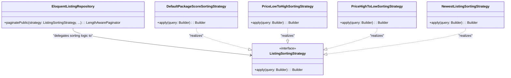

# Kế Hoạch Refactor Bộ Sắp Xếp Tin Đăng (Listing Sorting) — Strategy Pattern

Tài liệu này chi tiết hóa kế hoạch tái cấu trúc (refactor) chức năng sắp xếp tin đăng công khai (public listings) từ dạng truy vấn cứng (hardcoded SQL) sang **Strategy Pattern** nhằm tuân thủ nguyên lý **SOLID** và giúp hệ thống dễ dàng mở rộng thêm các tùy chọn sắp xếp mới.

---

## 1. Hiện trạng & Vấn đề thiết kế

### Hiện trạng code
Trong file [EloquentListingRepository.php](file:///d:/PROJECT/Meyland/PropifyBackend/app/Repositories/Eloquent/EloquentListingRepository.php#L108-L144), logic sắp xếp tin đăng theo độ ưu tiên gói và công thức giảm dần theo thời gian (time-decay score) đang được viết cứng trong SQL:

```php
// EloquentListingRepository.php
public function paginatePublic(?string $demandType, ?string $keyword, int $perPage): LengthAwarePaginator
{
    return Listing::query()
        // ...
        ->selectRaw('
            COALESCE(packages.priority, 1) AS pkg_priority,
            (
                COALESCE(listings.score, 0)
                * COALESCE(packages.multiplier, 1.0)
                * (1.0 / (1.0 + TIMESTAMPDIFF(HOUR, COALESCE(listings.published_at, listings.created_at), NOW()) / 24.0))
                * EXP(-COALESCE(packages.decay_rate, 0.05) * TIMESTAMPDIFF(HOUR, COALESCE(listings.published_at, listings.created_at), NOW()))
            ) AS final_score
        ')
        ->leftJoin('packages', 'listings.package_id', '=', 'packages.id')
        // ...
        ->orderByDesc('pkg_priority')
        ->orderByDesc('final_score')
        ->paginate($perPage);
}
```

### Vấn đề:
1. **Vi phạm Open-Closed Principle (OCP)**: Khi hệ thống cần hỗ trợ người dùng sắp xếp theo các tiêu chí khác (vd: Giá tăng/giảm dần, Tin mới nhất, Xem nhiều nhất...), ta buộc phải sửa đổi hàm `paginatePublic` bằng các câu lệnh `if/else` để ghép nối SQL Order động.
2. **Fat Repository / Phình to logic**: Logic tính điểm ưu tiên và sắp xếp bị trộn lẫn trực tiếp với truy vấn cơ bản (lọc theo nhu cầu, từ khóa).

---

## 2. Giải Pháp Thiết Kế (Strategy Pattern)

Đóng gói mỗi kiểu sắp xếp thành một lớp Strategy triển khai chung interface `ListingSortingStrategy`.



---

## 3. Danh sách các file tạo mới & thay đổi

### 3.1. Tạo mới các file Strategy

#### 1. [NEW] `app/Services/Listing/Sorting/ListingSortingStrategy.php`
Định nghĩa interface chung cho các thuật toán sắp xếp:
```php
<?php

namespace App\Services\Listing\Sorting;

use Illuminate\Database\Eloquent\Builder;

interface ListingSortingStrategy
{
    /**
     * Áp dụng điều kiện sắp xếp vào Eloquent Query Builder.
     */
    public function apply(Builder $query): Builder;
}
```

#### 2. [NEW] `app/Services/Listing/Sorting/Strategies/DefaultPackageScoreSortingStrategy.php`
Lớp sắp xếp mặc định theo độ ưu tiên của gói tin và công thức thời gian (time decay):
```php
<?php

namespace App\Services\Listing\Sorting\Strategies;

use App\Services\Listing\Sorting\ListingSortingStrategy;
use Illuminate\Database\Eloquent\Builder;

class DefaultPackageScoreSortingStrategy implements ListingSortingStrategy
{
    public function apply(Builder $query): Builder
    {
        return $query
            ->selectRaw('
                COALESCE(packages.priority, 1) AS pkg_priority,
                (
                    COALESCE(listings.score, 0)
                    * COALESCE(packages.multiplier, 1.0)
                    * (1.0 / (1.0 + TIMESTAMPDIFF(HOUR, COALESCE(listings.published_at, listings.created_at), NOW()) / 24.0))
                    * EXP(-COALESCE(packages.decay_rate, 0.05) * TIMESTAMPDIFF(HOUR, COALESCE(listings.published_at, listings.created_at), NOW()))
                ) AS final_score
            ')
            ->leftJoin('packages', 'listings.package_id', '=', 'packages.id')
            ->orderByDesc('pkg_priority')
            ->orderByDesc('final_score');
    }
}
```

#### 3. [NEW] `app/Services/Listing/Sorting/Strategies/PriceLowToHighSortingStrategy.php`
Sắp xếp theo giá tăng dần:
```php
<?php

namespace App\Services\Listing\Sorting\Strategies;

use App\Services\Listing\Sorting\ListingSortingStrategy;
use Illuminate\Database\Eloquent\Builder;

class PriceLowToHighSortingStrategy implements ListingSortingStrategy
{
    public function apply(Builder $query): Builder
    {
        return $query
            ->join('properties', 'listings.property_id', '=', 'properties.id')
            ->orderBy('properties.price', 'asc');
    }
}
```

#### 4. [NEW] `app/Services/Listing/Sorting/Strategies/NewestListingSortingStrategy.php`
Sắp xếp theo ngày tin được xuất bản mới nhất:
```php
<?php

namespace App\Services\Listing\Sorting\Strategies;

use App\Services\Listing\Sorting\ListingSortingStrategy;
use Illuminate\Database\Eloquent\Builder;

class NewestListingSortingStrategy implements ListingSortingStrategy
{
    public function apply(Builder $query): Builder
    {
        return $query->orderByDesc('listings.published_at');
    }
}
```

---

### 3.2. Chỉnh sửa Repository để áp dụng Strategy động

#### [MODIFY] [ListingRepository.php](file:///d:/PROJECT/Meyland/PropifyBackend/app/Repositories/ListingRepository.php)
Cập nhật signature phương thức nhận thêm Strategy:
```php
use App\Services\Listing\Sorting\ListingSortingStrategy;

public function paginatePublic(
    ListingSortingStrategy $sortingStrategy,
    ?string $demandType,
    ?string $keyword,
    int $perPage
): LengthAwarePaginator;
```

#### [MODIFY] [EloquentListingRepository.php](file:///d:/PROJECT/Meyland/PropifyBackend/app/Repositories/Eloquent/EloquentListingRepository.php)
Chỉnh sửa phương thức `paginatePublic` chuyển giao quyền sắp xếp cho Strategy:
```php
use App\Services\Listing\Sorting\ListingSortingStrategy;

public function paginatePublic(
    ListingSortingStrategy $sortingStrategy,
    ?string $demandType,
    ?string $keyword,
    int $perPage
): LengthAwarePaginator {
    $query = Listing::query()
        ->select([
            'listings.id', 'listings.property_id', 'listings.owner_id', 'listings.title',
            'listings.demand_type', 'listings.status', 'listings.is_verified',
            'listings.has_video', 'listings.package_id', 'listings.score',
            'listings.views', 'listings.submitted_at', 'listings.published_at',
        ])
        ->with([
            'property:id,type,province_code,ward_code,street_code,project_name,address_detail,area,price,bedrooms,bathrooms,contact_name,poster_type',
            'images:id,listing_id,image_url,is_thumbnail,sort_order',
            'owner:id,full_name,avatar_url',
            'package:id,name,slug,badge,color,priority',
        ])
        ->where('listings.status', 'ACTIVE')
        ->when($demandType, function ($query) use ($demandType) {
            $query->where('listings.demand_type', $demandType);
        })
        ->when($keyword, function ($query) use ($keyword) {
            $query->where(function ($subQuery) use ($keyword) {
                $subQuery
                    ->where('listings.title', 'like', '%' . $keyword . '%')
                    ->orWhere('listings.description', 'like', '%' . $keyword . '%');
            });
        });

    // 🔥 Ủy quyền sắp xếp cho Strategy
    $query = $sortingStrategy->apply($query);

    return $query->paginate($perPage);
}
```

---

### 3.3. Áp dụng tại Controller (Đăng ký Binding & Resolve Strategy)

#### [NEW] `app/Services/Listing/Sorting/ListingSortingStrategyFactory.php`
Factory hoặc Resolver để chọn Strategy tương ứng dựa trên query parameter của client (ví dụ: `?sort=price_asc` hoặc `?sort=newest`):

```php
<?php

namespace App\Services\Listing\Sorting;

use App\Services\Listing\Sorting\Strategies\DefaultPackageScoreSortingStrategy;
use App\Services\Listing\Sorting\Strategies\PriceLowToHighSortingStrategy;
use App\Services\Listing\Sorting\Strategies\NewestListingSortingStrategy;

class ListingSortingStrategyFactory
{
    public static function make(?string $sortBy): ListingSortingStrategy
    {
        return match ($sortBy) {
            'price_asc' => new PriceLowToHighSortingStrategy(),
            'newest'    => new NewestListingSortingStrategy(),
            default     => new DefaultPackageScoreSortingStrategy(),
        };
    }
}
```

#### [MODIFY] `app/Http/Controllers/Api/V1/Listing/PublicListingController.php`
Gọi Factory để lấy Strategy và truyền vào Repository:
```php
$sortBy = $request->query('sort'); // Lấy query param từ Client
$strategy = ListingSortingStrategyFactory::make($sortBy);

$listings = $this->listingRepository->paginatePublic(
    $strategy,
    $request->query('demand_type'),
    $request->query('keyword'),
    $request->query('per_page', 10)
);
```

---

## 4. Kế hoạch xác thực (Verification Plan)

### 4.1. Unit Test / Integration Test
Tạo mới file test `tests/Feature/ListingSortingTest.php` để đảm bảo logic hoạt động chính xác:
* **Test Case 1**: Sắp xếp mặc định (`DefaultPackageScoreSortingStrategy`) trả về tin có mức độ ưu tiên gói tin cao hơn lên trước.
* **Test Case 2**: Sắp xếp theo giá tăng dần (`PriceLowToHighSortingStrategy`) trả về danh sách có giá từ thấp đến cao.
* **Test Case 3**: Sắp xếp theo tin mới nhất (`NewestListingSortingStrategy`) trả về tin có `published_at` gần nhất lên đầu.

### 4.2. Manual Verification
* Chạy server local bằng `composer run dev`.
* Sử dụng Postman hoặc Trình duyệt để gửi yêu cầu đến API danh sách public:
  * `/api/v1/listings?sort=newest`
  * `/api/v1/listings?sort=price_asc`
  * `/api/v1/listings` (mặc định)
* Xác nhận dữ liệu JSON trả về được sắp xếp đúng theo tham số truyền lên.
