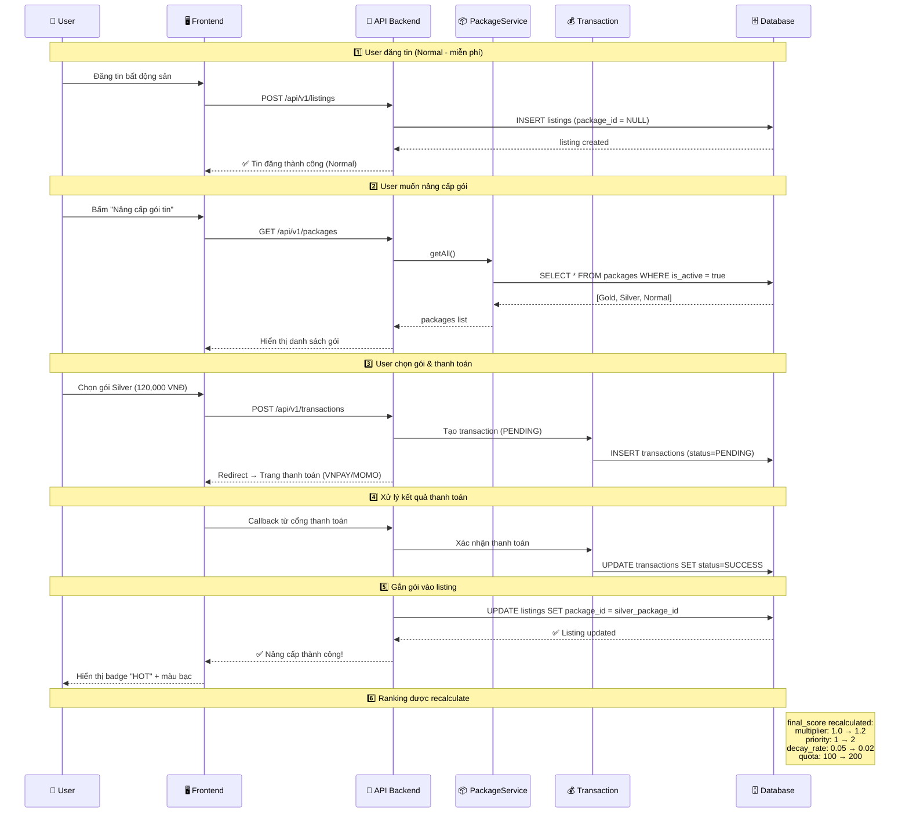

# 🏗️ Hệ Thống Gói Tin (Packages) — Propify

## 📌 Tổng quan

Hệ thống Gói Tin quản lý cách **tin đăng bất động sản** được xếp hạng và hiển thị trên nền tảng Propify. Mỗi listing khi đăng có thể được gắn với một **gói tin** (Gold, Silver, hoặc Normal). Gói tin quyết định mức độ ưu tiên, thời gian sống, và khả năng hiển thị của tin đăng.

---

## 🗄️ Cấu trúc Database

### Bảng `packages`

Dựa trên migration [update_packages_table.php](file:///d:/PROJECT/Meyland/PropifyBackend/database/migrations/2026_04_22_155418_update_packages_table.php):

| Cột | Kiểu | Mặc định | Mô tả |
|-----|------|----------|-------|
| `id` | `bigint` (PK) | auto | Khóa chính |
| `name` | `string` | — | Tên gói (Gold, Silver, Cơ bản) |
| `slug` | `string` (unique) | — | Định danh URL-safe (`gold`, `silver`, `basic`) |
| `price` | `decimal(10,2)` | `0` | Giá gói (VNĐ) |
| `priority` | `tinyint unsigned` | `1` | **Tầng ưu tiên** — quyết định thứ tự sort trước khi so `final_score` |
| `multiplier` | `float` | `1.0` | **Hệ số nhân điểm** — boost `base_score` |
| `daily_quota` | `int unsigned` | `100` | **Quota hiển thị/ngày** — giới hạn lượt impression |
| `decay_rate` | `float` | `0.05` | **Tốc độ tụt hạng** — càng lớn, tin tụt càng nhanh |
| `badge` | `string` (nullable) | `null` | Nhãn hiển thị trên UI (`HOT`, `VIP`) |
| `color` | `string` (nullable) | `null` | Mã màu badge (`#FFD700`, `#C0C0C0`) |
| `is_active` | `boolean` | `true` | Trạng thái kích hoạt |
| `created_at` | `timestamp` | auto | — |
| `updated_at` | `timestamp` | auto | — |

> [!NOTE]
> Index `['priority', 'is_active']` giúp query sort theo tầng ưu tiên nhanh hơn.

### Bảng `listings` — Liên kết với Package

Từ migration [create_listings_table.php](file:///d:/PROJECT/Meyland/PropifyBackend/database/migrations/2026_03_23_161049_create_listings_table.php):

```
package_id  →  FK đến packages.id  (nullable)
score       →  integer, default 0
```

- `package_id = null` → tin đăng **không gắn gói** (mặc định là Normal).
- `score` → điểm `base_score` tính toán từ nội dung + tương tác.

### Bảng `transactions` — Ghi nhận thanh toán

Từ [create_transactions_table.php](file:///d:/PROJECT/Meyland/PropifyBackend/database/migrations/2026_03_23_161205_create_transactions_table.php):

| Cột | Mô tả |
|-----|-------|
| `user_id` | Người thực hiện thanh toán |
| `listing_id` | Tin đăng được nâng cấp |
| `package_id` | Gói tin đã mua |
| `amount` | Số tiền thanh toán |
| `payment_method` | VNPAY, MOMO, ... |
| `status` | `PENDING` → `SUCCESS` / `FAILED` |

---

## 📊 Bảng so sánh 3 gói tin

| Thuộc tính | 🥇 Gold | 🥈 Silver | 📄 Normal (Cơ bản) |
|------------|---------|-----------|---------------------|
| **Priority** (tầng sort) | `3` | `2` | `1` |
| **Multiplier** (hệ số nhân) | `1.5` | `1.2` | `1.0` |
| **Daily Quota** (lượt/ngày) | `500` | `200` | `100` |
| **Decay Rate** (tốc độ tụt) | `0.01` | `0.02` | `0.05` |
| **Badge** | `VIP` | `HOT` | *(không có)* |
| **Color** | `#FFD700` 🟡 | `#C0C0C0` ⚪ | *(không có)* |
| **Giá (VNĐ)** | Cao nhất | Trung bình | `0` (miễn phí) |

> [!IMPORTANT]
> **Priority** quyết định **tầng sort** — Gold luôn xuất hiện trước Silver, Silver trước Normal, **trước khi** so sánh `final_score`. Tuy nhiên, trong cùng 1 tầng, tin có `final_score` cao hơn sẽ đứng trên.

---

## 🔢 Công thức xếp hạng (Ranking Formula)

### Công thức tổng

```
final_score = base_score × package_multiplier × freshness × quota_penalty × decay
```

### Thứ tự sort khi hiển thị

```sql
ORDER BY packages.priority DESC, final_score DESC
```

---

### 3.1. BASE SCORE — Điểm nền

```
base_score = content_score + engagement_score
```

#### ✳️ Content Score (0 → 100)

| Yếu tố | Điểm |
|---------|------|
| Có `title` rõ ràng | +10 |
| Có `description` | +10 |
| Có `ai_description` | +5 |
| Có ảnh (`listing_images`) | +20 |
| Có video (`has_video = true`) | +10 |
| Thông tin đầy đủ (giá, diện tích, địa chỉ...) | +20 |
| Đã xác minh (`is_verified = true`) | +25 |

👉 **Max ~100 điểm**

#### ✳️ Engagement Score

| Hành động | Điểm |
|-----------|------|
| View (xem tin) | +1 |
| Click (xem chi tiết) | +2 |
| Save (yêu thích — `user_favorites`) | +5 |
| Contact (liên hệ) | +10 |

> [!TIP]
> Engagement score nên áp dụng **time-decay**: tương tác 1 giờ trước có giá trị hơn tương tác 1 tuần trước.

---

### 3.2. PACKAGE MULTIPLIER — Hệ số gói

Lấy trực tiếp từ cột `packages.multiplier`:

| Gói | multiplier | Ảnh hưởng |
|-----|-----------|-----------|
| Gold | `1.5` | Tăng 50% base_score |
| Silver | `1.2` | Tăng 20% base_score |
| Normal | `1.0` | Không thay đổi |

> [!WARNING]
> Multiplier chỉ **boost nhẹ**, không vượt quá 2.0 để tránh hiệu ứng **pay-to-win**. Tin Normal với nội dung tốt vẫn có thể cạnh tranh.

---

### 3.3. FRESHNESS — Độ mới

```
freshness = 1 / (1 + age_in_hours / 24)
```

| Tuổi tin | freshness | Ý nghĩa |
|----------|-----------|---------|
| 1 giờ | ~0.96 | Gần như đầy đủ |
| 12 giờ | ~0.66 | Giảm 1/3 |
| 24 giờ | ~0.50 | Giảm một nửa |
| 72 giờ | ~0.25 | Chỉ còn 1/4 |
| 1 tuần | ~0.12 | Gần như mất ảnh hưởng |

> [!NOTE]
> `age_in_hours` tính từ `listings.published_at` đến thời điểm hiện tại.

---

### 3.4. QUOTA PENALTY — Kiểm soát phân phối

```
ratio = impressions_today / daily_quota
penalty = max(0.2, 1 - ratio)
```

| impressions_today | daily_quota | ratio | penalty |
|-------------------|-------------|-------|---------|
| 10 | 100 | 0.1 | **0.9** |
| 50 | 100 | 0.5 | **0.5** |
| 90 | 100 | 0.9 | **0.2** (sàn) |
| 100+ | 100 | 1.0+ | **0.2** (sàn) |

> [!IMPORTANT]
> - **Không hard-block** — tin đạt quota KHÔNG biến mất, chỉ bị giảm 80% điểm.
> - Sàn `0.2` đảm bảo tin luôn có cơ hội hiển thị.
> - Gold với `daily_quota = 500` cần nhiều lượt hơn mới bị penalty.

---

### 3.5. DECAY — Phân rã theo thời gian

```
decay = e^(-decay_rate × age_in_hours)
```

Lấy trực tiếp từ cột `packages.decay_rate`:

| Gói | decay_rate | Sau 24h | Sau 48h | Sau 72h |
|-----|-----------|---------|---------|---------|
| Gold | `0.01` | ~0.79 | ~0.62 | ~0.49 |
| Silver | `0.02` | ~0.62 | ~0.38 | ~0.24 |
| Normal | `0.05` | ~0.30 | ~0.09 | ~0.03 |

> [!CAUTION]
> Normal với `decay_rate = 0.05` sẽ gần như **mất hẳn** sau 72h. Đây là động lực chính để user nâng cấp gói.

---

## 🔄 Luồng nâng cấp gói tin (Upgrade Flow)

### Sequence Diagram



### Các bước chi tiết

#### Bước 1: Đăng tin (Normal — miễn phí)

- User tạo listing → `package_id = NULL` → hệ thống mặc định dùng giá trị Normal
- Listing xuất hiện với **priority = 1**, **multiplier = 1.0**, **decay_rate = 0.05**
- Không có badge, không có màu nổi bật

#### Bước 2: Xem danh sách gói

- User truy cập trang nâng cấp → Frontend gọi `GET /api/v1/packages`
- API trả về danh sách gói đang active (`is_active = true`)
- Frontend hiển thị bảng so sánh các gói

#### Bước 3: Chọn gói & thanh toán

- User chọn gói → hệ thống tạo `Transaction` với status `PENDING`
- Redirect sang cổng thanh toán (VNPAY, MOMO...)
- Ghi nhận: `user_id`, `listing_id`, `package_id`, `amount`

#### Bước 4: Xác nhận thanh toán

- Cổng thanh toán callback → Backend xác nhận
- Transaction status: `PENDING` → `SUCCESS`
- Nếu `FAILED` → không cập nhật listing

#### Bước 5: Gắn gói vào listing

- Update `listings.package_id` = ID gói đã mua
- Listing lập tức được hưởng các quyền lợi của gói mới:
  - **priority** cao hơn → đứng trên tầng cao hơn
  - **multiplier** lớn hơn → score được boost
  - **decay_rate** nhỏ hơn → sống lâu hơn trên bảng xếp hạng
  - **daily_quota** lớn hơn → hiển thị nhiều hơn/ngày

#### Bước 6: Nâng cấp tiếp (Silver → Gold)

Quy trình tương tự bước 2-5, chỉ khác:
- `package_id` cũ (Silver) → `package_id` mới (Gold)
- Transaction mới được tạo, ghi nhận giao dịch nâng cấp

---

## 📐 Ví dụ thực tế: So sánh xếp hạng

### Tin A — Gold Package

```
base_score = 80 (content tốt, có ảnh + video)
multiplier = 1.5
freshness  = 0.8 (đăng ~6h trước)
penalty    = 0.9 (90/500 impressions)
decay      = e^(-0.01 × 6) ≈ 0.94
```

```
final_score = 80 × 1.5 × 0.8 × 0.9 × 0.94 ≈ 81.22
priority = 3
```

### Tin B — Normal Package (nhưng content xuất sắc)

```
base_score = 95 (verified, đầy đủ thông tin, nhiều tương tác)
multiplier = 1.0
freshness  = 1.0 (mới đăng)
penalty    = 1.0 (0 impressions)
decay      = 1.0 (mới đăng)
```

```
final_score = 95 × 1.0 × 1.0 × 1.0 × 1.0 = 95.00
priority = 1
```

### Kết quả sort

```
ORDER BY priority DESC, final_score DESC

1️⃣ Tin A  → priority=3, score=81.22  (Gold, hiển thị trước)
2️⃣ Tin B  → priority=1, score=95.00  (Normal, dù score cao hơn)
```

> [!IMPORTANT]
> **Tin B có final_score cao hơn (95 > 81.22)** nhưng vẫn nằm dưới Tin A vì **priority Gold (3) > Normal (1)**. Đây là cơ chế phân tầng — đảm bảo quyền lợi cho gói trả phí, nhưng **trong cùng tầng**, content tốt hơn sẽ thắng.

### Sau 72 giờ — Tin A bắt đầu xuống

```
Tin A (Gold, 72h):
  decay = e^(-0.01 × 72) ≈ 0.49
  freshness = 1/(1 + 72/24) = 0.25
  → final ≈ 80 × 1.5 × 0.25 × 0.9 × 0.49 ≈ 13.23

Tin C (Normal mới đăng):
  → final = 70 × 1.0 × 1.0 × 1.0 × 1.0 = 70.00

Sort: Tin A vẫn trên (priority=3) nhưng nếu hết hạn gói → tụt về priority=1
```

---

## 🛡️ Quy tắc thiết kế hệ thống

### ✅ Không dùng Hard Rule

```diff
- ❌ Sai: đạt quota → ẩn tin hoàn toàn
+ ✔ Đúng: đạt quota → giảm dần score bằng penalty (sàn 0.2)
```

### ✅ Multiplier không quá lớn

```diff
- ❌ Sai: Gold multiplier = 5.0 (pay-to-win)
+ ✔ Đúng: Gold multiplier = 1.5 (boost vừa phải)
```

### ✅ Luôn có Decay

```diff
- ❌ Sai: Tin Gold sống mãi trên top
+ ✔ Đúng: Gold decay_rate = 0.01 (chậm nhưng vẫn tụt)
```

### ✅ Luôn có Quota

```diff
- ❌ Sai: Gold hiển thị vô giới hạn → spam
+ ✔ Đúng: Gold daily_quota = 500 (cao nhưng có giới hạn)
```

---

## 🖥️ Mapping UI Admin → Database

Giao diện tạo gói tin trong Admin Panel map trực tiếp vào bảng `packages`:

| UI Field | DB Column | Ý nghĩa |
|----------|-----------|---------|
| Tên gói | `name` | Tên hiển thị |
| Định danh (Slug) | `slug` | URL-safe identifier |
| Giá tiền (VNĐ) | `price` | Giá gói |
| Độ ưu tiên | `priority` | Tầng sort (1→3) |
| Hệ số điểm (Multiplier) | `multiplier` | Nhân điểm base_score |
| Số lượt hiển thị/ngày (Daily Quota) | `daily_quota` | Giới hạn impression |
| Tốc độ tụt hạng (Decay Rate) | `decay_rate` | Tốc độ phân rã |
| Badge hiển thị | `badge` | Nhãn UI (HOT, VIP) |
| Màu sắc (Color code) | `color` | Hex color cho badge |

---

## 📁 Cấu trúc code liên quan

### Backend (Laravel)

| Layer | File | Vai trò |
|-------|------|---------|
| **Model** | [Package.php](file:///d:/PROJECT/Meyland/PropifyBackend/app/Models/Package.php) | Eloquent model, scopes (active, byPriority), relationships |
| **Model** | [Listing.php](file:///d:/PROJECT/Meyland/PropifyBackend/app/Models/Listing.php) | Chứa `package_id`, `score`, relationship đến Package |
| **Model** | [Transaction.php](file:///d:/PROJECT/Meyland/PropifyBackend/app/Models/Transaction.php) | Ghi nhận giao dịch mua gói |
| **Enum** | [PackageType.php](file:///d:/PROJECT/Meyland/PropifyBackend/app/Enums/PackageType.php) | `GOLD`, `SILVER`, `DIAMOND` |
| **Service** | [PackageService.php](file:///d:/PROJECT/Meyland/PropifyBackend/app/Services/Packages/PackageService.php) | Interface: getAll, getById, create, update, delete |
| **Service Impl** | [PackageServiceImpl.php](file:///d:/PROJECT/Meyland/PropifyBackend/app/Services/Packages/Impl/PackageServiceImpl.php) | Business logic, validation, soft-delete |
| **Controller** | [PackageController.php](file:///d:/PROJECT/Meyland/PropifyBackend/app/Http/Controllers/Api/V1/Package/PackageController.php) | REST API endpoints (CRUD) |
| **DTO** | [CreatePackageDto.php](file:///d:/PROJECT/Meyland/PropifyBackend/app/DTOs/Packages/CreatePackageDto.php) | Data transfer cho tạo mới |
| **DTO** | [UpdatePackageDto.php](file:///d:/PROJECT/Meyland/PropifyBackend/app/DTOs/Packages/UpdatePackageDto.php) | Data transfer cho cập nhật |
| **Request** | [CreatePackageRequest.php](file:///d:/PROJECT/Meyland/PropifyBackend/app/Http/Resources/Requests/Package/CreatePackageRequest.php) | Validation rules (chỉ Admin) |

### API Routes

```
GET    /api/v1/packages       → PackageController@index    (danh sách gói)
GET    /api/v1/packages/{id}  → PackageController@show     (chi tiết gói)
POST   /api/v1/packages       → PackageController@create   (tạo gói — Admin only)
PUT    /api/v1/packages/{id}  → PackageController@update   (sửa gói — Admin only)
DELETE /api/v1/packages/{id}  → PackageController@destroy  (ẩn gói — soft delete)
```

> [!NOTE]
> Tất cả routes đều yêu cầu `auth:api` middleware. Tạo/Sửa/Xóa gói chỉ cho phép role **Admin**.

---

## 🔥 Pseudo Code — Tính Ranking Score

```php
function calculateScore(Listing $listing, Package $package): float
{
    // 1. Base score = chất lượng nội dung + tương tác
    $base = $listing->content_score + $listing->engagement_score;

    // 2. Freshness — tin mới ưu tiên
    $ageHours = $listing->published_at->diffInHours(now());
    $freshness = 1 / (1 + $ageHours / 24);

    // 3. Quota penalty — kiểm soát spam hiển thị
    $ratio = $listing->impressions_today / $package->daily_quota;
    $penalty = max(0.2, 1 - $ratio);

    // 4. Decay — phân rã theo thời gian + gói
    $decay = exp(-$package->decay_rate * $ageHours);

    // 5. Final score
    return $base
        * $package->multiplier
        * $freshness
        * $penalty
        * $decay;
}
```

```php
// Query xếp hạng
Listing::query()
    ->join('packages', 'listings.package_id', '=', 'packages.id')
    ->where('listings.status', 'ACTIVE')
    ->orderByDesc('packages.priority')  // Tầng ưu tiên
    ->orderByDesc('final_score')        // Điểm trong tầng
    ->get();
```

---

## 🎯 Insight tổng kết

```mermaid
graph TD
    A["🥇 Gold Package"] --> A1["Priority: 3 — Luôn top tầng"]
    A --> A2["Multiplier: 1.5 — Boost 50%"]
    A --> A3["Decay: 0.01 — Sống ~7 ngày"]
    A --> A4["Quota: 500/ngày"]

    B["🥈 Silver Package"] --> B1["Priority: 2 — Tầng giữa"]
    B --> B2["Multiplier: 1.2 — Boost 20%"]
    B --> B3["Decay: 0.02 — Sống ~3 ngày"]
    B --> B4["Quota: 200/ngày"]

    C["📄 Normal Package"] --> C1["Priority: 1 — Tầng cuối"]
    C --> C2["Multiplier: 1.0 — Không boost"]
    C --> C3["Decay: 0.05 — Chỉ ~1 ngày"]
    C --> C4["Quota: 100/ngày"]

    style A fill:#FFD700,stroke:#B8860B,color:#000
    style B fill:#C0C0C0,stroke:#808080,color:#000
    style C fill:#F5F5F5,stroke:#CCCCCC,color:#000
```



| Đặc tính | Gold 🥇 | Silver 🥈 | Normal 📄 |
|----------|---------|-----------|-----------|
| Lên top nhanh | ✅✅✅ | ✅✅ | ✅ |
| Sống lâu | ~7 ngày | ~3 ngày | ~1 ngày |
| Hiển thị/ngày | 500 lượt | 200 lượt | 100 lượt |
| Badge nổi bật | VIP 🟡 | HOT ⚪ | Không |
| Cơ hội cạnh tranh nếu content tốt | Rất cao | Cao | Có — trong cùng tầng |

> [!TIP]
> Hệ thống được thiết kế **công bằng**: trả tiền = ưu tiên hiển thị, nhưng **không triệt tiêu** cơ hội của tin miễn phí có nội dung chất lượng. Content is still king.
